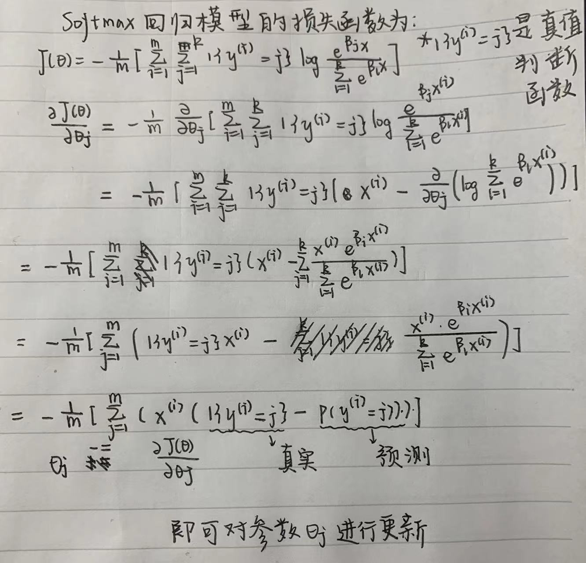
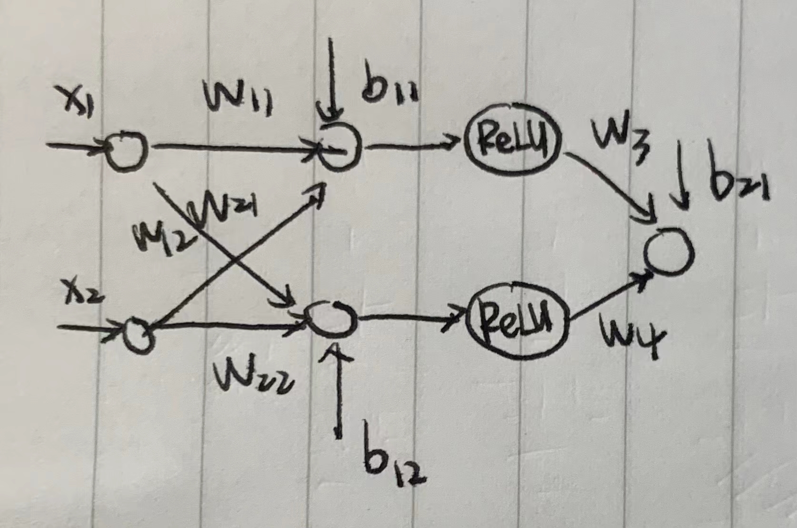
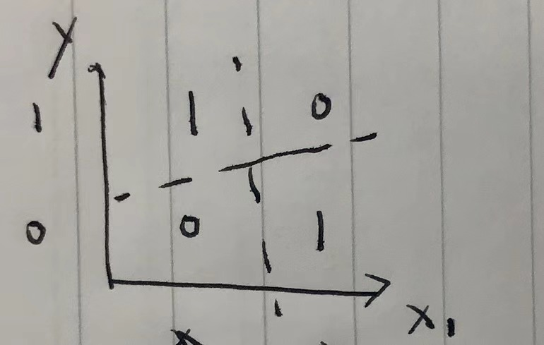

1. 

2. （a）网络结构大致如下：

   ​			                                   

    		其中，
   $$
   w_{11} = 1, \ w_{21} = 1\\
   w_{12} = 1, \ w_{22} = 1\\
   b_{11} = 0, b_{12} = -1\\
   w_3 = 1, \ w_4 = -2, \ b_{21} = 0
   $$
   ​		 验证，当$x_1 = 1,x_2 = 1$，$ReLU_1 = 2,ReLU_2 = 1$，$y=0$

   ​		 			当$x_1 = 0,x_2 = 1$，$ReLU_1 = 1,ReLU_2 = 0$，$y=1$

   ​					 当$x_1 = 1,x_2 = 0$，$ReLU_1 = 1,ReLU_2 = 0$，$y=1$

   ​					 当$x_1 = 0,x_2 = 0$，$ReLU_1 = 0,ReLU_2 = 0$，$y=0$

   （b）证明：假设为线性函数，可写为$y = a x + b$，则网络的最终表达式可写为：
   $$
   \boldsymbol{y}=\left(\boldsymbol{w}^{(2)}\right)^{\mathrm{T}}\left(\boldsymbol{a}\left(\left(\boldsymbol{W}^{(1)}\right)^{\mathrm{T}} \boldsymbol{X}+\boldsymbol{b}^{(1)}\right)+\boldsymbol{b}\right)+\boldsymbol{b^{(2)}}\\
    = \left(\boldsymbol{w}^{(2)}\right)^{\mathrm{T}}\left(\boldsymbol{a}\left(\boldsymbol{W}^{(1)}\right)^{\mathrm{T}} \boldsymbol{X}+\boldsymbol{a}\boldsymbol{b}^{(1)}+\boldsymbol{b}\right) + \boldsymbol{b^{(2)}}\\
   =\boldsymbol{a}\left(\boldsymbol{w}^{(2)}\right)^{\mathrm{T}}\left(\boldsymbol{W}^{(1)}\right)^{\mathrm{T}} \boldsymbol{X}+\left(\boldsymbol{w}^{(2)}\right)^{\mathrm{T}}\left(\boldsymbol{W}^{(1)}\right)^{\mathrm{T}}\left(\boldsymbol{a}\boldsymbol{b}^{(1)}+\boldsymbol{b}\right) + \boldsymbol{b^{(2)}}
   $$
   ​			可以看出最后结果是一个关于输入单元的线性函数，但是抑或模块并不能用线性模块拟合，如下图所示，因此无法用线性函数做激活模块。

   