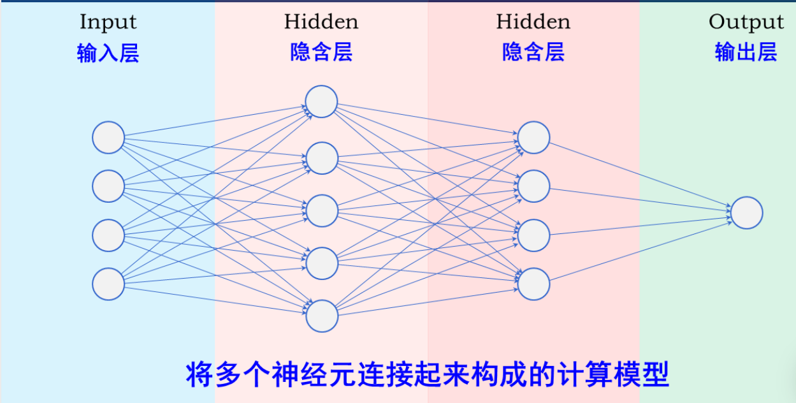
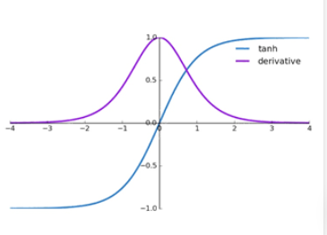
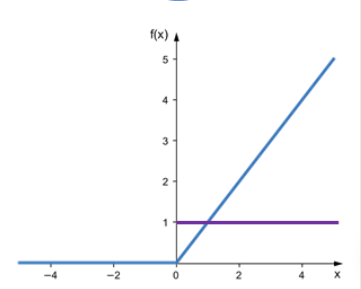
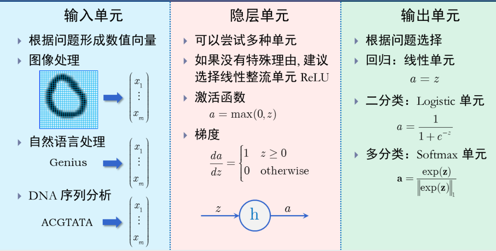
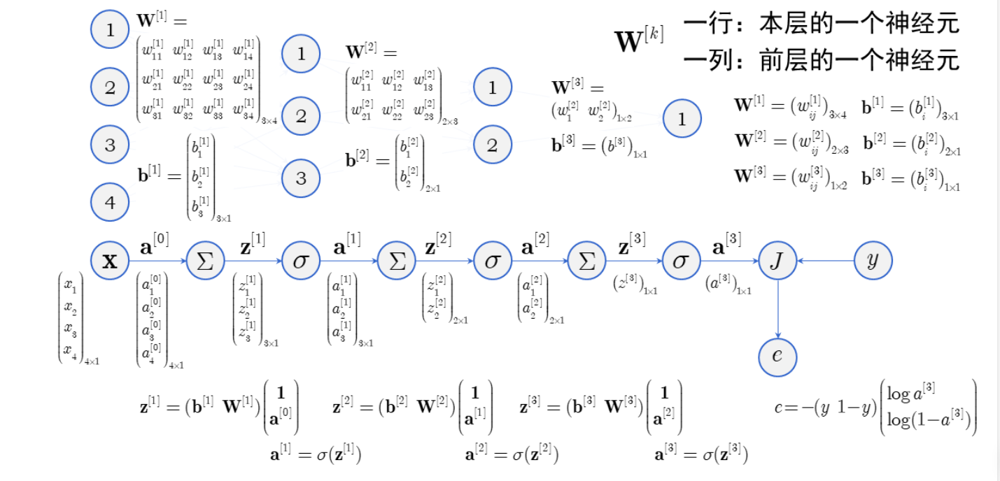
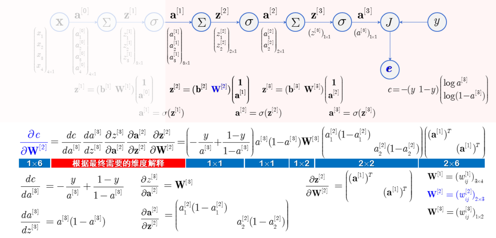
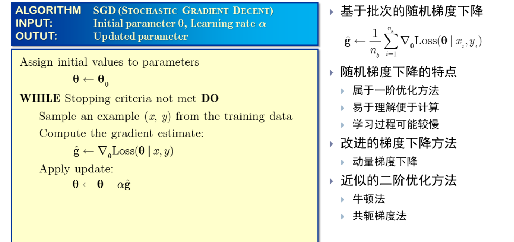
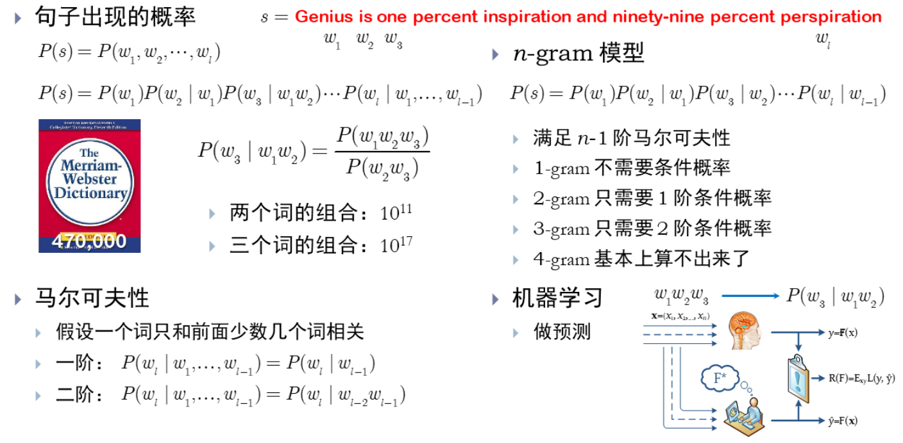
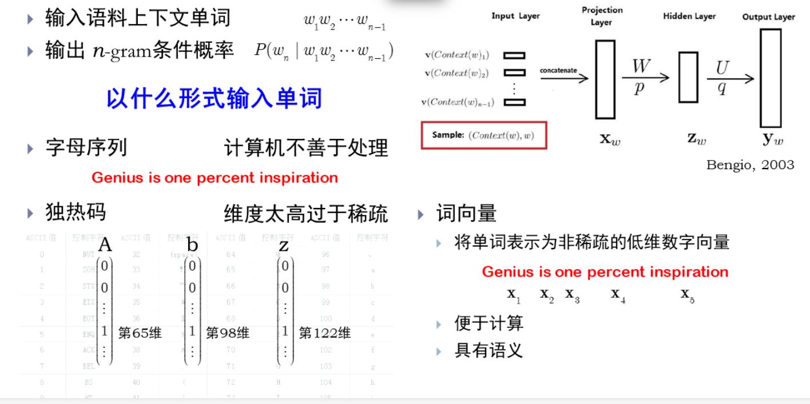

## 前馈神经网络

- 神经网络分层模型

  

- 输入单元变成向量
- 矩阵求导即多元函数求导，求导的结果是雅可比矩阵，矩阵的维度由变量数确定，行数设定为因变量的个数，列数设定为自变量的个数

- 神经单元求导：

  标量对向量求导
  $$
  \begin{aligned}
  &z: 1 \times 1 \quad \mathbf{w}: n \times 1 \\
  &\frac{\partial z}{\partial \mathbf{w}}:(1 \times 1) \times(n \times 1)=1 \times n
  \end{aligned}
  $$
  向量对向量求导
  $$
  \begin{aligned}
  &\mathbf{u}: s \times 1 \quad \mathbf{v}: t \times 1 \\
  &\frac{\partial \mathbf{u}}{\partial \mathbf{v}}:(s \times 1) \times(t \times 1)=s \times t
  \end{aligned}
  $$
  矩阵对矩阵求导
  $$
  \begin{aligned}
  &\mathbf{U}: s \times t \quad \mathbf{V}: m \times n \\
  &\frac{\partial \mathbf{U}}{\partial \mathbf{V}}:(s \times t) \times(m \times n)
  \end{aligned}
  $$
  标量对矩阵求导
  $$
  \begin{aligned}
  &z: 1 \times 1 \quad \mathbf{W}: m \times n \\
  &\frac{\partial z}{\partial \mathbf{W}}:(1 \times 1) \times(m \times n)=1 \times(m \times n)
  \end{aligned}
  $$
  向量对矩阵求导
  $$
  \begin{aligned}
  &\mathbf{u}: s \times 1 \quad \mathbf{W}: m \times n \\
  &\frac{\partial \mathbf{u}}{\partial \mathbf{W}}:(s \times 1) \times(n \times 1)=s \times(m \times n)
  \end{aligned}
  $$

- Logistic单元计算

  计算输出
  $$
  \begin{aligned}
  &z=\mathbf{w}^{T} \mathbf{x}+b \\
  &a=\frac{1}{1+e^{-z}}
  \end{aligned}
  $$
  计算梯度
  $$
  \begin{aligned}
  &\frac{d a}{d z}=a(1-a) \\
  &\frac{\partial z}{\partial b}=1 \quad \frac{\partial a}{\partial b}=\frac{d a}{d z} \frac{\partial z}{\partial b}=a(1-a) \\
  &\frac{\partial z}{\partial \mathbf{w}}=\mathbf{x}^{T} \quad \frac{\partial a}{\partial \mathbf{w}}=\frac{d a}{d z} \frac{\partial z}{\partial \mathbf{w}}=a(1-a) \mathbf{x}^{T}
  \end{aligned}
  $$

- 饱和性：输入较大或较小时趋于饱和梯度消失；输入较大或较小时导数趋近于零
- softmax回归的随机梯度下降[^1 ]

- 双曲正切单元（TANH）

  激活函数
  $$
  a=\frac{c^{z}-c^{-z}}{c^{z}+c^{-z}}
  $$
  导数
  $$
  \frac{d a}{d z}=1-a^{2}=(1+a)(1-a)
  $$
  - 单位性

    ​	输入适中时像单位函数

  梯度消失问题

  - 输入较大或较小时导数趋近于零

  - 导数总比 Logistic 单元大
  - 比 Logistic 单元有优势

  

  - 整流线性单元（RELU）

    激活函数
    $$
    a=\max (0, z)
    $$
    导数
    $$
    \frac{d a}{d z}= \begin{cases}1 & z \geq 0 \\ 0 & \text { otherwise }\end{cases}
    $$
    - 自变量为零时导数如何计算?

    ​		自变量不太会正好为 0

    ​		如果正好为 0 , 导数取 0 或 1 皆可 

    - 梯度消失问题

      比 Logistic 和双曲正切单元有优势

    

- 单元选择策略

  

- 网络结构设计

  - 万能近似定理

    具有线性输出层和至少一个隐层的前馈神经网络, 如果有足够数量的隐层单元, 就能以任意精度逼近任意有限维函数, 其导 数也能以任意精度逼近该函数的导数。

  - 不是浅而深的网络就够了，可能不一定能学会参数。
  - 可表示区域的数量是深度的指数函数 
  - 比较深的网络性能更好

## 神经网络的训练

- 第一步：找一个函数族

- 第二步：找一个优化准则：回归、二分类、多分类

- 第三步：找一个最优函数

- 前向传播

  

- 反向传播

  

- GPU可以对向量进行加速

- 随机梯度下降法

  

## 神经网络做预测

- 各种模型的MNIST数据集预测效果[^2 ]

- 自然语言处理

  - 统计自然语言模型

    

  - 神经自然语言模型

    

  - word2vec：词向量具有语义

## 补充

[^1 ]:见第十周课件第15页
[^2 ]: 见第十周课件第42页

