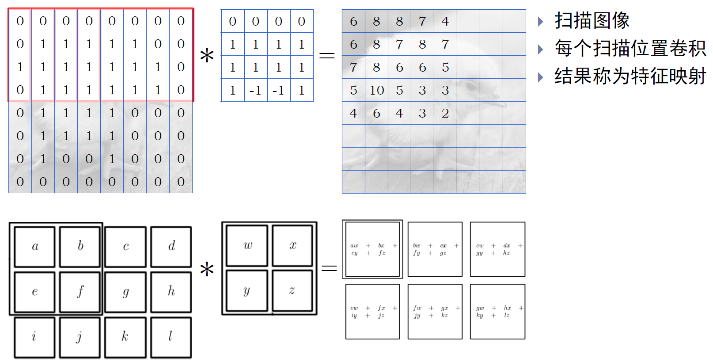

## 卷积神经网络

- 图像的属性往往由很小的特征决定

- 图像的卷积
  - 卷积核与像素点相乘后再求和
  - 卷积核的作用是提取局部特征
  - 卷积核比原图像更小

- 扫描图像：结果称为特征映射

  

  

- 填充后卷积

  **Valid padding**
  不进行填充, 不允许卷积 核超出原始图像边界, 卷积结果与原图大小不一致
  **Same padding**
  进行填充, 允许卷积核超 出原始图像边界, 并使得 卷积结果与原图大小一致 

    

- 特点一：稀疏连接
- 特点二：参数共享
- 特点三：等变表示

- 多通道卷积

  各通道分别进行卷积 再把卷积的结果相加

  

- 多卷积核产生多个通道

  - 一个卷积核提取一个特征

  - 多个卷积核产生多个特征

  - 每个特征对应于一个通道

  - 多卷积: 多通道 $\rightarrow$ 多通道

  

- 特殊卷积核

  - 非共享卷积
  - 平铺卷积

  

  - 1 x 1的卷积核

  - 通道的合并：降维

  - 通道的生成：升维

  - 减少计算量：

    

- 其他数据的卷积
  - 多帧数据卷积：包含空间位置信息，需要高位卷积核
  - 序列卷积：

- 图卷积

  - 把卷积核涉及的点理解为中心的邻居 

  - 则图像可以转化为图

- 图像太大：卷积无法降低问题规模

  原始图: $N \times N$
  卷积核: $m \times m$
  卷积后: $(N-m+1) \times(N-m+1)$

  因为有多个通道，输入规模反而变大了

- 图像对细节不敏感

  - 降采样：缩小图像，降低噪声
  - 保持图像性质

- **池化**

  - 用某一位置相邻输出的统计特征来代替该位置的输出

  - 池化函数

    最大池化
    平均池化
    随机池化

  - 例子：

    

  - 步长大于 1 的池化能降低输入规模

- 卷积神经网络的典型网络

  - 卷积部分是特征提取

  - 前馈功能是完成最终学习

    

  - 端到端的学习

- 卷积神经网络的训练过程
  - 仍然分解为前向传播和后向传播两个迭代过程
  - 关键是池化和卷积单元的梯度计算
  - 对输出有贡献的单元才用计算梯度

## 卷积神经网络的典型结构

- 数据的扩增

  增加训练数据的数量 从原图随机抽取小图 对原图进行几何变换

- 基于动量的随机梯度下降

  参数更新公式
  $$
  \begin{aligned}
  &\mathbf{v} \leftarrow \alpha \mathbf{v}-\epsilon \nabla_{\theta} \\
  &\boldsymbol{\theta} \leftarrow \boldsymbol{\theta}+\mathbf{v}
  \end{aligned}
  $$

- 参数初始化策略

  - 破坏对称性
  - 仅有经验指导原则
  - 随机初始化
  - 借用已有结果

  

- 学习速率调整方法

  - 线性衰减
    $$
    \alpha_{k}=\left\{\begin{array}{ll}
    \lambda \alpha_{\tau}+(1-\lambda) \alpha_{0} & k \leq \tau \\
    \alpha_{\tau} & k>\tau
    \end{array} \quad \lambda=\frac{k}{\tau}\right.
    $$

  - 自适应衰减

    

- 正则化

  - 增加数据、提前终止、修改目标函数

  - 

  - Ridge
    $$
    f(\mathbf{w})=\|\mathbf{w}\|_{2}
    $$
    Lasso
    $$
    f(\mathbf{w})=\|\mathbf{w}\|_{1}
    $$
    Best subset
    $$
    f(\mathbf{w})=\|\mathbf{w}\|_{0}
    $$
    ElasticNet
    $$
    f(\mathbf{w})=\alpha\|\mathbf{w}\|_{1}+\beta\|\mathbf{w}\|_{2}
    $$
    Stepwise

- 简化网络结构

  - 随机扔掉一些节点
  - 随机扔掉一些连接

- 批次标准化

  - 在批量式随机梯度下降中，对隐层输出进行标准化

    

  - 可以使用较大学习率, 提升训练速度, 加快收敛过程 

  - 能够提高性能（一种类似于Dropout的正则化方式）

  - 简化调参过程, 降低对初始化的要求