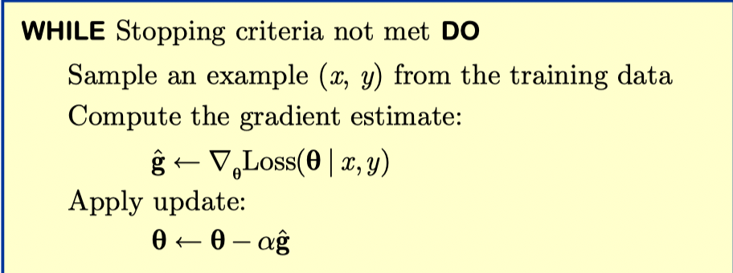

## Logistic回归

- 找到函数族，满足
  $$
  P(Y=1)=\pi(x)=\frac{1}{1+e^{-(w x+b)}}\\
  \log \frac{P(Y=1)}{1-P(Y=1)}=\log \frac{\pi(x)}{1-\pi(x)}=w x+b
  $$

​		$\pi(x)>0, \pi(x) \rightarrow 0$, 当 $w x+b \rightarrow-\infty$
​		$\pi(x)<1, \pi(x) \rightarrow 1$, 当 $w x+b \rightarrow \infty$		

​		$\omega : x$ 增加一个单位时对数几率的变化量
$$
e^{w}=\frac{\pi(x+1) /(1-\pi(x+1))}{\pi(x) /(1-\pi(x))}
$$
​		$\exp (w): x+1$ 及 $x$ 处的几率比为常数

- 找到优化准则

  可观测的是 $Y=1$, 而不是概率 $P(Y=1)$

    - 似然函数：对一个观测值 $y$ (不是 1 就是 0)

      $P(Y=y)=\pi^{y}(1-\pi)^{1-y}$

    - 最大似然估计
      $$
      \begin{gathered}
      \max \sum_{i=1}^{n}\left(y_{i} \log \pi\left(x_{i}\right)+\left(1-y_{i}\right) \log \left(1-\pi\left(x_{i}\right)\right)\right) \\
      \max \prod_{i=1}^{n}\left(\pi\left(x_{i}\right)\right)^{y_{i}}\left(1-\pi\left(x_{i}\right)\right)^{1-y_{i}}
      \end{gathered}
      $$

    - 信息量：$I=-\log _{2} p$，度量系统信息量

      - 以概率小, 看到一次很难, 信息量大
      
  - 概率大, 看到一次不难, 信息量小
  
  - 信息熵：$H=-\sum_{i=1}^{l} p_{i} \log _{2} p_{i}$，度量系统混乱程度
  
    - 内容不一致, 混乱度高 
  
    - 内容较一致, 混乱度低
  
  - 交叉熵：$H(p, q)=-\sum_{i=1}^{l} p_{i} \log _{2} q_{i}$，度量一个系统描述另一个系统的能力
  
    - 能够描述, 交叉熵小 
  
    - 不能描述，交叉熵大
  
      
  
  - 交叉熵损失
  
    对大量观测值 $y =\left\{y_{i}\right\}_{1 \leq i \leq n}$
    $$
    -\frac{1}{n} \sum_{i=1}^{n}\left(y_{i} \log \pi\left(x_{i}\right)+\left(1-y_{i}\right) \log \left(1-\pi\left(x_{i}\right)\right)\right) \quad \pi\left(x_{i}\right)=\frac{e^{\left[x_{i}+b\right.}}{1+e^{w_{i}+b}}
    $$
    
    能够**最小化交叉嫡损失函数**的参数 $w$ 和 $b$ 即为所求
    
  - 总结
  
    最大化对数似然和最小化交叉熵损失都可优化，两者是有无负号的关系

-  找到最优函数

  - 普通梯度下降：需要遍历大量数据集

  - 随机梯度下降：每次只更新一个数据，适用于在线学习场景

  - 梯度更新推导公式：链式法则简单推导即可

  - 伪代码：

    

- 测试方法

  独立测试集、随机抽样、多倍交叉验证、留一交叉验证

- 混淆矩阵与错误率

  - 混淆矩阵

    

  - $$
    \begin{array}{ll}
    \text { True positive rate } & =\text { TP / }(\text { TP+FN }) \\
    \text { False positive rate } & =\text { FP / }(\text { TN+ FP }) \\
    \text { True negative rate } & =\text { TN / }(\text { TN+FP }) \\
    \text { False negative rate } & =\text { FN / }(\text { TP+FN })
    \end{array}
    $$

- 敏感性与特异性

  - 混淆矩阵

  

- 精确率与召回率

  - 混淆矩阵

  

  - $$
    \begin{aligned}
    &\text { Recall }=\mathrm{TP} /(\mathrm{TP}+\mathrm{FN}) \\
    &\text { Precision }=\mathrm{TP} /(\mathrm{TP}+\mathrm{FP}) \\
    &\text { Fall-out }=\mathrm{FP} /(\mathrm{TP}+\mathrm{FP}) \\
    &\text { F1-measure }=2 \times \operatorname{Precision} \times \operatorname{Recall} /(\text { Precision }+\operatorname{Recall})
    \end{aligned}
    $$

- 评价指标：扩展

  

  变动阈值得到的敏感度-特异性曲线，还可以通过类似的方法得到其他曲线。

  以识别数字01为例的评价结果：

  

- 广义线性模型

  

- 多元回归
  $$
  \log \frac{P(Y=1)}{1-P(Y=1)}=\sum_{k=1}^{m} w_{k} x_{k}+b
  $$

​		随机梯度下降：
$$
\begin{aligned}
\frac{\partial e}{\partial b} &=\frac{d e}{d \pi} \frac{d \pi}{d z} \frac{\partial z}{\partial b}=\pi-y \\
\frac{\partial e}{\partial w_{k}} &=\frac{d e}{d \pi} \frac{d \pi}{d z} \frac{\partial z}{\partial w_{k}}=(\pi-y) x_{k}
\end{aligned}
$$

## Softmax回归

目的：解决多分类问题

1. 转换为多个二分类
2. 对多分类问题直接建模：Softmax回归

- 多分类中类别的独热码表示：

  将类别变量表示为 $0 / 1$ 向量 属于哪个类别, 对应维度为 1 ; 其他维度为 0

- 找到函数族：
  $$
  \operatorname{softmax}\left(j, z_{1}, \ldots, z_{l}\right)=\frac{e^{z_{j}}}{\sum_{k=1}^{l} e^{z_{k}}} \quad z_{k}=w_{k} x+b_{k}
  $$

​		接近于 0 , 当 $z_{j}$ 远小于最大的 $z_{j}$ 

​		接近于 1 , 当 $z_{j}$ 远大于次大的 $z_{j}$

- 找到一个优化准则：$\pi_{j}\left(x_{i}\right)=\frac{e^{z_{j}}}{\sum_{k=1}^{l} e^{z_{k}}}，$$z_{j}=w_{j} x_{i}+b_{j}$

- 最大化对数似然
  $$
  \max \sum_{i=1}^{n} \sum_{j=1}^{l} y_{i j} \log \pi_{j}\left(x_{i}\right)
  $$
  最小化交叉熵损失
  $$
  \min \quad-\frac{1}{n} \sum_{i=1}^{n} \sum_{i=1}^{l} y_{i j} \log \pi_{j}\left(x_{i}\right)
  $$

- $P\left(Y=y_{i}\right)=\pi_{j}$

  $P\left(Y=y_{i}\right)=\prod_{i=1}^{l}\left(\pi_{j}\left(x_{i}\right)\right)^{y_{i j}}$

​		其中$y_{ij}$为1，其他都为0

- 真实观测$\left(\begin{array}{c}0 \\ \vdots \\ 1 \\ \vdots \\ 0\end{array}\right)_{l \times 1}$预测概率$\left(\begin{array}{c}\pi_{1} \\ \vdots \\ \pi_{j} \\ \vdots \\ \pi_{l}\end{array}\right)_{l \times 1}$

- 评价指标

  - 混淆矩阵

    

  - 计算公式[^1 ]

- 高维扩展

  

## 补充知识

[^1 ]:参考第九章课件softmax部分

