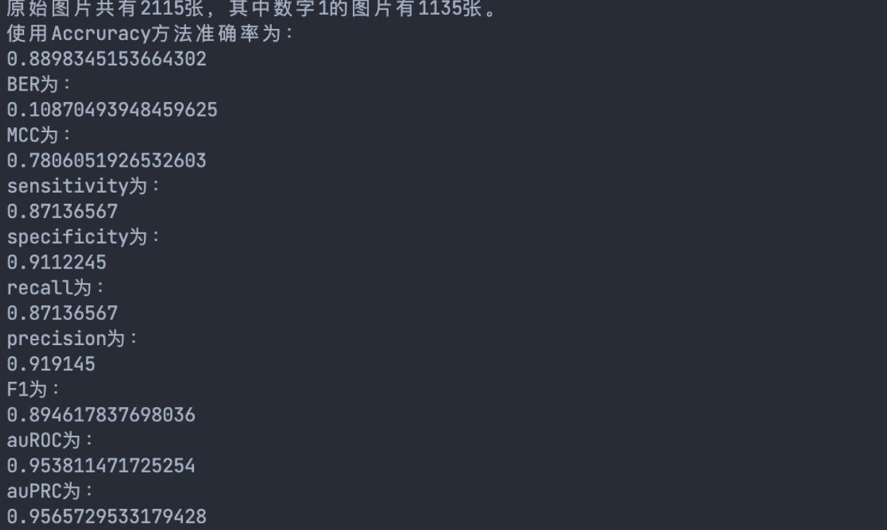
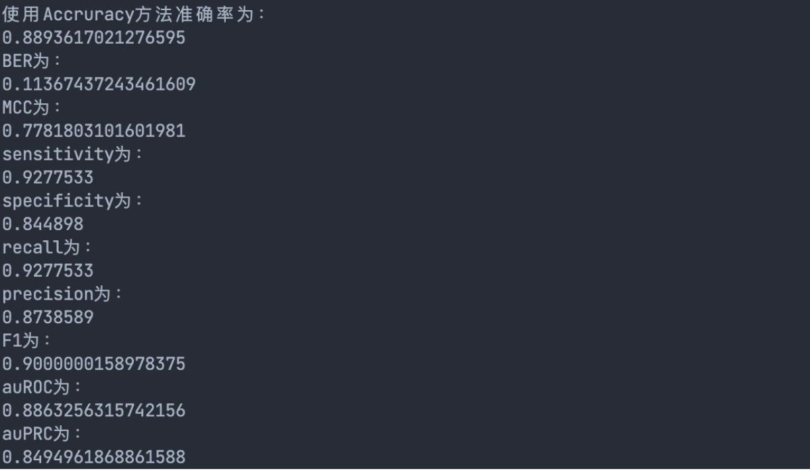

# 第三次编程

<center>何东阳 2019011462</center>

## 1 题目介绍

MNIST 数据库是美国国家标准与技术研究院收集整理的大型手写数字数据库，在机器学习领域被广泛使用。数据库中的每张图片由 28 × 28 个像素 点构成，每个像素点用一个灰度值表示，原始数据中将 28 × 28 的像素展开为一个一维的行向量（每行 784 个 值）。图片标签为 one-hot 编码：0-9。

## 2 编程要求

1. **参看课件，推导用随机梯度下降法求解一元 Logistic 回归的过程**：

​		一元Logistic回归的预测函数为：
$$
P(y=1) = \frac{1}{e^{-(wx+b)}+1}
$$
​		其损失函数为：
$$
F(w, b) =-\sum_{n=1}^{N}\left(y_{n} \ln (p)+\left(1-y_{n}\right) \ln (1-p)\right)
$$
​		其中$y_n$是标签，$p$是预测概率，$w$梯度更新公式为：
$$
\begin{aligned}
\frac{\partial F(w,b)}{\partial w}
& = \frac{\partial F(w,b)}{\partial p}\frac{\partial p}{\partial w} \\
& = -(\sum_{n=1}^{N}\left(\frac{y_{n}}{p}-\frac{\left(1-y_{n}\right)}{1-p} \right)\frac{\partial p}{\partial w}) \\
& = -(\sum_{n=1}^{N}\frac{y_n-p}{p(1-p)}\frac{\partial p}{\partial w})\\
\end{aligned}
$$
​		又，
$$
&\begin{aligned}
\frac{\partial p}{\partial w}
& = -\frac{1}{\left(1+e^{-w x-b}\right)^{2}} \cdot\left(1+e^{-w x - b}\right)^{\prime}\\
& = \frac{1}{\left(1+e^{-w x-b}\right)^{2}} \cdot e^{-w x - b}\cdot x\\
& = p(1-p)x
\end{aligned}
&\begin{aligned}
\frac{\partial p}{\partial b}
& = -\frac{1}{\left(1+e^{-w x-b}\right)^{2}} \cdot\left(1+e^{-w x - b}\right)^{\prime}\\
& = \frac{1}{\left(1+e^{-w x-b}\right)^{2}} \cdot e^{-w x - b}\\
& = p(1-p)
\end{aligned}
$$
​		带入得到
$$
\frac{\partial F(w,b)}{\partial w} = \sum_{n=1}^{N}(p-y_n)x_n
$$
​		同理
$$
\begin{aligned}
\frac{\partial F(w,b)}{\partial b}
& = \frac{\partial F(w,b)}{\partial p}\frac{\partial p}{\partial b} \\
& = -(\sum_{n=1}^{N}\left(\frac{y_{n}}{p}-\frac{\left(1-y_{n}\right)}{1-p} \right)\frac{\partial p}{\partial b}) \\
& = -(\sum_{n=1}^{N}\frac{y_n-p}{p(1-p)}\frac{\partial p}{\partial b})\\
& = \sum_{n=1}^{N}(p-y_n)
\end{aligned}
$$
​		因此使用随机梯度下降时梯度更新公式为：

$$
w -= \frac{\partial F(w,b)}{\partial w} = \sum_{n=1}^{N}(p-y_n)x_n\\
b -= \frac{\partial F(w,b)}{\partial b} = \sum_{n=1}^{N}(p-y_n)
$$


2. **编程实现该随机梯度下降算法，以每张图中白色像素点的比例为特征，对数据文件中的数字 0 和数字 1 使 用 Logistic 回归进行二分类。**

   ```python
   def train(w, b, X, Y, alpha=0.1, epochs=200, batchsize=32):
       """
       YOUR CODE HERE
       """
       def pi_x(XX, ww, bb):
           return 1 / (np.exp(-(ww * XX + bb)) + 1)
   
       for i in range(epochs):
           shuffle(X, Y)
           Batch = X.shape[0] // batchsize
           for j in range(Batch):
               train_x = X[i * batchsize:(i + 1) * batchsize]
               train_y = Y[i * batchsize:(i + 1) * batchsize]
               db = alpha * np.sum(train_y - pi_x(train_x, w, b)) / batchsize
               dw = alpha * np.sum(
                   (train_y - pi_x(train_x, w, b)) * train_x) / batchsize
               w += dw
               b += db
       return w, b
     
   
   def pi_x(w, b, XX):
       return 1 / (np.exp(-(w * XX + b)) + 1)
   ```

   

3. **使用 Accuracy、BER、MCC、Sensitivity、Specificity、Recall、Precision、F1、auROC、auPRC 等指标 评价你的分类方法。**

   代码如下：

   ```python
   def test(Y, y_pred):
       """
       YOUR CODE HERE
       """
       pred = (y_pred > 0.5)
       answer = (Y == pred)
   
       # 计算TP，FP，FN，TN
       TP = np.sum(np.where((Y == pred) & pred, np.ones_like(Y), np.zeros_like(Y)))
       FP = np.sum(np.where((Y != pred) & pred, np.ones_like(Y), np.zeros_like(Y)))
       FN = np.sum(np.where((Y != pred) & (pred == 0), np.ones_like(Y), np.zeros_like(Y)))
       TN = np.sum(np.where((Y == pred) & (pred == 0), np.ones_like(Y), np.zeros_like(Y)))
   
       # 使用Accruracy方法
       ans = np.sum(answer) / len(answer)
       print("使用Accruracy方法准确率为：")
       print(ans)
       # 使用BER方法
       BER = 1 / 2 * (FP / (FP + TN) + FN / (FN + TP))
       print("BER为：")
       print(BER)
   
       # 使用MCC方法
       A = TP * TN - FP * FN
       # 防止溢出
       B = np.sqrt((TP + FP) * (FP + TN)) * np.sqrt((TN + FN) * (FN + TP))
       MCC = A / (B + 1e-8)
       print("MCC为：")
       print(MCC)
   
       # 计算sensitivity和specificity
       sensitivity = TP / (TP + FN)
       specificity = TN / (FP + TN)
       print("sensitivity为：")
       print(sensitivity)
       print("specificity为：")
       print(specificity)
   
       # 计算recall，precision，F1
       recall = TP / (TP + FN)
       precision = TP / (TP + FP)
       F1 = 2 / (1 / precision + 1 / recall)
       print("recall为：")
       print(recall)
       print("precision为：")
       print(precision)
       print("F1为：")
       print(F1)
   
       # 计算auROC，auPRC
       auROC = metrics.roc_auc_score(Y, y_pred)
       auPRC = metrics.average_precision_score(Y, y_pred)
       print("auROC为：")
       print(auROC)
       print("auPRC为：")
       print(auPRC)
   ```

   

   

4. **使用 scikit-learn 中的LogisticRegression 分类器求解该二分类问题，与自己实现的效果进行对比。**

​		

经过指标对比可见，我自己实现的训练效果和调用的**LogisticRegression **分类器效果接近，说明使用像素点百分比指标的随机梯度下降方法很适合本题的识别。
