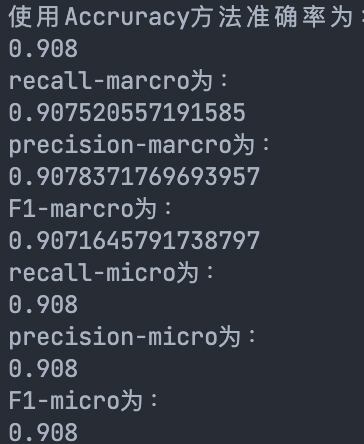
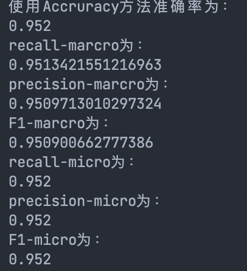
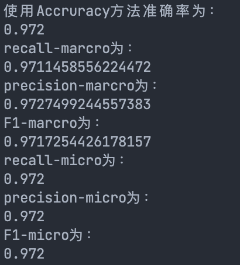

# 第四次编程

<center>何东阳 自96 2019011462</center>

## 1 题目介绍

MNIST 数据库中的每张图片由28×28 个像素点构成，每个像素点用一个灰度值表示，原始数据中将28×28
的像素展开为一个一维的行向量，即单张图片的原始特征是一个长度为 784 的行向量。
在上一次的编程作业中，我们并没有直接使用图片的原始特征，而是使用基于原始特征计算得到的白色像素
点比例作为图片的特征。而后我们搭建了一元Logistic 回归模型，使用该一元特征作为模型输入，解决了MNIST
手写数字数据集中数字 0 和数字 1 的二分类问题。
在本次编程作业中，我们将尝试使用图片的原始多元特征，在完整数据集上求解十分类问题。

## 2 编程要求

本次编程作业我使用了**pytorch**框架，数据集使用的是从官网下载的数据集。

### 2.1 Softmax回归模型

- 代码

  ```python
  class SoftmaxNet(nn.Module):
      def __init__(self):
          super(SoftmaxNet, self).__init__()
          self.fc1 = nn.Linear(784, 10)
          self.softmax = nn.Softmax(dim=1)
  
      def forward(self, x):
          # torch.Size([64, 1, 28, 28]) -> (64,784)
          x = x.view(x.size()[0], -1)
  
          x = self.fc1(x)
          x = self.softmax(x)
          return x
  ```

- 评价指标

  

### 2.2 全连接前馈神经网络

- 代码

  ```python
  class FCNet(nn.Module):
      #初始化网络结构
      def __init__(self):
          super(FCNet, self).__init__()
          self.fc1 = nn.Linear(784, 256)
          self.relu = nn.ReLU()
          self.fc2 = nn.Linear(256, 10)
  
      def forward(self, x):
          x = x.view(x.size()[0], -1)
          x = self.fc1(x)
          x = self.relu(x)
          x = self.fc2(x)
          return x
  ```

- 评价指标

  

### 2.3 卷积神经网络 

- 代码

  ```python
  class ConvNet(nn.Module):
      def __init__(self):
          super(ConvNet, self).__init__()
          self.conv1 = nn.Conv2d(1, 10, kernel_size=5)
          self.conv2 = nn.Conv2d(10, 20, kernel_size=5)
          self.conv2_drop = nn.Dropout2d()
          self.fc1 = nn.Linear(320, 50)
          self.fc2 = nn.Linear(50, 10)
  
      def forward(self, x):
          x = F.relu(F.max_pool2d(self.conv1(x), 2))
          x = F.relu(F.max_pool2d(self.conv2_drop(self.conv2(x)), 2))
          x = x.view(-1, 320)
          x = F.relu(self.fc1(x))
          x = F.dropout(x, training=self.training)
          x = self.fc2(x)
          return F.log_softmax(x)
  ```

- 评价指标

​		                                              

## 3 总结

- 由最终评判指标可以看出，三个模型的测试集准确率Softmax回归模型 < 全连接前馈神经网络 < 卷积神经网络，前两个问说明全连接层有利于提高本题的准确率，收敛的更快；最后一个问说明卷积神经网络的训练效果非常好。

- 此次作业使用pytorch模型完成，主要分为设计网络和设计训练部分，为完成大作业打好了基础，且加深了我对机器学习的理解。
