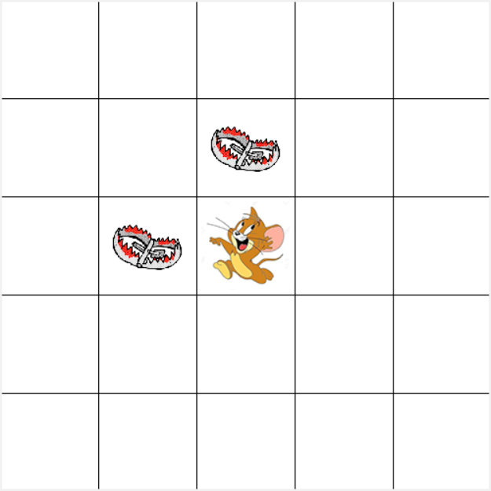

## 第五次编程

<center>何东阳 2019011462 自96</center>

### 作业要求

1. **试对问题进行建模，给出本问题的状态空间、行动集合、状态转移概率及回报，自定折现因子 $\gamma$ 的取值。**

   本题的状态空间可以建模为老鼠在迷宫中的位置：$s = \{s_1, s_2, ..., s_n\}$，其中$s$可以写作$s(i, j )$表示为老鼠在迷宫的第$i$行第$j$列，行动集合$A = \{up,down,left,right\}$表示在迷宫中的移动方向。$\gamma$取为0.1。

2. **任选一种强化学习方法, 编程解决上述老鼠找蛋糕问题。**

   我选择的是策略评价和策略更新迭代的算法：

   ```python
   
   # 用现有策略更新价值函数
   def policy_evaluate(v, policy):
       for _ in range(100):
           now_v = np.copy(v)
           for i in range(0, 5):
               for j in range(0, 5):
                   s = [i, j]
                   # 如果状态结束，就跳过
                   if s == [1, 2] or s == [2, 1] or s == [2, 2]:
                       v[i][j] = r[i][j]
                       continue
                   # 未结束找到最佳更新
                   action = policy[i][j]
                   next_state = moveOnestep(action, s[:])
                   # 如果动作合法则更新矩阵
                   if next_state != s:
                       v[i][j] = r[next_state[0]][next_state[1]] + 0.1 * now_v[
                           next_state[0]][next_state[1]]
   
           print(v)
   
       return v
   
   
   # TODO: de这个bug
   # 用现有价值函数更新策略
   def policy_improve(v, policy):
       for i in range(0, 5):
           for j in range(0, 5):
               rewards = {}
               s = [i, j]
               for action in range(0, 4):
                   # 合法动作则更新state
                   # next_state, _ = env.step(action)
                   next_state = moveOnestep(action, s[:])
                   # 如果原地不动则不更新
                   if s == [1, 2] or s == [2, 1] or s == [2, 2
                                                          ] or next_state == s:
                       next_state = s[:]
                       continue
                   reward = r[next_state[0]][
                       next_state[1]] + 0.1 * v[next_state[0]][next_state[1]]
                   rewards.update({action: reward})
               # 选出最优策略，如果没有就不更新
               if len(rewards) > 0:
                   print(max(rewards, key=rewards.get))
                   policy[i][j] = max(rewards, key=rewards.get)
   
       return policy
   
   for _ in range(50):
       v = policy_evaluate(v, policy)
       # 开始运行
       policy = policy_improve(v, policy)
   ```

   初始的价值矩阵和策略矩阵都是全零矩阵，经过算法迭代，最后得到策略矩阵为：

   [[1, 2, 2, 1, 0], [1, 0, 0, 1, 0], [1, 0, 0, 0, 0], [2, 2, 3, 0, 0], [2, 2, 3, 0, 0]]

   代入更新函数可知老鼠最终吃到了蛋糕。

   

3. **如果环境是动态的, 例如老鼠夹的个数和位置会随时间变化, 该如何求解这个问题? 请简述你的想法, 本 问无需编程实现。**

   如果环境是动态的，对算法的鲁棒性要求更高，因此需要增加策略的随机性。可以使用时序差分算法，每一步更新一次策略，并且使用$\varepsilon-\text { greedy }$的法则更新策略，平衡探索和利用。

### 作业总结

此次作业要求我们从零实现一个基础的强化学习算法，十分有趣，也加深了我对课堂内容的理解，我收获颇丰。