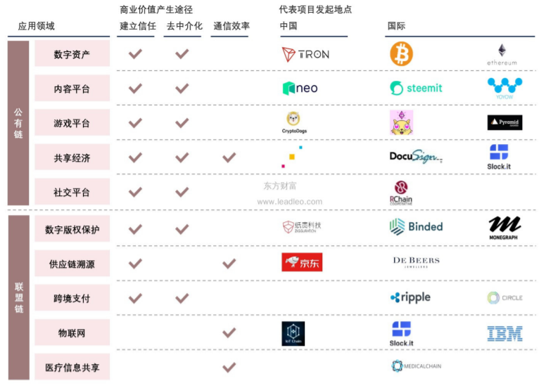
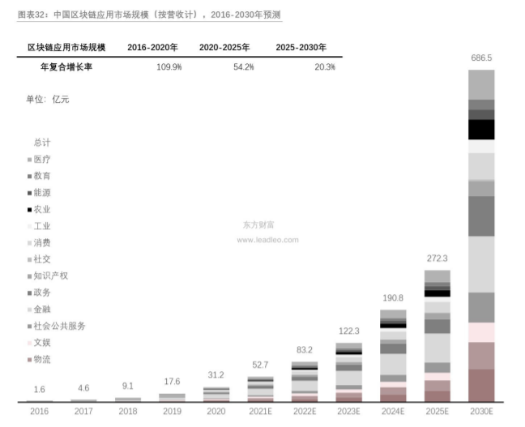
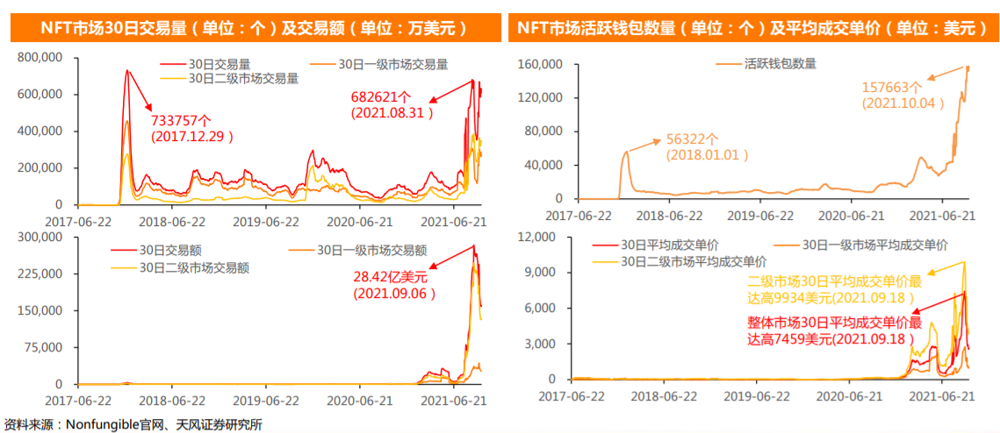

# 区块链产业调研

何东阳 2019011462 自96

## 1 行业概述

### 1.1 区块链产业特点

第46届世界经济论坛达沃斯年会将区块链与人工智能、自动驾驶等一并列入“第四次工业革命。这是一项崭新的技术，自2008年中本聪在他的《比特币白皮书》中提出区块链的概念起，计算机和金融从业者开始接触并了解到这项技术，经过十年的时间，衍生出了一个庞大的信息产业—区块链行业。

正如早期兴起的信息互联网行业一样，区块链行业的发展调动起了无数开发者的热情，他们借鉴比特币的思想，利用加密技术、去中心化网络和分布式系统等等早已被提出的计算机技术共同构建了一个新的王国。开发者们沉迷于自己幻想的网络乌托邦—区块链的去中心化属性中：区块链的技术能够为这些无政府主义者在一定程度上提供技术的保证，这一点我们将在第二章和第3.3节中提到；同时，一些嗅觉敏锐的投资者也意识到了区块链行业带来的价值，他们中不乏金融从业者，和一些希望分走后互联网时代剩下的一杯羹的投资人。开发者做出区块链的蛋糕，他们形成社区，共同发展；投资者加了很多甜腻的奶油进去，试图获得丰厚的回报，一个崭新的大蛋糕就这样被做出来了。

肉眼可见，自09年比特币流通起，如今其价值已达到60000美元/枚，这背后不仅仅是资本机构的炒作，还说明比特币确实在全球范围内获得了一定程度的共识，也说明了比特币背后的区块链技术获得了投资者的共识。金融市场会周期性地出现较大的风险，这个问题在比特币交易中也被暴露了出来，但是随着时间的推移，无数的山寨货币价值归零，比特币仍然屹立不倒。这十年间，区块链行业也出现了很多其他的新鲜技术，包括具有智能合约功能的以太坊—开发者们在这项技术上寄托了自己对去中心化互联网的想象、非同质化代币—元宇宙的入场券、DAO—企业管理新方案等等。这些技术让我们意识到：区块链行业正在悄悄地发生巨变，无数富有想象力的应用场景正在或者即将改变世界。

目前的区块链行业正处于上升期，区块链基础设施正在被逐渐完善，许多应用也层出不穷的出现。其中大部分技术是由独立开发团队研发而成，而非被大公司垄断。近期，尤其在欧美地区掀起了一股区块链热潮，在国内由于政府对虚拟货币交易的管控，普罗大众似乎没有显现出过大的兴趣，但是技术开发者们仍然在热火朝天的工作着。

### 1.2 行业发展概况

疫情催化下，政府加强公共空间管理和封锁，商业模式改变，数字化变革点燃的星星之火愈演愈烈。数字化变革促进区块链行业发展，在疫情的背景下促进更多商业应用场景落地。区块链较短的发展历史也能使中国在此行业中占领发展高地，在国内形成更加完善的产业链，从而形成发展的良性循环。

图源网络

早期的区块链技术主要服务于金融行业，其为金融行业的交易提供了新的解决方案。在跨境支付的应用场景下，区块链为避免传统银行金融系统的低效、冗余、手续费高等问题提供新的思路。疫情过后，国家要求各企业尽快复工复产，政策多次提及供应链金融。通过在区块链上发行数字票据，可以提高资金运转效率；将可流转可融资的确认凭证登记到区块链上使得债权转让得到多方共识从而降低操作难度；分布式共享账本存储和共享非商业机密数据并让数据在链上实现可信流转；区块链难以篡改的特征一定程度上保证供应链交易信息的真实性从而减少贷前的风控投入。

目前区块链产业正处于区块链2.0阶段，也就是以以太坊为代表的智能合约技术。智能合约支持开发者在区块链上运行自己的程序，这一富有想象力的技术可能会出现颠覆性的产业应用。

区块链3.0是基于去中心化的可编程社会，开发者们将不局限于金融货币，在社会、医疗、教育等行业都全面的推行区块链技术，最近大火的"元宇宙"就是对区块链3.0的一种设想。

## 2 技术分析

### 2.1 密码学

密码学是研究编制密码和破译密码的技术科学。研究密码变化的客观规律，应用于编制密码以保守通信秘密的，称为编码学；应用于破译密码以获取通信情报的，称为破译学，总称密码学。密码学是区块链技术的基石，为去中心化交易提供了技术保证。在区块链上，每一个区块都会经过哈希函数转换为一串数码，这串数码会被保存在下一个区块的数据中，实现区块之间的连接。加密算法保证了区块链的信息安全，促进了价值流通。

密码学应用之一的消息认证码和数字签名技术通过对消息的摘要进行加密，可用于消息防篡改和身份证明问题。

数字签名技术基于非对称加密，既可以用于证实某数字内容的完整性，又同时可以确认来源（或不可抵赖，Non-Repudiation）。

### 2.2 分布式系统

分布式系统是多个处理机通过通信线路互联而构成的松散耦合的系统。从系统中某台处理机来看，其余的处理机和相应的资源都是远程的，只有它自己的资源才是本地的。至今，对分布式系统的定义尚未形成统一的见解。一般认为，分布式系统应具有以下四个特征： [3] 

(1)分布性。分布式系统由多台计算机组成，它们在地域上是分散的，可以散布在一个单位、一个城市、一个国家，甚至全球范围内。整个系统的功能是分散在各个节点上实现的，因而分布式系统具有数据处理的分布性。

(2)自治性。分布式系统中的各个节点都包含自己的处理机和内存，各自具有独立的处理数据的功能。通常，彼此在地位上是平等的，无主次之分，既能自治地进行工作，又能利用共享的通信线路来传送信息，协调任务处理。

(3)并行性。一个大的任务可以划分为若干个子任务，分别在不同的主机上执行。

(4)全局性。分布式系统中必须存在一个单一的、全局的进程通信机制，使得任何一个进程都能与其他进程通信，并且不区分本地通信与远程通信。同时，还应当有全局的保护机制。系统中所有机器上有统一的系统调用集合，它们必须适应分布式的环境。在所有CPU上运行同样的内核，使协调工作更加容易。[^3]

### 2.3 共识机制

共识机制在区块链领域中指的是链上节点达成共识的某种机制。用通俗的话语解释，对于一笔交易而言，如果链上的多个客户（节点）均认同该交易的合法性，这笔交易则是合法的，比特币中共识机制需要的节点数通常6个就足够了。共识机制的提出是为了解决去中心化区块链中系统公平性和分配规则指定的需求，常见的共识机制有：

1. **工作量证明机制**：比特币
2. **权益证明**：以太坊
3. **股份授权证明**：EOS
4. **容量证明**

对区块链的共识机制进行评价时，通常采用以下几个指标来评判：安全性、扩展性、性能效率、资源消耗。合理设计共识机制是保证区块链运行正常的必要前提。

## 3 行业现状

### 3.1 行业宏观数据展示

上图为**目前区块链技术的落地情况**，应用以用户群区分主要分为公有链和联盟链，其中公有链是大众均可参与的区块链，而联盟链只允许特定群体加入（如公司内部）。从图中可以看出，公有链在建立信任和去中介化两个方面已经能够产生一定规模的商业价值，相比之下联盟链的部分应用如物联网和医疗信息共享方面暂时没有显著的商业价值；但是公有链在通信效率方面暂时还没有明显的商业价值，这可能和传统的社交媒体仍然强势有关，而联盟链这种偏向于私有项目的应用则在通信效率方面显示出了一些价值。同时，表格还显示目前多数区块链项目的参与方以国际尤其是美国居多，国内相对更少，不过有的报告表明近几年国内的区块链专利数逐步上升，有着强劲的发展趋势。

上图为**对2016年到2030年全球区块链应用市场规模的估计**。可以看出，区块链技术自16年起发展势头迅猛，经过行业初期的摸索，底层技术的完善，区块链技术的商业解决方案日渐成熟并在16年至30年期间可能会迎来爆发时期，与20年代中叶到达700亿元的水准。在2021年的估计中，占据市场价值前三位的分别是金融、医疗、消费行业，但是图中也表明，随着整个区块链产业的发展，金融的占比最终将会降低，行业垂直分布会更加均衡，随之上升的是政务、农业等公共场景。

### 3.2 企业案例分析

#### 3.2.1 外国企业

微软以Azure云服务为基础，构建区块链生态系统，与各区块链厂商合作共赢，支持开发者开发区块链应用。谷歌相比之下则入局迟缓，主要以投资为主，之后则和微软一样从云服务入手进行区块链技术探索。亚马逊同样基于云服务，在探索零售、开源平台、物流等方面均有所布局，区块链技术有望成为亚马逊电商发展的下一个契机。Facebook致力于探索线上支付的新模式，推出金融服务，但由于监管问题，一直未能发展壮大，Libra是Facebook基于区块链推行的数字货币，是其对金融业务的新尝试。

#### 3.2.2 国内企业

国内企业主要以大厂为代表，在区块链领域布局众多。阿里巴巴从公益区块链入手，然所开放的场景应用，旗下有蚂蚁金融等涉及区块链技术的产品。腾讯则是从面向企业到面向用户逐步转变，从研究技术到进行商业落地，但是在商业落地方面仍有待考量。其他企业如化华为、百度、京东等均在进行区块链应用的探索，整体发展呈现百花齐放的态势。

### 3.3 应用分析

#### 3.3.1 金融业务

区块链尚不适合传统零售支付等高并发场景，适合对信息可信共享要求较高、对并发量要求较低的领域，因为区块链需要同步储存大量冗余数据以及共同计算，将牺牲系统处理效能和客户的部分隐私。支付清算是区块链应用热度及成熟度仅次于数字货币的金融领域，其中尤其以跨境支付领域为典型代表。支付清算流程是典型的多中心场景，与区块链特性匹配度较高。国内外市场主体开始尝试将区块链技术应用于跨境支付场景，部分中央银行对区块链（DLT）技术作为大额支付系统的备选技术方案开展了测试。

Ripple 是跨境支付区块链应用最早、也是最成熟的解决方案。Ripple 由Ripple 实验室于 2012 年开发出来，是一个开源的用于金融交易结算的互联网协议。截至 2017 年底，Ripple 已实现横跨 27 个国家的实时全球支付， 全球知名银行中不少都在参与 Ripple 的技术测试与相关合作。目前 Ripple 体系可以降低涉及到代理行和 SWIFT 所产生的流动性损失、支付费用、换汇费用以及资金运作费用。根据 Ripple 估算，银行间每笔交易的成本将从5.56 美元下降到 2.21 美元，降低 60，以 2016 年通过 SWIFT 完成的 30 多亿次支付类报文数量计算，2016 年可以节约大约 100 亿美元的费用。

目前为止区块链在金融行业主要的应用有供应链金融、贸易融资、资金管理、支付清算等，是当前区块链领域的市场大头。不过，区块链金融行业仍存在许多问题，

#### 3.3.2 非同质化代币

非同质化代币（NFT）是一种被称为区块链数字账本上的数据单位，每个代币可以代表一个独特的数字资料，作为虚拟商品所有权的电子认证或证书。由于其不能互换，非同质化代币可以代表数字文件，如画作、声音、视频、游戏中的项目或其他形式的创意作品。虽然文件（作品）本身是可以无限复制的，但代表它们的代币在其底层区块链上被追踪，并为买家提供所有权证明。

21年三月份，一件艺术品以上千万美元的价格在佳德士官网拍卖成功，引起了大众的注意。纵观NFT发展历史，自17年萌芽期开始，NFT吸引了越来越多的用户参与交易，在近几年随着比特币等加密火币的爆火飞速发展。

根据网络调研结果，可以看到目前NFT的交易量仍局限于新闻效益和明星效益，在短期内（17年和21年）迅速到达交易焦点，17年是由于一款叫加密猫的游戏的爆火，21年则是因为资本市场对比特币和元宇宙等概念炒作造成的。NFT市场未来的稳定发展，还需依赖于明星效益形成的流量加持，吸引大众入场，促进更新的商业模式诞生。

#### 3.3.3 区块链游戏

区块链游戏一般会以区块链非同质化代币（NFT）技术确保其所有虚拟商品具有不可被轻易窜改的独有性和认证唯一所有者的特性，按个别游戏的框架这些NFT虚拟商品可以是只由游戏开发者或外加第三方“资源（asset）”开发者提供，而从游戏商店购买这些NFT虚拟商品则必须使用以太币或与第三方以太币钱包网站联动。为了确保NFT商品的价值，大部分商品取决于其稀有度都会有一个非无限的出货量。

传统销售虚拟商品的游戏一般会在其终端用户许可协议（EULA）中，要求终端用户（即玩家）同意其虚拟商品的所有权仅仅属于游戏运营方，并申告其虚拟商品在其游戏或网络商城以外没有实质经济价值，以回避诸如提供虚拟抽奖或游戏以外皮肤赌博的法律争议与责任。区块链游戏出售的NFT商品是将其虚拟商品的所有权永久转移给买家，而所有NFT信息都能够在游戏以外的第三方市场上自由进行二手交易，导致区块链游戏的NFT虚拟商品被赋予了实质经济价值，其市场价值亦会受到其游戏或虚拟商品的热潮而出现波动。由此吸引了不是以游玩电子游戏消遣为目的的投机者购买这些NFT虚拟商品，期待NFT资产或以太币升值时高价转手套利。

目前是市场上出现了多款火热的区块链游戏，如角色扮演类型的Axie Infinity，和沙盒系统Sandbox，区块链游戏和NFT是目前区块链上层应用中较为火热的部分，吸引了大批投资者入场，不过随着风口逐渐褪去，这两个应用的价值将会趋于稳定并转移到其他应用上来。

#### 3.3.4 分布式自治组织

分布式自治组织（DAO），有时也被称为分布式自治公司（DAC），是一个以公开透明的计算机代码来体现的组织，其受控于股东，并不受中央政府影响。一个分布式自治组织的金融交易记录和程序规则是保存在区块链中的。

目前DAO处于起步发展阶段，前期遇到了较大的安全性问题，著名的项目 The DAO遭遇黑客攻击，数千万美元的加密货币被导走，项目组后来通过以太坊硬分叉的形式解决了问题。DAO的发展态势仍需观望。

#### 3.3.5 元宇宙

元宇宙这一概念最早来源于科幻小说《雪崩》，通常用来描述一种空想的在线沉浸式虚拟空间。这种虚拟环境可以通过各种硬件设备，如手机、电脑、VR设备等打造。去中心化是元宇宙的一个重要特点，这个要素支持不同的企业和个人参与，去中心化体系也能更好地促进线上数字交易公平化、便捷化，区块链正是支持这一要素的技术基础设施。

元宇宙更像是多种技术融合的集大成者。比特币等加密货币可以为元宇宙提供底层经济交易系统，NFT可以直接标定元宇宙中的物品价值，使得交易更加透明清楚，DAO则可以为元宇宙中出现的团体组织提供结构化方案，使得集体中的参与者收益，促进社区粘性和玩家参与度提高。可见，要想建立元宇宙，区块链技术是必不可少的基础设施。

## 4 政策分析

近期的政策表示，国家对于区块链技术的发展表示支持，但不支持利用区块链技术投机倒把，损害用户利益的行为。

复工复产期间，政策多次提及供应链金融。2月18日，工信部发布《关于运用新一代信息技术支撑服务疫情防控和复工复产工作的通知》，强调通过加强科技能力，基于线上化服务等模式，推广应用供应链金融，保障企业复工复产的资金需求，防止出现资金链断裂。

10 月 24 日，最高层集体学习区块链以来，区块链备受关注，相关政策密集出台，行业标准逐步落地。 1024 会议后，国家层面出台区块链相关政策步伐进一步加快， 根据 IPRI 统计，2019 年全年中央各部委发布区块链相关扶持政策信息多达 45 则，仅在 2020 年 1 月，有 11 则促进区块链和各领域结合的政策信息出台，且区块链在众多技术排序中逐步靠前。 2 月 5 日，被称作 “国内金融行业首个区块链标准”的 《金融分布式账本技术安全规范》 正式出炉。与此前相比，本次《规范》主要针对金融行业，对分布式账本的用户管理、监管支撑、隐私保护等方面提出更高要求。金融区块链在架构设计、模块功能、软件接口等各方面都有参考基准，而这些基准走在世界前列。同时，中国人民银行数字货币研究所区块链课题组也以“ 区块链技术的发展与管理 ” 为题撰文，理清区块链的“是与非”和“真伪应用”。在疫情期间，区块链技术在助推企业融资过程中也进一步发挥作用。

中国监管部门在 2013 年迅速发布相关警示： 2013 年 12 月 5 日，中国人民银行等五部委发布《关于防范比特币风险的通知》，把比特币定位为虚拟商品，不具有与货币等同的法律地位，不能且不应作为货币在市场上流通使用，还要求各金融机构和支付机构不得开展与比特币相关的业务 。

随着各方对比特币及其底层技术了解和研究的加深，区块链技术的价值很快得到认可。 2016 年 10 月 18 日，由工业和信息化部及国家标准化管理委员会指导、中国区块链技术和产业发展论坛编写的《中国区块链技术和应用发展白皮书（ 2016 ）》 正式发布，报告分析了区块链的核心关键技术，探讨了多个应用场景，并首次提出我国区块链技术发展路线图和标准化路线图。

国务院在 2016 年 12 月 17 日发布《 “ 十三五”国家信息化规划》 ，明确了区块链技术的国家战略意义，并将其列入国家级信息规划之中。 2020 年 4 月 20 日，国家发改委在新闻发布会上提出新型基础建设（新基建）的概念，区块链成为信息基础建设的一个关键要素。

中共中央政治局2019年10月24日下午就区块链技术发展现状和趋势进行第十八次集体学习。中共中央总书记习近平在主持学习时强调，区块链技术的集成应用在新的技术革新和产业变革中起着重要作用。我们要把区块链作为核心技术自主创新的重要突破口 ，明确主攻方向，加大投入力度，着力攻克一批关键核心技术，加快推动区块链技术和产业创新发展。

习近平总书记指出，区块链技术应用已延伸到数字金融、物联网、智能制造、供应链管理、数字资产交易等多个领域。 目前，全球主要国家都在加快布局区块链技术发展。

2020年4月20日，在国家发改委举行的例行新闻发布会上，区块链被列为新型基础设施中的信息基础设施。

## 5 建议

从宏观数据和市场布局情况来看，20年-30年有望成为区块链行业飞跃式发展的一年。技术方面，行业重点仍在于发展技术，完善基础设施，因此对于在校的同学可以先从基础知识入手，自行梳理区块链原理，甚至可以自行发行虚拟货币，在了解原理的基础上进行以太坊DAPP开发；由于在应用探索期，可以综合考虑区块链技术去中心化、加密化在各行各业的交叉应用，对于在校学生可以从解决身边需求入手，如基于学习资料的NFT交易、校园场景下的区块链应用搭建等等。

## 参考资料

1. 区块链行业深度研究报告https://www.shangyexinzhi.com/article/1804506.html

2. https://www.shangyexinzhi.com/article/1648975.html

3. 百度百科关于分布式系统的介绍 https://baike.baidu.com/item/%E5%88%86%E5%B8%83%E5%BC%8F%E7%B3%BB%E7%BB%9F/4905336

4. 2021年中国区块链行业发展白皮书

