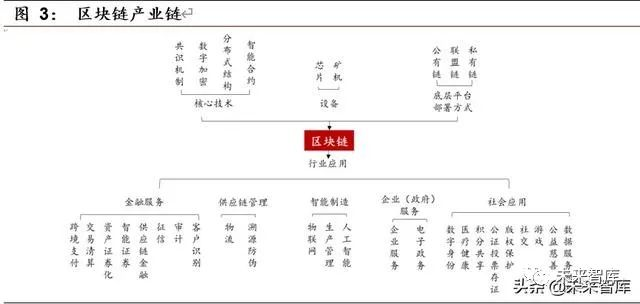

# 区块链产业调研

何东阳 2019011462 自96

## 1 行业概述

### 1.1 区块链行业特点

第46届世界经济论坛达沃斯年会将区块链与人工智能、自动驾驶等一并列入“第四次工业革命。这是一项崭新的技术，自2008年中本聪在他的《比特币白皮书》中提出区块链的概念起，计算机和金融从业者开始接触并了解到这项技术，经过十年的时间，衍生出了一个庞大的信息产业—区块链行业。

正如早期兴起的信息互联网行业一样，区块链行业的发展调动起了无数开发者的热情，他们借鉴比特币的思想，利用加密技术、去中心化网络和分布式系统等等早已被提出的计算机技术共同构建了一个新的王国。开发者们沉迷于自己幻想的网络乌托邦—区块链的去中心化属性中：区块链的技术能够为这些无政府主义者在一定程度上提供技术的保证，这一点我们将在第二章和第3.3节中提到；同时，一些嗅觉敏锐的投资者也意识到了区块链行业带来的价值，他们中不乏金融从业者，和一些希望分走后互联网时代剩下的一杯羹的投资人。开发者做出区块链的蛋糕，他们形成社区，共同发展；投资者加了很多甜腻的奶油进去，试图获得丰厚的回报，一个崭新的大蛋糕就这样被做出来了。

肉眼可见，自09年比特币流通起，如今其价值已达到60000美元/枚，这背后不仅仅是资本机构的炒作，还说明比特币确实在全球范围内获得了一定程度的共识，也说明了比特币背后的区块链技术获得了投资者的共识。金融市场会周期性地出现较大的风险，这个问题在比特币交易中也被暴露了出来，但是随着时间的推移，无数的山寨货币价值归零，比特币仍然屹立不倒。这十年间，区块链行业也出现了很多其他的新鲜技术，包括具有智能合约功能的以太坊—开发者们在这项技术上寄托了自己对去中心化互联网的想象、非同质化代币—元宇宙的入场券、DAO—企业管理新方案等等。这些技术让我们意识到：区块链行业正在悄悄地发生巨变，无数富有想象力的应用场景正在或者即将改变世界。

目前的区块链行业正处于上升期，区块链基础设施正在被逐渐完善，许多应用也层出不穷的出现。其中大部分技术是由独立开发团队研发而成，而非被大公司垄断。近期，尤其在欧美地区掀起了一股区块链热潮，在国内由于政府对虚拟货币交易的管控，普罗大众似乎没有显现出过大的兴趣，但是技术开发者们仍然在热火朝天的工作着。

### 1.2 行业发展概况

疫情催化下，政府加强公共空间管理和封锁，商业模式改变，数字化变革点燃的星星之火愈演愈烈。数字化变革促进区块链行业发展，在疫情的背景下促进更多商业应用场景落地。区块链较短的发展历史也能使中国在此行业中占领发展高地，在国内形成更加完善的产业链，从而形成发展的良性循环。

图源网络

早期的区块链技术主要服务于金融行业，其为金融行业的交易提供了新的解决方案。在跨境支付的应用场景下，区块链为避免传统银行金融系统的低效、冗余、手续费高等问题提供新的思路。疫情过后，国家要求各企业尽快复工复产，政策多次提及供应链金融。通过在区块链上发行数字票据，可以提高资金运转效率；将可流转可融资的确认凭证登记到区块链上使得债权转让得到多方共识从而降低操作难度；分布式共享账本存储和共享非商业机密数据并让数据在链上实现可信流转；区块链难以篡改的特征一定程度上保证供应链交易信息的真实性从而减少贷前的风控投入。

目前区块链产业正处于区块链2.0阶段，也就是以以太坊为代表的智能合约技术。智能合约支持开发者在区块链上运行自己的程序，这一富有想象力的技术可能会出现颠覆性的产业应用。

区块链3.0是基于去中心化的可编程社会，开发者们将不局限于金融货币，在社会、医疗、教育等行业都全面的推行区块链技术，最近大火的"元宇宙"就是对区块链3.0的一种设想。

## 2 技术分析

### 2.1 密码学

密码学是研究编制密码和破译密码的技术科学。研究密码变化的客观规律，应用于编制密码以保守通信秘密的，称为编码学；应用于破译密码以获取通信情报的，称为破译学，总称密码学。密码学是区块链技术的基石，为去中心化交易提供了技术保证。在区块链上，每一个区块都会经过哈希函数转换为一串数码，这串数码会被保存在下一个区块的数据中，实现区块之间的连接。加密算法保证了区块链的信息安全，促进了价值流通。

应用之一的消息认证码和数字签名技术通过对消息的摘要进行加密，可用于消息防篡改和身份证明问题。

数字签名技术基于非对称加密，既可以用于证实某数字内容的完整性，又同时可以确认来源（或不可抵赖，Non-Repudiation）。

### 2.2 分布式系统

## 3 行业现状

### 3.1 行业宏观数据展示

### 3.2 企业案例分析

### 3.3 应用分析

#### 3.3.1 金融业务

区块链尚不适合传统零售支付等高并发场景，适合对信息可信共享要求较 高、对并发量要求较低的领域，因为区块链需要同步储存大量冗余数据以及共同计算，将牺牲系统处理效能和客户的部分隐私。支付清算是区块链应用热度及成熟度仅次于数字货币的金融领域，其中尤其以跨境支付领域为典型代表。支付清算流程是典型的多中心场景，与区块链特性匹配度较高。国内外市场主体开始尝试将区块链技术应用于跨境支付场景，部分中央银行对区块链（DLT）技术作为大额支付系统的备选技术方案开展了测试。

Ripple 是跨境支付区块链应用最早、也是最成熟的解决方案。Ripple 由Ripple 实验室于 2012 年开发出来，是一个开源的用于金融交易结算的互联网协议。截至 2017 年底，Ripple 已实现横跨 27 个国家的实时全球支付， 全球知名银行中不少都在参与 Ripple 的技术测试与相关合作。目前 Ripple 体系可以降低涉及到代理行和 SWIFT 所产生的流动性损失、支付费用、换汇费用以及资金运作费用。根据 Ripple 估算，银行间每笔交易的成本将从5.56 美元下降到 2.21 美元，降低 60，以 2016 年通过 SWIFT 完成的 30 多亿次支付类报文数量计算，2016 年可以节约大约 100 亿美元的费用。

#### 3.3.2 非同质化数字资产

#### 3.3.3 区块链游戏

#### 3.3.4 DAO

#### 3.3.5 元宇宙

## 4 政策分析

复工复产期间，政策多次提及供应链金融。 2 月 18 日，工信部发布《关于运用新一代信息技术支撑服务疫情防控和复工复产工作的通知》，强调通过加强科技能力，基于线上化服务等模式，推广应用供应链金融，保障企业复工复产的资金需求，防止出现资金链断裂。

10 月 24 日，最高层集体学习区块链以来，区块链备受关注，相关政策密集出台，行业标准逐步落地。 1024 会议后，国家层面出台区块链相关政策步伐进一步加快， 根据 IPRI 统计，2019 年全年中央各部委发布区块链相关扶持政策信息多达 45 则，仅在 2020 年 1 月，有 11 则促进区块链和各领域结合的政策信息出台，且区块链在众多技术排序中逐步靠前。 2 月 5 日，被称作 “国内金融行业首个区块链标准”的 《金融分布式账本技术安全规范》 正式出炉。与此前相比，本次《规范》主要针对金融行业，对分布式账本的用户管理、监管支撑、隐私保护等方面提出更高要求。金融区块链在架构设计、模块功能、软件接口等各方面都有参考基准，而这些基准走在世界前列。同时，中国人民银行数字货币研究所区块链课题组也以“ 区块链技术的发展与管理 ” 为题撰文，理清区块链的“是与非”和“真伪应用”。在疫情期间，区块链技术在助推企业融资过程中也进一步发挥作用。

中国监管部门在 2013 年迅速发布相关警示： 2013 年 12 月 5 日，中国人民银行等五部委发布《关于防范比特币风险的通知》，把比特币定位为虚拟商品，不具有与货币等同的法律地位，不能且不应作为货币在市场上流通使用，还要求各金融机构和支付机构不得开展与比特币相关的业务 。

随着各方对比特币及其底层技术了解和研究的加深，区块链技术的价值很快得到认可。 2016 年 10 月 18 日，由工业和信息化部及国家标准化管理委员会指导、中国区块链技术和产业发展论坛编写的《中国区块链技术和应用发展白皮书（ 2016 ）》 4 正式发布，报告分析了区块链的核心关键技术，探讨了多个应用场景，并首次提出我国区块链技术发展路线图和标准化路线图。

国务院在 2016 年 12 月 17 日发布《 “ 十三五”国家信息化规划》 5 ，明确了区块链技术的国家战略意义，并将其列入国家级信息规划之中。 2020 年 4 月 20 日，国家发改委在新闻发布会上提出新型基础建设（新基建）的概念 6 ，区块链成为信息基础建设的一个关键要素。

**中共中央政治局2019年10月24日下午就区块链技术发展现状和趋势进行第十八次集体学习。** **中共中央总书记习近平在主持学习时强调，区块链技术的集成应用在新的技术革新和产业变革中起着重要作用。** **我们要把区块链作为核心技术自主创新的重要突破口** ，明确主攻方向，加大投入力度，着力攻克一批关键核心技术，加快推动区块链技术和产业创新发展。

习近平总书记指出， **区块链技术应用已延伸到数字金融、物联网、智能制造、供应链管理、数字资产交易等多个领域。** 目前，全球主要国家都在加快布局区块链技术发展。

**2020年4月20日，在国家发改委举行的例行新闻发布会上，区块链被列为新型基础设施中的信息基础设施。**

** 《经济学人》曾在2015年10月的封面文章《信任的机器》中介绍区块链——“比特币背后的技术有可能改变经济运行的方式”。**

## 5 发展预测

长远来看，区块链技术极大促进了信息资源的分享。

## 参考资料

<<<<<<< HEAD
https://www.shangyexinzhi.com/article/1648975.html
=======
[^1 ]: 区块链行业深度研究报告https://www.shangyexinzhi.com/article/1804506.html

>>>>>>> 1a5f38919b209ddcfca119fd5e0b5483b13dc76c
