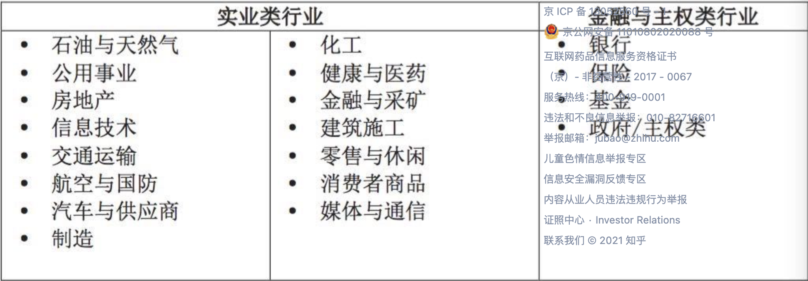
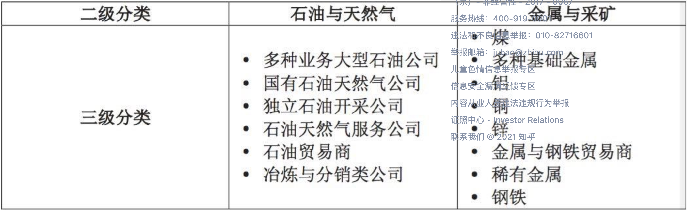
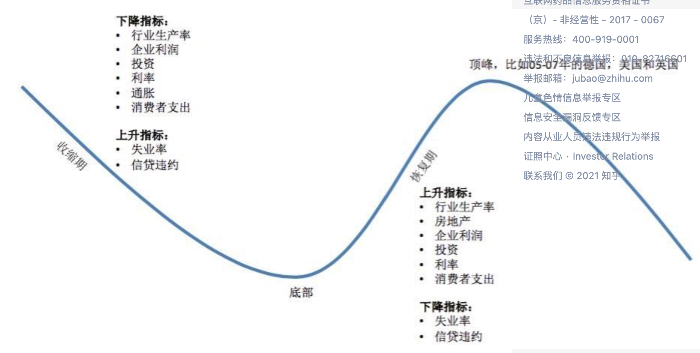
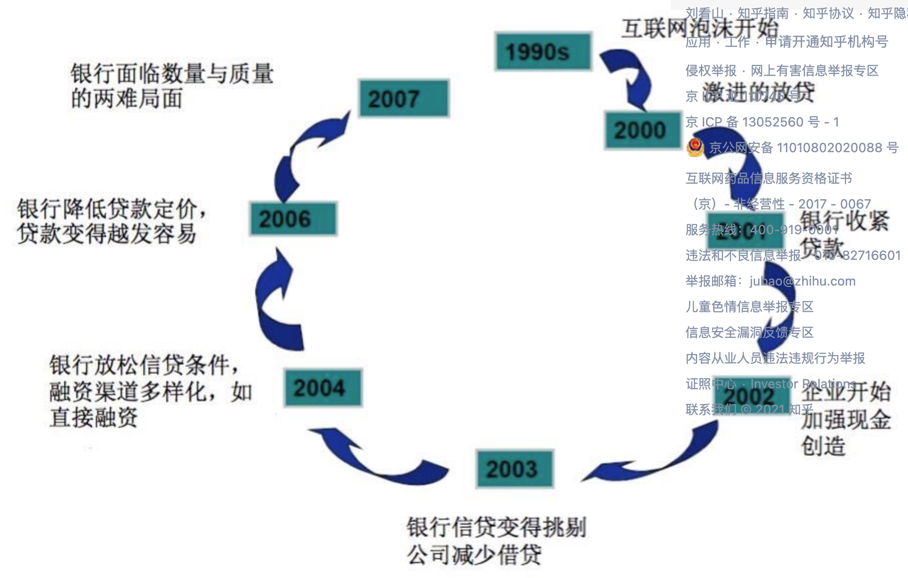
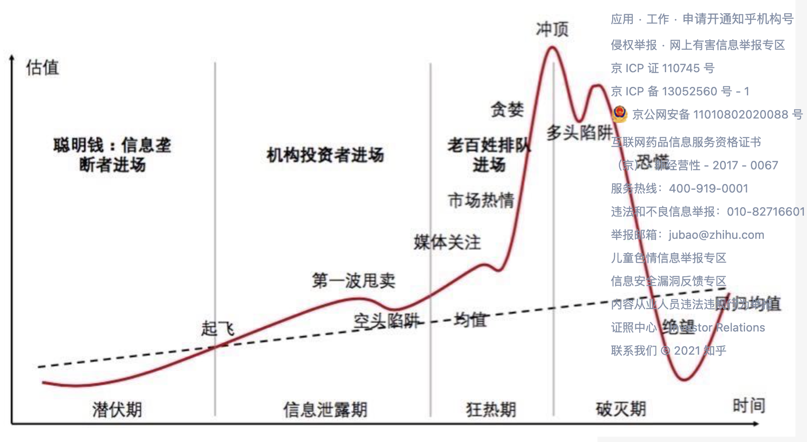

根据行业本质的不同，我们首先把行业分为实业类行业（ Corporate Industry  ）与金融或主权类行业（ Financial Institution  /  Public Sector  ），暂且称为**一级分类**，

以上细分行业为二级分类，还可以继续细分，进行三级分类：

思考宏观方向，给出直觉评分，再进行分析。

分析时考虑周期和系统，某些关键指标可以得出目前我们位于周期的哪一个阶段：

而经济周期结合行业，我们会发现，**有些行业比较敏感，会较早地被经济周期所影响，有些行业反应则比较迟钝**。

1. 一些早期就会被影响的行业有：汽车与供应商、建筑材料、房地产、零售与餐馆等；

2. 在经济周期中相对稳定的行业有：健康与医药、饮食与烟草、消费者类产品以及公用事业；

3. 最后，在经济周期中较晚被影响的行业包括：金属与采矿、化工、石油与天然气、电信、航空、造纸、信息科技、广播与媒体以及出版印刷等。

因此行业还可以分为：

1. **周期性行业**（Cyclical，可以理解为非日常生活必须的行业  - Discretionary  ）：这种行业波动性较强，与经济周期的相关性高，当整体周期处于上升阶段的时候，这个行业往往发展得比较好；反之亦然。比如汽车行业、旅游、高端时装、航空

2. **非周期性行业**（  Non-Cyclical  ，日常生活必须的  - Necessity  ）：如电力、供水、快速消费品行业。

部分较弱的公司无法熬到行业周期的拐点。部分行业的公司需要较多的现金储备应对技术变革（如汽车行业）

季节性因素也会影响行业（不要纠结于一个公司某个季度的财报）。

信贷周期与经济周期类似：循环见下图：

泡沫不一定就是不好的：郁金香狂热、英国铁路泡沫、日本房地产泡沫

几个泡沫的重要组成因素：

1. 资产价格的迅速攀升——往往伴随短时间内两位数的增长，与基本面价值快速脱离

2. 同时期大规模的投资与投机——泡沫期无论进与出，总是有着大量资金的参与，无论是聪明钱（  smart money  ）或是老百姓的血汗钱。这个涉及到了阴谋论来解释泡沫，图 8 展示了投机性泡沫的完整周期，可以看到每一个环节参与泡沫投资或投机的主体都不同，从最开始潜伏期聪明钱的参与（信息垄断者），到最后老百姓的接单（江湖人称韭菜）

3. 泡沫期总是会出现一些特定的投资标的行业、公司或某种资产，从各方面来看都有着极好的未来，缺少的恰恰是明确的盈利前景（如互联网泡沫时代的高科技公司，英国铁路泡沫中的铁路行业，等等）。

4. 高杠杆（郁金香狂热中的期权，南海公司事件中的低比例首付与分期，20 世纪 20 年代美国股市泡沫，日本房地产泡沫以及亚洲金融危机期间的银行积极信贷支持，等等）

5. 政府有意（或无意）的参与和影响（无论是泡沫形成期——政府助长，或是泡沫的破灭期——政府捅破）

关于泡沫理论的一本书：《就业、利息和货币通论》—凯恩斯

之后就是书的内容了，但是由于我是想研究行业的调研而不是经济系统分析，所以略去下面内容。