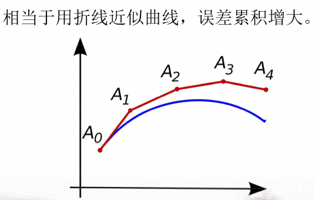
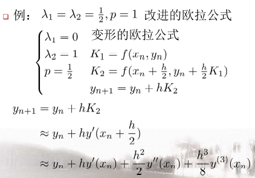
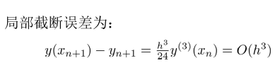

## 常微分方程数值解

### 第一节 引言

- 基本思路：
  1. 数值积分法
  2. 数值微分法

### 第二节 欧拉法

一、欧拉方法
$$
\left\{\begin{aligned}
y^{\prime} &=f(x, y) \\
y\left(x_{0}\right) &=y_{0}
\end{aligned}\right.
$$
​		用向前差商公式近似导数:
$$
\begin{aligned}
y^{\prime}\left(x_{n}\right) & \approx \frac{y\left(x_{n+1}\right)-y\left(x_{n}\right)}{h} \\
\Rightarrow y_{n+1} &=y_{n}+h f\left(x_{n}, y_{n}\right)
\end{aligned}
$$
​		依次求 $y_{1}, y_{2}, \cdots$

​																

​		误差分析：

​		局部截断误差，即假设 $y_{n}=y\left(x_{n}\right)$ 时的 $y\left(x_{n+1}\right)-y_{n+1}$

​		Taylor展开：
$$
\begin{aligned}
&y\left(x_{n+1}\right)=y\left(x_{n}\right)+h y^{\prime}\left(x_{n}\right)+\frac{h^{2}}{2} y^{(2)}\left(x_{n}\right)+\cdots \\
&y\left(x_{n+1}\right)-y_{n+1} \approx \frac{h^{2}}{2} y^{(2)}\left(x_{n}\right)=O\left(h^{2}\right)
\end{aligned}
$$
​		**一阶精度**		

​		当**分析累积误差**时, 可近似有：
$$
\begin{aligned}
\Delta_{n+1} & \approx \Delta_{n}+h \frac{\partial f}{\partial y} \Delta_{n}+\frac{h^{2}}{2} y^{(2)}\left(x_{n}\right)\\
& \approx \Delta_{n}+\frac{h^{2}}{2} y^{(2)}\left(x_{n}\right) \\
&=\frac{h^{2}}{2} \sum_{i} y^{(2)}\left(x_{i}\right) \\
& \approx \frac{h}{2}\left[y^{\prime}\left(x_{n+1}\right)-y^{\prime}\left(x_{0}\right)\right]
\end{aligned}
$$
​		考虑方法误差、存储/舍入误差[^1 ]： $\exists \xi_{n}, \zeta_{n}$
$$
\Delta_{n+1}=\Delta_{n} \underbrace{\left[1+h \cdot \frac{\partial f}{\partial y}\left(x_{n}, \xi_{n}\right)\right]}_{\Delta_{n} \text { 对下一步的影响 }}+\underbrace{\frac{h^{2}}{2} y^{(2)}\left(\zeta_{n}\right)}_{\text {局部截断误差 }}
$$
​		若 $\left|\frac{\partial f}{\partial y}(x, y)\right| \leq M,\left|y^{(2)}(x)\right| \leq L$ 则有 $\Delta_{n+1} \leq(1+h M) \Delta_{n}+\frac{h^{2}}{2} L$

​		可有
$$
\begin{array}{r}\Delta_{n+1}+\frac{1}{h M} \cdot \frac{L h^{2}}{2} \leq(1+h M)\left[\Delta_{n}+\frac{1}{h M} \cdot \frac{L h^{2}}{2}\right] \\ \leq \cdots \leq\underbrace{(1+h M)^{n+1}}_{常数，由极限得}\left[\Delta_{0}+\frac{1}{h M} \cdot \frac{L h^{2}}{2}\right]\end{array}
$$
二、后退的欧拉公式

​		用向后差商来近似导数 $y^{\prime}\left(x_{n+1}\right) \approx \frac{y\left(x_{n+1}\right)-y\left(x_{n}\right)}{h}$

​		隐性公式: 要借助其他方法得到 $y_{n+1}^{(0)}$[^3 ]
$$
\begin{aligned}
y_{n+1}^{(k+1)} &=y_{n}+h f\left(x_{n+1}, y_{n+1}^{(k)}\right), k=0,1, \cdots \\
y_{n+1} &=\lim _{k \rightarrow \infty} y_{n+1}^{(k)}
\end{aligned}
$$
​		迭代公式数值稳定性好，因$\Delta^{(k+1)}=h \frac{\partial f}{\partial y} \Delta^{(\mathrm{k})}$，其中$h \frac{\partial f}{\partial y}$ 较小就可以得到收敛。

​		局部截断误差：
$$
\begin{aligned}
&y_{n}=y\left(x_{n}\right) \\
&\quad=y\left(x_{n+1}\right)-h y^{\prime}\left(x_{n+1}\right)+\frac{h^{2}}{2} y^{(2)}\left(x_{n+1}\right)+\cdots \\
&y\left(x_{n+1}\right)-y_{n+1} \approx-\frac{h^{2}}{2} y^{(2)}\left(x_{n+1}\right)
\end{aligned}
$$
​		**一阶精度**

三、欧拉两步公式

​		用中间差商近似导数：
$$
\begin{aligned}
y^{\prime}\left(x_{n}\right) &=\frac{y\left(x_{n+1}\right)-y\left(x_{n-1}\right)}{2 h} \\
\Rightarrow y_{n+1} &=y_{n-1}+2 h f\left(x_{n}, y_{n}\right)
\end{aligned}
$$
​		用其它方法 (如欧拉法) 得到 $y_{1}$, 然后用 $y_{0}, y_{1}$ 计算 $y_{2}$, 再 $y_{3}, y_{4}, \cdots$

​		局部截断误差：
$$
\begin{aligned}
\text { 设 } y_{n-1} &=y\left(x_{n-1}\right), y_{n}=y\left(x_{n}\right) \\
y_{n-1} &=y_{n}-h y^{\prime}\left(x_{n}\right)+\frac{h^{2}}{2} y^{(2)}\left(x_{n}\right)-\frac{h^{3}}{3 !} y^{(3)}\left(x_{n}\right)+\cdots \\
y\left(x_{n+1}\right) &=y_{n}+h y^{\prime}\left(x_{n}\right)+\frac{h^{2}}{2} y^{(2)}\left(x_{n}\right)+\frac{h^{3}}{3 !} y^{(3)}\left(x_{n}\right)+\cdots \\
y_{n+1} &=y_{n-1}+2 h y^{\prime}\left(x_{n}\right) \\
\Rightarrow y\left(x_{n+1}\right)-y_{n+1} & \approx \frac{h^{3}}{3} y^{(3)}\left(x_{n}\right)=O\left(h^{3}\right)
\end{aligned}
$$
​		**二阶精度**		

​		累积误差：
$$
\begin{aligned}
\Delta_{n+1} & \approx \Delta_{n-1}+2 h \frac{\partial f}{\partial y}\left(x_{n}, y_{n}\right) \Delta_{n}+\frac{h^{3}}{3} y^{(3)}\left(x_{n}\right) \\
& \approx \Delta_{n-3}+2 h \frac{\partial f}{\partial y}\left(x_{n-2}, y_{n-2}\right) \Delta_{n-2} \\
&+2 h \frac{\partial f}{\partial y}\left(x_{n}, y_{n}\right) \Delta_{n-2}+\frac{h^{3}}{3}\left[y^{(3)}\left(x_{n}\right)+y^{(3)}\left(x_{n-2}\right)\right] \\
& \approx \cdots \approx \begin{cases}0+C_{1} \Delta_{1}+C_{2} h^{2} & \mathrm{n} \text { 为奇 } \\
\Delta_{1}+C_{2} h^{2} & \mathrm{n} \text { 为偶 }\end{cases}
\end{aligned}
$$
四、改进的欧拉法

1. 梯形公式：积分法
   $$
   \begin{aligned}
   &y\left(x_{n+1}\right)-y\left(x_{n}\right)=\int_{x_{n}}^{x_{n+1}} y^{\prime}(x) d x=\int_{x_{n}}^{x_{n+1}} f(x, y) d x \\
   &\approx \frac{h}{2}\left[f\left(x_{n}, y\left(x_{n}\right)\right)+f\left(x_{n+1}, y\left(x_{n+1}\right)\right)\right] \\
   &\begin{aligned}
   \Rightarrow y_{n+1} &=y_{n}+\frac{h}{2}\left[f\left(x_{n}, y_{n}\right)+f\left(x_{n+1}, y_{n+1}\right)\right] \\
   &=\frac{\text { 欧拉公式 }+\text { 后退欧拉公式 }}{2}
   \end{aligned}
   \end{aligned}
   $$

​		改进欧拉精度更高

2. 改进的欧拉法

   预测: $\bar{y}_{n+1}=y_{n}+h f\left(x_{n}, y_{n}\right)$
   校正: $y_{n+1}=y_{n}+\frac{h}{2}\left[f\left(x_{n}, y_{n}\right)+f\left(x_{n+1}, \bar{y}_{n+1}\right)\right]$

   分析**局部截断误差**

   设 $y_{n}=y\left(x_{n}\right), \bar{y}_{n+1}=y\left(x_{n+1}\right)$ (若有误差又如何？）
   分析 $y\left(x_{n+1}\right)-y_{n+1}$
   $$
   \begin{aligned}
   y\left(x_{n+1}\right)=& y_{n}+h y^{\prime}\left(x_{n}\right)+\frac{h^{2}}{2} y^{(2)}\left(x_{n}\right)+\frac{h^{3}}{3 !} y^{(3)}\left(x_{n}\right)+\cdots \\
   y_{n+1}=& y_{n}+\frac{h}{2}\left[y^{\prime}\left(x_{n}\right)+y^{\prime}\left(x_{n+1}\right)\right] \\
   =& y_{n}+\frac{h}{2}\left[y^{\prime}\left(x_{n}\right)+y^{\prime}\left(x_{n}\right)+h y^{(2)}\left(x_{n}\right)\right.\\
   &\left.+\frac{h^{?}}{2} y^{(3)}\left(x_{n}\right)+\cdots\right] \\
   y\left(x_{n+1}\right) &-y_{n+1} \approx-\frac{h^{3}}{12} y^{(3)}\left(x_{n}\right)=O\left(h^{3}\right) \\
   \text { 二阶精度 } &
   \end{aligned}
   $$
   改进欧拉法:
   $$
   \left\{\begin{array}{l}
   y_{n+1}=y_{n}+h f\left(x_{n}, y_{n}\right) \\
   y_{n+1}=y_{n}+\frac{h}{2}\left[f\left(x_{n}, y_{n}\right)+f\left(x_{n+1}, \bar{y}_{n+1}\right)\right]
   \end{array}\right.
   $$
   方法累积误差:
   $$
   \left\{\begin{array}{l}
   \bar{\Delta}_{n+1} \leq(1+h M) \Delta_{n}+\frac{L}{2} h^{2} \\
   \Delta_{n+1} \leq \Delta_{n}+\frac{h}{2} M \Delta_{n}+\frac{h}{2} M \bar{\Delta}_{n+1}+\frac{T \cdot h^{3}}{12}
   \end{array}\right.
   $$
   $$
   \Rightarrow \Delta_{n+1} \leq\left(1+h M+\frac{h^{2}}{2} M^{2}\right) \Delta_{n}+\left(\frac{L M}{4}+\frac{T}{12}\right) h^{3}
   $$

   其中 $\left|\frac{\partial f}{\partial y}(x, y)\right| \leq M,\left|y^{(2)}(x)\right| \leq L,\left|y^{(3)}(x)\right| \leq T$

   舍入误差累积:
   $\begin{cases}\bar{\delta}_{n+1} & \leq(1+h M) \delta_{n}+\frac{1}{2} \cdot 10^{-m} \\ \delta_{n+1} & \leq \delta_{n}+\frac{h}{2} M \delta_{n}+\frac{h}{2} M \bar{\delta}_{n+1}+\frac{1}{2} \cdot 10^{-m}\end{cases}$
   $\Rightarrow \delta_{n+1} \leq\left(1+h M+\frac{h^{2}}{2} M^{2}\right) \delta_{n}+\left(1+\frac{h M}{2}\right) \cdot \frac{1}{2} \cdot 10^{-m}$
   $h \downarrow \rightarrow \Delta_{n+1} \downarrow, \delta_{n+1} \uparrow$ 关键: $\mathrm{m}$ 的选取

   对给定整体误差要求：

   对半分，一半是方法累计误差，得到$N(h)$，一半是舍入累积误差，得到$m$[^4 ]

### 第三节：龙格-库塔法 (R-K法)

将欧拉公式进行推广: 在 $\left[x_{n}, x_{n+1}\right]$ 上多取几点, 计算各点近似斜率, 加权平均, 作为 $\left[x_{n}, x_{n+1}\right]$ 上平均斜率一精度高
$$
\begin{array}{cc}
x_{n+p}=x_{n}+p h & 0<p<1 \\
x_{n+q}=x_{n}+q h & p<q<1 \\
& \cdots
\end{array}
$$
计算各点斜率 $K_{1}-f\left(x_{n}, y_{n}\right)$ 已知
$$
\begin{aligned}
K_{2}=& f\left(x_{n+p}, y_{n}+p h K_{1}\right) \\
K_{3}=& f\left(x_{n+q}, y_{n}+q h\left(r K_{1}+s K_{2}\right)\right) \\
& \cdots \\
y_{n+1}=& y_{n}+h\left[\lambda_{1} K_{1}+\lambda_{2} K_{2}+\cdots\right] \\
& \sum \lambda_{i}=1
\end{aligned}
$$
**二阶龙格-库塔公式**
$$
y_{n+1}=y_{n}+h\left[\lambda_{1} K_{1}+\lambda_{2} K_{2}\right]
$$
待定常数 $p, \lambda_{1}, \lambda_{2}\left(K_{2}=f\left(x_{n+p}, y_{n}+p h K_{1}\right)\right)$ 假设 $y_{n}=y\left(x_{n}\right)$ (局部截断误差分析，使得精度足够大)
$$
\begin{aligned}
y\left(x_{n+1}\right)=& y\left(x_{n}\right)+h f\left(x_{n}, y\left(x_{n}\right)\right) \\
&+\left.\frac{h^{2}}{2}\left(\frac{\partial f}{\partial x}+\frac{\partial f}{\partial y} \cdot y^{\prime}\right)\right|_{x_{n}}+\cdots
\end{aligned}
$$
注意: 其中 $f\left(x_{n}, y\left(x_{n}\right)\right)=y^{\prime}\left(x_{n}\right)$
$$
\left.\left(\frac{\partial f}{\partial x}+\frac{\partial f}{\partial y} \cdot y^{\prime}\right)\right|_{x_{n}}=y^{(2)}\left(x_{n}\right)
$$

$$
\begin{aligned}
y_{n+1}=& y_{n}+h\left[\lambda_{1} f\left(x_{n}, y_{n}\right)+\lambda_{2} f\left(x_{n+p}, y_{n}+p h K_{1}\right)\right] \\
=& y\left(x_{n}\right)+h\left\{\lambda_{1} f\left(x_{n}, y\left(x_{n}\right)\right)+\lambda_{2}\left[f\left(x_{n}, y\left(x_{n}\right)\right)\right.\right.\\
+&\left.\left.\left.p h \frac{\partial f}{\partial x}\right|_{x_{n}}+\left.p h K_{1} \cdot \frac{\partial f}{\partial y}\right|_{x_{n}}\right]\right\}+\cdots \\
=& y\left(x_{n}\right)+h\left[\left(\lambda_{1}+\lambda_{2}\right) \int\left(x_{n}, y\left(x_{n}\right)\right)\right] \\
&+\lambda_{2} p h^{2}\left[\left.\left(\frac{\partial f}{\partial x}+\frac{\partial f}{\partial y} \cdot y^{\prime}\right)\right|_{x_{n}}\right]+\cdots
\end{aligned}
$$

若有二阶精度 $\mathrm{O}\left(h^{3}\right)$
$$
\Rightarrow\left\{\begin{array}{r}
\lambda_{1}+\lambda_{2}=1 \\
\lambda_{2} p=\frac{1}{2}
\end{array}\right.
$$
**例子**

- 经典的四阶龙格-库塔公式

$$
\begin{aligned}
y_{n+1} &=y_{n}+\frac{h}{6}\left[K_{1}+2 K_{2}+2 K_{3}+K_{4}\right] \\
K_{1} &=f\left(x_{n}, y_{n}\right) \\
K_{2} &=f\left(x_{n}+\frac{h}{2}, y_{n}+\frac{h}{2} K_{1}\right) \\
K_{3} &=f\left(x_{n}+\frac{h}{2}, y_{n}+\frac{h}{2} K_{2}\right) \\
K_{4} &=f\left(x_{n+1}, y_{n}+h K_{3}\right) \\
y\left(x_{n+1}\right) &-y_{n+1}=O\left(h^{5}\right)
\end{aligned} \text { 四阶精度 }
$$

## 补充

[^1 ]:$\Delta_0$​通常为0
[^2 ]:  二阶导为$f^{\prime}(x,y)$
[^3 ]: 括号里的数字是计算时迭代的轮数
[^4 ]: 复习时还须注意这里的说辞