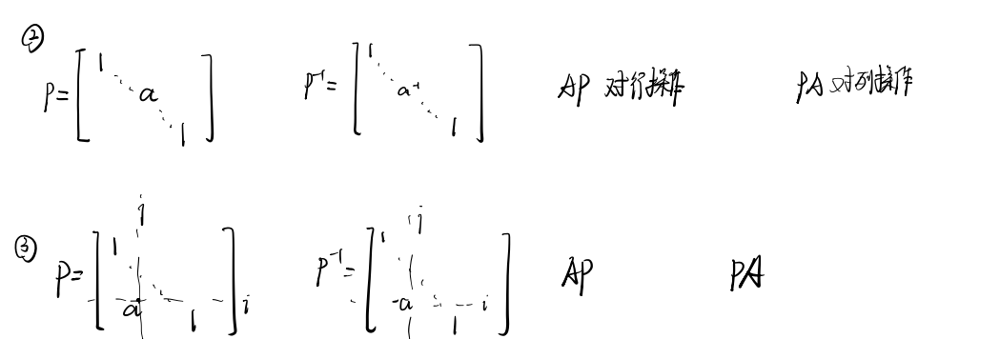

## 第七章 线性方程组的数值解

$A x=b, \mathrm{~A}$ 可逆时, 有两大类方法:

- 直接法: 当 $\mathrm{A}$ 为低阶矩阵

- 迭代法: 当$\mathrm{A}$ 为大型稀疏矩阵

若A不可逆, 则属于**广义逆**问题，此课不考虑:
有解问题为 $\min \|A x-b\|$
有唯一解 $\min || x||$

本节需要使用到矩阵运算操作：

### 第一节 高斯消去法

一、基本方法
经典解方程消元法。相当于对矩阵$\mathrm{A}$进行了矩阵分解（上三角下三角）

二、计算量

加减法 $\approx \frac{n^{3}}{3} \quad$ 乘除法 $\approx \frac{n^{3}}{3}$

三、应用条件：$a_{k k}^{(k)} \neq 0, k=1, \cdots, n$

**定理1**: 高斯消去法能进行的充分必要条件是系数矩阵 $\mathrm{A}$ 的各阶顺序主子式均不为 0。

四、高斯主元素消去法：挑系数最大的换到前面算

1. 列主元素消去
2. 行主元素消去
3. 全面主元素消去

五、矩阵的三角分解

**定理2**：如果矩阵A的 $1 \sim n-1$ 阶顺序主子式都不为 0 , 则 $A=L U$, 其中 $L$ 为单位下三角矩阵，$U$ 为上三角矩阵, 且分解唯一。

### 第二节 矩阵的三角分解法

一、直接法：$L U x=b \Rightarrow L y=b，U x=y$

二、追赶法：用于对角线方程组
$$
A=\left[\begin{array}{ccccc}
b_{1} & c_{1} & & & \\
a_{2} & b_{2} & c_{2} & & \\
& & \cdots & & \\
& & & a_{n-1} & b_{n-1} & c_{n-1} \\
& & & & a_{n} & b_{n}
\end{array}\right]
$$
三、平方根法：适合于对称正定矩阵（上三角和下三角转置相等）

### 第三节 范数与误差分析

一、向量范数

二、矩阵范数：每一个矩阵对应一个非负实数

三、误差分析

误差来源：

1. 系数扰动
   $$
   \begin{aligned}
   &\left.\begin{array}{l}
   A x=b \\
   A \Rightarrow A+\delta A \\
   b \Rightarrow b+\delta b
   \end{array}\right\} x \Rightarrow x+\delta x
   \end{aligned}
   $$
   ​												分析 $\frac{\|\delta A\|}{\|A\|}, \frac{\|\delta b\|}{\|b\|}$ 对 $\frac{\|\delta x\|}{\|x\|}$ 的影响

   1) $\delta A=0, \delta b \neq 0$ 时
      $$
      \frac{\|\delta x\|}{\|x\|} \leq\|A\| \cdot\left\|A^{-1}\right\| \cdot \frac{\|\delta b\|}{\|b\|}
      $$

   2) $\delta A \neq 0, \delta b=0$ 时
      $$
      \frac{\|\delta x\|}{\|x\|} \approx \frac{\|\delta x\|}{\|x+\delta x\|} \leq\left\|A^{-1}\right\| \cdot\|A\| \cdot \frac{\|\delta A\|}{\|A\|}
      $$

   3) $\delta A \neq 0, \delta b \neq 0$ 时
      $$
      \frac{\|\delta x\|}{\|x\|} \leqslant\left\|A\|\cdot\| A^{-1}\right\| \frac{\|\delta b\|}{\|b\|}+\|A\|\left\|A^{-1}\right\| \frac{\|\delta A\|}{\|A\|}
      $$

   记 $\operatorname{Cond}(A)=\|A\| \cdot\left\|A^{-1}\right\|$ 为条件数, 如果 $\operatorname{Cond}(\mathrm{A})$ 较大, 则 $\mathrm{A}$ 称为病态。

   $\operatorname{Cond}(A)$的性质列举

2. 舍入误差（解方程各步骤）

   如果 $\bar{x}$ 为 $A x=b$ 的一个近似解, $x^{*}$ 为精确解：
   $$
   \frac{\left\|x^{*}-\bar{x}\right\|}{\left\|x^{*}\right\|} \leq\|A\| \cdot\left\|A^{-1}\right\| \cdot \frac{\|b-A \bar{x}\|}{\|b\|}
   $$
   注: 误差来源可以是舍入误差的累积, 也可以是迭代法的方法误差所带来的

### 第四节 迭代法

迭代法: $x^{(k+1)}=B x^{(k)}+f$

迭代法复杂度是平方级别的。

一、雅克比迭代法：$A = D+L+U$

迭代公式：
$$
\begin{aligned}
&\text { 令 } B=-D^{-1}(L+U) \quad f=D^{-1} b \\
&\text { 则有 } x=B x+f \\
&\text { 迭代公式 } x^{(k+1)}=B x^{(k)}+f \\
&x_{i}^{(k+1)}=\frac{1}{a_{i i}}\left[b_{i}-\sum_{j=1, j \neq i}^{n} a_{i j} x_{j}^{(k)}\right]
\end{aligned}
$$
如果有对角线有0**交换行**就行。

每次更新时使用的是旧值，不用新值（**写代码时注意**）

二、高斯-赛德尔迭代法

每次更新时使用的是新值
$$
x_{i}^{(k+1)}=\frac{1}{a_{i i}}\left[b_{i}-\sum_{j=1}^{i-1} a_{i j} x_{j}^{(k+1)}-\sum_{j=i+1}^{n} a_{i j} x_{j}^{(k)}\right]
$$
从矩阵形式上看
									$x^{(k+1)}=D^{-1}\left[b-L x^{(k+1)}-U x^{(k)}\right]$
相当于 $(D+L) x^{(k+1)}=b-U x^{(k)}$
  					       $x^{(k+1)}=\underbrace{-(D+L)^{-1} U}_{B} x^{(k)}+\underbrace{(D+L)^{-1} b}_{f}$

三、迭代法的收敛性

- 定理3: 迭代法 $x^{(k+1)}=B x^{(k)}+f$ 对于任意 $x^{(0)}$ 都收敛的充分必要条件是 $\rho(B)<1$，其中, $\rho(B)=\max _{1 \leq i \leq n}\left|\lambda_{i}\right|$，谱半径

- 定理4: 迭代法收敛的充分条件是 $||B||<1$, 中 $||B||$ 是一种与向量范数相容的矩阵范数。
