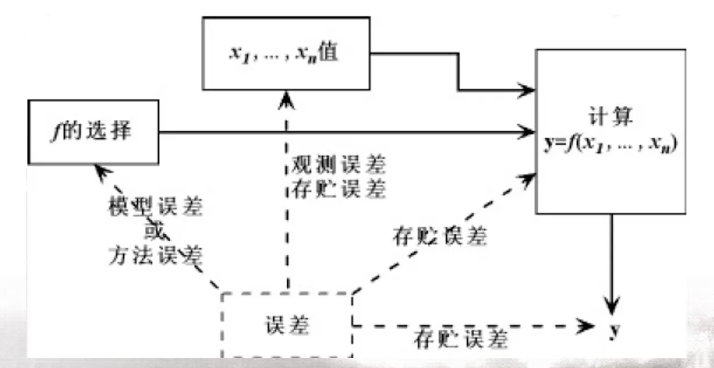
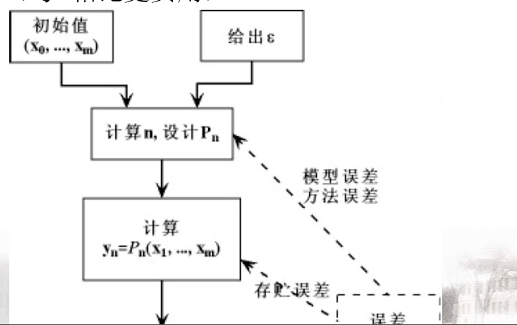
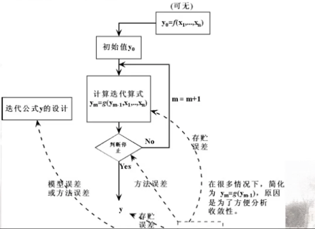

## 总结及第八章简介

- 会考一些很基础的内容，是关于**特征值的学习**

### A类型

对应: 插值, 逼近, 数值积分, 数值微分, 线性方程组直接法等

### B类型

对应: 插值，逼近，数值积分，常微分方程数值解 $(B+C)$等 $($ 与$A$相比更实用 $)$

### C类型

对应: 数值积分加速法，常微分方程 $(B+C)$, 方程求根, 线性方程组迭代法

### 矩阵特征值求解

一、特征值和特征向量（定义、性质）

设矩阵 $A \in R^{n \times n}$, 求 $\lambda \in C, x \in R^{n}$, 使得$A x=\lambda x$，等价于求A的特征方程 $\rho(\lambda)=\operatorname{det}(\lambda I-A)$ 的根

性质：

- $\lambda^{k}$ 为 $A^{k}$ 的特征值
- $\lambda^{-1}$ 为 $A^{-1}$ 的特征值
- 若 $\mathrm{A} 、 \mathrm{~B}$ 为相似矩阵, 即存在非奇异矩阵 $\mathrm{P}$ 使得 $B=P^{-1} A P$, 则 $A 、 B$ 的特征值相同; 若 $y$ 为 $B$ 的特征向量, 则 $P y$ 为 $A$ 的特征向量

二、幂法

设矩阵 $A \in R^{n \times n}$ 存 $\mathrm{n}$ 个线性无关的特征向量 $x_{1}, \cdots x_{n}$，对应特征值为 $\lambda_{1}, \cdots \lambda_{n}$, 已知 $\mathrm{A}$ 的主特征值 $\lambda_{1}$ 为实根且满足 $\left|\lambda_{1}\right|>$ $\left|\lambda_{2}\right| \geq \cdots \geq\left|\lambda_{n}\right|$

任取一非零向量 $v_{0}=\alpha_{1} x_{1}+\cdots+\alpha_{n} x_{n}$, 假设
$$
\begin{aligned}
&\alpha_{1} \neq 0, \text { 构造 } v_{k}=A v_{k-1}=A^{k} v_{0} \\
&v_{k}=\alpha_{1} \lambda_{1}^{k} x_{1}+\cdots+\alpha_{n} \lambda_{n}^{k} x_{n} \\
&=\lambda_{1}^{k}(\alpha_{1} x_{1}+\underbrace{\alpha_{2}\left(\frac{\lambda_{2}}{\lambda_{1}}\right)^{k} x_{2}+\cdots+\alpha_{n}\left(\frac{\lambda_{n}}{\lambda_{1}}\right)^{k} x_{n}}_{\epsilon_{k}})
\end{aligned}
$$

$$
\frac{\left(v_{k+1}\right)_{i}}{\left(v_{k}\right)_{i}}=\frac{\lambda_{1}^{k+1}\left(\alpha_{1} x_{1}+\epsilon_{k+1}\right)_{i}}{\lambda_{1}^{k}\left(\alpha_{1} x_{1}+\epsilon_{k}\right)_{i}} \stackrel{k}{\longrightarrow} \lambda_{1}
$$

三、反幂法

设矩阵 $A \in R^{n \times n}$ 有 $\mathrm{n}$ 个特征向量 $x_{1}, \cdots x_{n}$, 对 应特征值为 $\lambda_{1}, \cdots \lambda_{n}$, 满足
$$
\left|\lambda_{1}\right| \geq\left|\lambda_{2}\right| \geq \cdots \geq\left|\lambda_{n}\right|>0
$$
则 $A^{-1}$ 的特征值为
$$
\left|\frac{1}{\lambda_{n}}\right| \geq\left|\frac{1}{\lambda_{n-1}}\right| \geq \cdots \geq\left|\frac{1}{\lambda_{1}}\right|
$$
四、QR法

设非奇异矩阵 $A \in R^{n \times n}$, 则存在正交矩阵 $\mathrm{Q}$ 及上三角矩阵 $\mathrm{R}$, 使得 $\mathrm{A}=\mathrm{QR}$, 且当 $\mathrm{R}$ 对角线元素为正时, 分解唯一 。

令$B=R Q=$ 则 $\mathrm{A} 、 \mathrm{~B}$ 为相似矩阵, 特
$$
\left\{\begin{array}{c}A_{1}=A \\ A_{k}=Q_{k} R_{k}(Q R \text { 分解 }) \\ A_{k+1}=R_{k} Q_{k}=Q_{K}^{T} A_{k} Q_{k}\end{array}\right.
$$
设 $A \in R^{n \times n}$, 其特征值满足 $\left.\left|\lambda_{1}\right|>\left|\lambda_{2}\right|>\cdots\right\rangle$ $\left|\lambda_{n}\right|>0$, 其特征向量 $x_{1}, \cdots x_{n}$ 所构成的矩阵 $X=$ $\left[x_{1}, \cdots, x_{n}\right]$ 满足 $X^{-1}=L U \quad\left(X^{-1}\right.$ 有 $L U$ 分解 $)$, 则 $A_{k}$ 本质上收玫于上三角矩阵, 且					

​														$\lim _{k 	\rightarrow \infty} a_{i i}^{(k)}=\lambda_{i}, i=1, \cdots, n$

**看书**