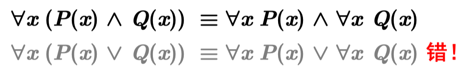
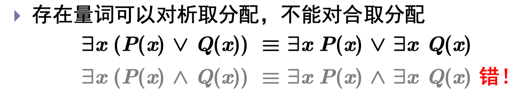

## 无信息搜索

- 开节点表、闭节点表
- 状态空间、动作空间、代价空间表示方法
- 

- 会考证明题吗？

- 迪杰斯特拉算法画图

  

  - 闭节点表维护太多节点

- 

- 绕来绕去的NP难题等概念
- 无信息搜索算法的复杂度分析
- 曼哈顿距离、欧式距离
- 启发函数$h(n)$的概念：到出口的距离

## 有信息搜索

- **最优性: 如果 $h(n)$ 是可采纳的, 则树搜索 $\mathrm{A}^{*}$ 算法是最优的
  最优性: 如果 $h(n)$ 是一致的, 则图搜索 $\mathrm{A} *$ 算法是最优的**

- **考试会考证明题吗？**

- 启发函数值越大，需要扩展的节点的路径代价越小

## 约束满足问题

- 状态、值域
- 

- CSP问题

- 回溯搜索法

  

- 节点相容（一元约束）、边相容（二元约束）、路径相容
- k-相容，如果对任何 k-1 个变量的相容赋值，第k个变量总能被赋予一个和它们相容的值， 则称这k-1 个变量对于第k个变量是k相容的

- 全局约束：可以排除一个单值变量

- 搜索中的推理

- 时序回溯、智能回溯

## 对抗搜索

### 极大极小搜索

- 与或树：对方走最小值，与；自己走最大值：或；选择就是与或的关系

### 剪枝

- 极大节点维护大阈值$\alpha$进行剪枝，用于极大层，在极大层计算，$\boldsymbol{\alpha}=\operatorname{MAX}\left(x_{1}, x_{2}, \ldots, x_{n}\right)$
- 极小节点维护小阈值$\beta$进行剪枝，用于极小层，在极小层计算，$\boldsymbol{\beta}=\operatorname{Min}\left(x_{1}, x_{2}, \ldots, x_{n}\right)$

- 详细过程是怎么样的，**还需理解**

  https://blog.csdn.net/qq_36612242/article/details/106425436

- 随机博弈会考吗？随机层的效用估计

## 命题逻辑

- 五种连接符

  

- 如果在所有使语句 $\alpha$ 为真的模型中, 语句 $\beta$ 也为真, 则称 $\alpha$ 蕴涵 $\beta(\alpha$ entails $\beta)$, 记为 $\alpha \vDash \beta$

### 演绎推理

- 演绎定理： For any sentences $\alpha$ and $\beta$，$\alpha \vDash \beta$ if and only if the sentence $\alpha \Rightarrow \beta$ is valid。

- 假言推理

  如果语句 $\alpha$ 为真, 且 $\alpha \Rightarrow \beta$, 则 $\beta$ 为真
  $(\alpha \wedge(\alpha \Rightarrow \beta)) \vDash \beta$

- **需要背各种推理的概念吗**：构造性二难、假言推理这些玩意儿？

- 前向链接：在限定子句上使用假言推理，匹配事实

### 归结原理

- 区分归结原理和归结算法：使用归谬法转换为证伪的命题即可

- 转换为**合取范式**的步骤

  

- 归结算法举例

  

## 谓词逻辑

- 全称量词隐含了合取关系

- 存在量词咋用，隐含了析取关系

- $$
  \forall \Rightarrow \text { 在一起, } \exists \wedge \wedge \text { 在一起 }
  $$

- 不同量词可以嵌套

- 量词的一些用法

  

- 语言的形式化

  

- 全称量词辖域收缩与扩张
- 全称量词可以对合取分配，不能对析取分配；存在量词可以对析取分配，不能对合取分配
  

​		