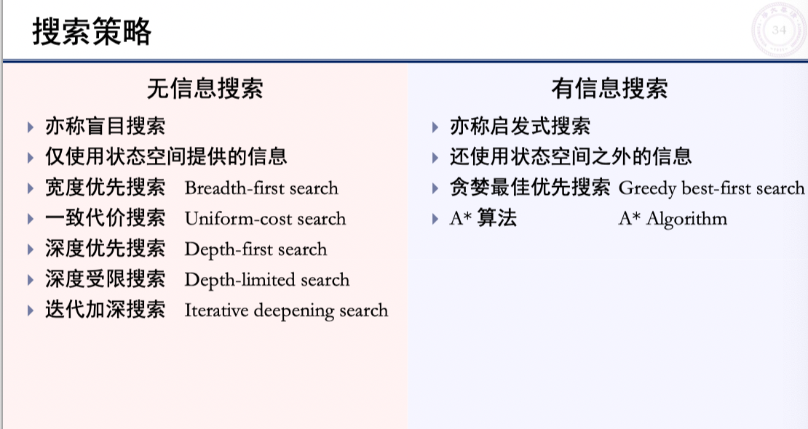
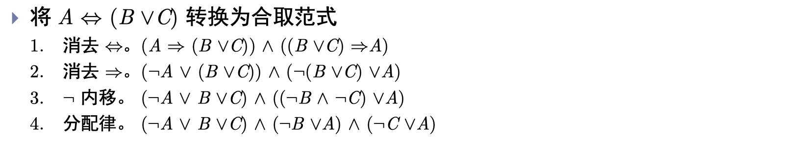

## 无信息搜索

- 开节点表、闭节点表
- 状态空间、动作空间、代价空间表示方法
- 

- 会考证明题吗？

- 迪杰斯特拉算法画图

  

  - 闭节点表维护太多节点

- 

- 绕来绕去的NP难题等概念
- 无信息搜索算法的复杂度分析
- 曼哈顿距离、欧式距离
- 启发函数$h(n)$的概念：到出口的距离

## 有信息搜索

- **最优性: 如果 $h(n)$ 是可采纳的, 则树搜索 $\mathrm{A}^{*}$ 算法是最优的
  最优性: 如果 $h(n)$ 是一致的, 则图搜索 $\mathrm{A} *$ 算法是最优的**

- **考试会考证明题吗？**

- 启发函数值越大，需要扩展的节点的路径代价越小

## 约束满足问题

- 状态、值域
- 

- CSP问题

- 回溯搜索法

  

- 节点相容（一元约束）、边相容（二元约束）、路径相容
- k-相容，如果对任何 k-1 个变量的相容赋值，第k个变量总能被赋予一个和它们相容的值， 则称这k-1 个变量对于第k个变量是k相容的

- 全局约束：可以排除一个单值变量

- 搜索中的推理

- 时序回溯、智能回溯

## 对抗搜索

### 极大极小搜索

- 与或树：对方走最小值，与；自己走最大值：或；选择就是与或的关系

### 剪枝

- 极大节点维护大阈值$\alpha$进行剪枝，用于极大层，在极大层计算，$\boldsymbol{\alpha}=\operatorname{MAX}\left(x_{1}, x_{2}, \ldots, x_{n}\right)$
- 极小节点维护小阈值$\beta$进行剪枝，用于极小层，在极小层计算，$\boldsymbol{\beta}=\operatorname{Min}\left(x_{1}, x_{2}, \ldots, x_{n}\right)$

- 详细过程是怎么样的，**还需理解**

  https://blog.csdn.net/qq_36612242/article/details/106425436

- 随机博弈会考吗？随机层的效用估计

## 命题逻辑

- 五种连接符

  

- 如果在所有使语句 $\alpha$ 为真的模型中, 语句 $\beta$ 也为真, 则称 $\alpha$ 蕴涵 $\beta(\alpha$ entails $\beta)$, 记为 $\alpha \vDash \beta$

### 演绎推理

- 演绎定理： For any sentences $\alpha$ and $\beta$，$\alpha \vDash \beta$ if and only if the sentence $\alpha \Rightarrow \beta$ is valid。

- 假言推理

  如果语句 $\alpha$ 为真, 且 $\alpha \Rightarrow \beta$, 则 $\beta$ 为真
  $(\alpha \wedge(\alpha \Rightarrow \beta)) \vDash \beta$

- **需要背各种推理的概念吗**：构造性二难、假言推理这些玩意儿？

- 前向链接：在限定子句上使用假言推理，匹配事实

### 归结原理

- 区分归结原理和归结算法：使用归谬法转换为证伪的命题即可

- 转换为**合取范式**的步骤

  

- 归结算法举例

  

## 谓词逻辑

- 全称量词隐含了合取关系

- 存在量词咋用，隐含了析取关系

- $$
  \forall \Rightarrow \text { 在一起, } \exists \wedge \wedge \text { 在一起 }
  $$

- 不同量词可以嵌套

- 量词的一些用法

  

- 语言的形式化

  

- 全称量词辖域收缩与扩张
- 全称量词可以对合取分配，不能对析取分配；存在量词可以对析取分配，不能对合取分配
  

- 综合使用举例

  

- 前束范式：语句中所有量词（不含否定词）都在最左边， 且这些量词的辖域都到公式最末端
  - 一阶逻辑中任何语句均可转换为与之等值的前束范式
  - 前束范式不唯一

- 全称量词的实例化：直接消去全称量词，待需要替换时再考虑置换为哪个对象

  

- 存在量词的实例化

​		

- 谓词逻辑的推理：转换为命题逻辑

  

  

- 广义假言推理

  

- 形式化+合取式+前向链接

​		

- **抽时间把逻辑一章好好梳理一下**

- 归结定理解谓词逻辑例题见第七章

## 线性回归

- 确定系数：样本方差有多大比例由回归模型解释

$$
\begin{aligned}
r^{2} &=\frac{\sum_{i=1}^{n}\left(\hat{y}_{i}-\bar{y}\right)^{2}}{\sum_{i=1}^{n}\left(y_{i}-\bar{y}\right)^{2}}=\frac{S_{x y}^{2}}{S_{x x} S_{y y}} \\
&=\frac{\text { 回归的平方和 }}{\text { 总平方和 }}
\end{aligned}
$$

- 样本方差有多大比例由回归模型解释
$0 \leq r^{2} \leq 1$
$r^{2}=1:$ all $y_{i} \mathrm{~s}$ are on the fitted line.
$r^{2} \approx 0$ : all $y_{i}$ s are far away from the fitted line.

- 条件正态模型

  

- 似然函数

  

- 最大似然估计

  找使似然函数值最大的参数值，最大似然估计与最小二乘法 的目标函数一致、结果相同，最小二乘法没有对残差建模
  $$
  \begin{aligned}
  \frac{\partial}{\partial w} l(w, b \mid \mathbf{x}, \mathbf{y}) &=\frac{1}{2 \sigma^{2}} \sum_{i=1}^{n}\left[\left(y_{i}-\bar{y}\right)-w\left(x_{i}-\bar{x}\right)\right] x_{i}=0 \\
  \frac{\partial}{\partial b} l(w, b \mid \mathbf{x}, \mathbf{y}) &=\frac{1}{2 \sigma^{2}} \sum_{i=1}^{n}\left[\left(y_{i}-w x_{i}\right)-b\right]=0
  \end{aligned}
  $$

$$
\begin{aligned}
&\hat{w}=\frac{S_{x y}}{S_{x x}} \\
&\hat{b}=\bar{y}-\hat{w} \bar{x}
\end{aligned}
$$

- $\sum_{i=1}^{n}\left(x_{i}-\bar{x}\right)=0$

- **线性无偏估计量要考吗**？

  

- 假设检验、方差未知这几种情况要考吗？

​                  		

- 建立变量之间的联系

  

- 测试方法：MAE，MSE，RMSE

- 解析解

  

​                                                                                   

- 预测的偏差与方差

  

- 简单模型欠拟合（偏差大、方差小，用更复杂的模型）、复杂模型过拟合（偏差小、方差大，增加训练数据量，用更简单的模型）

- 正则化

  

### 线性回归

- 逻辑回归的似然函数：

- $$
  \begin{aligned}
  \max \sum_{i=1}^{n}\left(y_{i} \log \pi\left(x_{i}\right)+\left(1-y_{i}\right) \log \left(1-\pi\left(x_{i}\right)\right)\right) & \\
  \max \prod_{i=1}^{n}\left(\pi\left(x_{i}\right)\right)^{y_{i}}\left(1-\pi\left(x_{i}\right)\right)^{1-y_{i}} & \pi\left(x_{i}\right)=\frac{e^{w x_{i}+b}}{1+e^{w x_{i}+b}}
  \end{aligned}
  $$

- 随机梯度下降，运算量小

- softmax回归的特点：设属于第 $j$ 类, 则其独热码向量的第 $j$ 维 $y_{i j}$ 为, 其他维为 $\mathbf{0}$

  