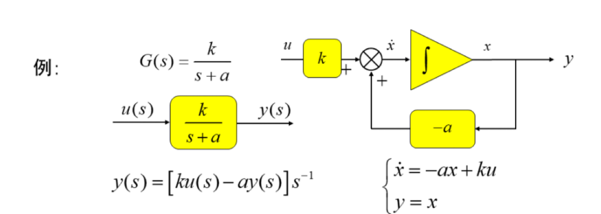
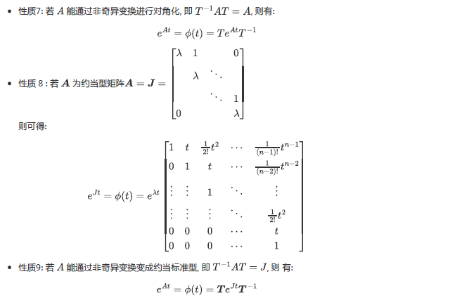

- 根据方程计算传递函数

  $\boldsymbol{G}(s)=\boldsymbol{C}(s \boldsymbol{I}-\boldsymbol{A})^{-1} \boldsymbol{B}+\boldsymbol{D}$

​		$y(s) = G(s)u(s)$		

​		算出来是矩阵

- 二阶方阵求逆公式
  $$
  \left(\begin{array}{ll}
  a & b \\
  c & d
  \end{array}\right)^{-1}=\frac{1}{a d-b c}\left(\begin{array}{cc}
  d & -b \\
  -c & a
  \end{array}\right)
  $$

- 串、并联反馈系统的状态方程书写

- 基本元器件及其传递函数书写

  

- 传递函数书写状态空间表达式：记住简单的就行

- 基于模拟结构图画：画特征值、能控、能观

- 系统的等价变化，转换为特征值标准型

- 知道怎么根据状态方程求解时间解

- 状态空间变换的函数

  

- 知道怎么求解$e^{At}$：使用拉普拉斯反变换   

- 能控标准性、能观标准型的代数判据、模态判据等方法，还有特征值相等的约当块等

- 知道怎么分解能观和能空

- 子空间