# 实验一     二阶系统阶跃响应、连续系统校正

何东阳 自96 2019011462

## 1 实验目的

1. 学会根据模拟电路确定系统传递函数。
2. 研究二阶系统的两个重要参数: 阻尼比 $\xi$ 和无阻尼自振角频率 $\omega_{n}$ 对系统动态性能的影响。 
3. 学习串联校正的基本设计方法, 观察串联超前、滞后校正对改善系统性能的作用。

## 2 研究内容

### 2.1 二阶系统阶跃响应

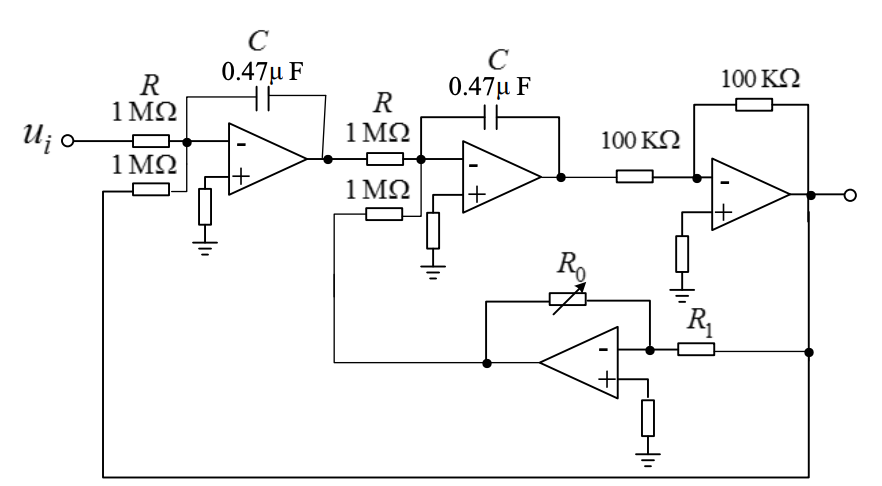

系统特征方程为 $T^{2} s^{2}+K T s+1=0$, 其中 $T=R C, K=\frac{R_{0}}{R_{1}}$ 。根据二阶系统的标准形式可知, $\xi=K / 2$, 通过调整 $K$ 可使 $\xi$ 获得期望值。

### 2.2 连续系统串联校正

- 已知系统开环传递函数 (图 2-4 为参考模拟电路图):

$$
G_{0}(\mathrm{~s})=\frac{100}{s(0.1 s+1)(0.01 s+1)}
$$
- 设计一个超前校正装置, 要求速度误差系数 $K_{v} \geq 100 \mathrm{~s}^{-1}$, 截止角频率 $\omega_{c} \geq 40 \mathrm{rad} / \mathrm{s}$, 相角稳定裕 度 $\emptyset \geq 30^{\circ}$, 超调量 $\sigma \leq 40 \%$, 这里给出一个参考的超前校正 (图 2-5 为参考模拟电路图):

$$
G_{c}(s)=\frac{0.044 s+1}{0.0044 s+1}
$$
- 设计一个滞后校正装置, 要求 $K_{v} \geq 100 s^{-1}, \omega_{c} \geq 4 \mathrm{rad} / \mathrm{s}, \emptyset \geq 30^{\circ}, \sigma \leq 40 \%$, 这里给出一个参考 的滞后校正 (图 2-6 为参考模拟电路图。):

$$
G_{c}(s)=\frac{0.5 s+1}{10 s+1}
$$

## 3 实验计算

### 3.1 二阶系统阶跃响应预习

- 传递函数
  $$
  G(s)=\frac{1}{T^2 s^{2}+K T s+1}
  $$

- 计算公式为

  超调量: $\sigma=e^{-\frac{\xi \pi}{\sqrt{1-\Xi ^{2}}}}$
  过渡过程时间: $t_{\mathrm{s}}(5 \%) \approx \frac{3}{\xi \omega_{\mathrm{n}}}=\frac{3 T}{\xi} \quad(0<\xi<0.9)$
  
- 分别计算出 $T=0.47, \xi=0.25,0.5,0.75$ 时, 系统阶跃响应的超调量 $\sigma$ 和过渡过程时间 $t_{s}$ 。

  当$T = 0.47时$

  |   $\xi$   | 0        | 0.25  |  0.5  | 0.75 |
  | :-------: | -------- | :---: | :---: | :--: |
  | $\sigma$% | 无       | 44.43 | 16.30 | 2.84 |
  |   $t_s$   | $\infty$ | 5.64  | 2.82  | 1.88 |

- 分别计算出 $\xi=0.5, T=0.22,0.47,1.0$ 时, 系统阶跃响应的超调量 $\sigma$ 和过渡过程时间 $t_{s}$ 。

  当$\zeta = 0.5$
  
  |     T      | 0.22 | 0.47 | 1.0  |
  | :--------: | :--: | :--: | :--: |
  | $\sigma\%$ | 16.3 | 16.3 | 16.3 |
  |  $t_(s)$   | 1.32 | 2.83 |  6   |
  
- 通过改变 $K$，使$\xi$获得 $0,0.25,0.5,0.75,1.0$ 等值，记录过渡过程曲线、超调量 $\sigma$ 和过渡过程时间 $t$

  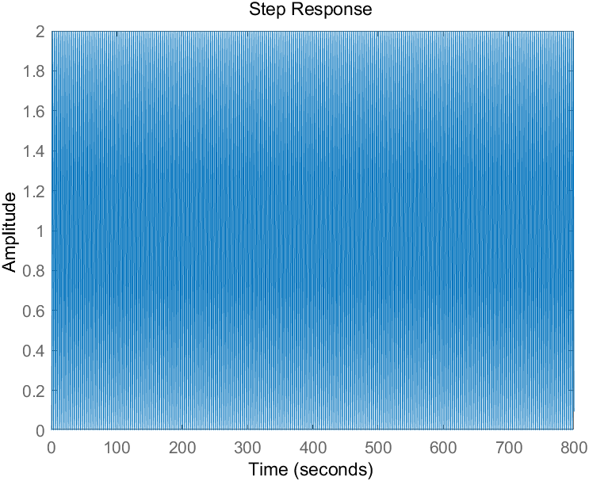

  ​												  							$\xi = 0时$

  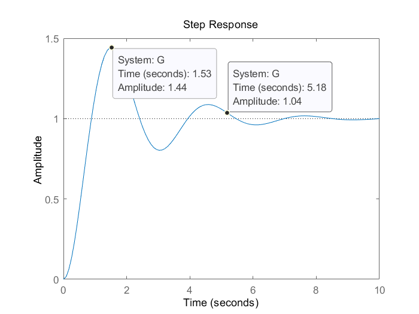

  ​																			$\xi = 0.25时$

  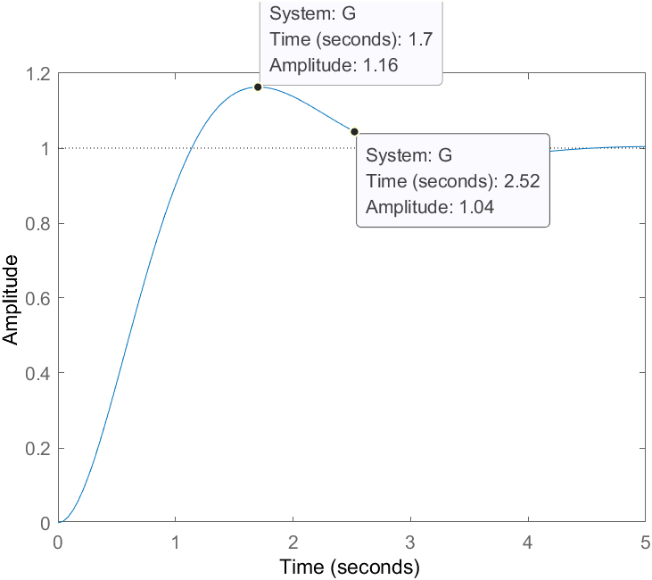

  ​																				$\xi = 0.5时$

  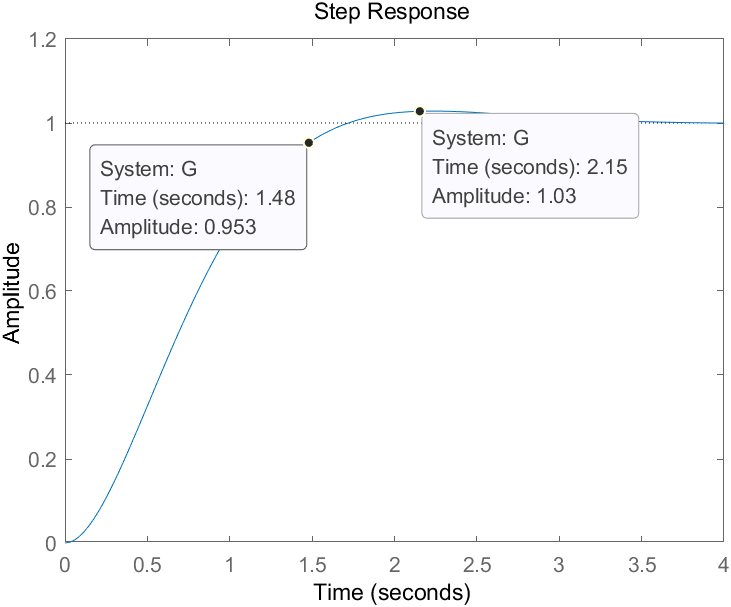

  ​																				$\xi = 0.75时$

  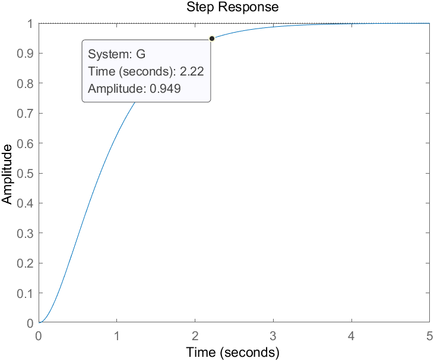

  ​																				$\xi = 1时$

  |   $\xi$   | 0.25 | 0.5  | 0.75 | 1.0  |
  | :-------: | :--: | :--: | :--: | :--: |
  | $\sigma$% |  44  |  16  |  3   |  0   |
  |   $t_s$   | 5.18 | 2.52 | 1.48 | 2.22 |

- 当 $\xi=0.5$ 时，令 $T=0.22$ 秒， $0.47$ 秒， $1.0$ 秒，记录过渡过程曲线、超调量 $\sigma$ 和过渡过程时间 $t_{s}$，比较三条阶跃响应曲线的异同。

  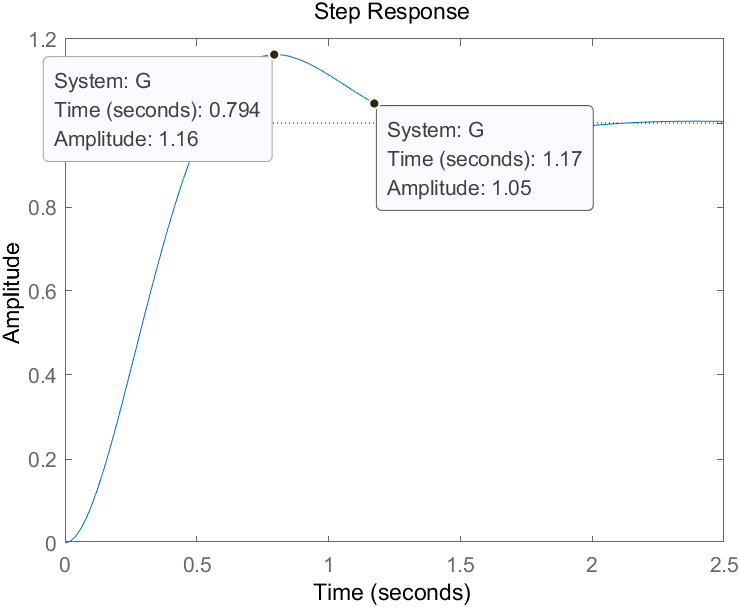
  
  ​																				$T=0.22$
  
  
  
  ​																				$T=0.47$
  
  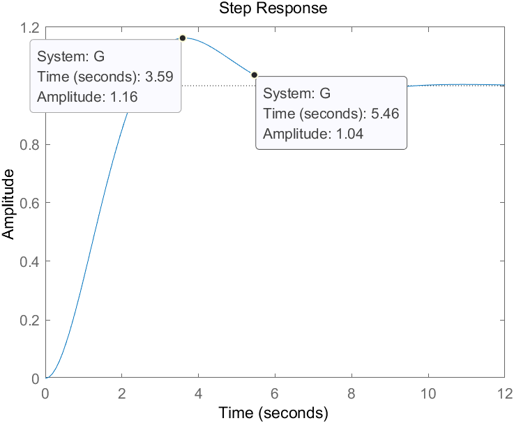
  
  ​																				$T=1.0$
  
  |     T      | 0.22 | 0.47 | 1.0  |
  | :--------: | :--: | :--: | :--: |
  | $\sigma\%$ |  16  |  16  |  16  |
  |   $t_s$    | 1.17 | 2.52 | 5.46 |

### 3.2 连续系统串联校正预习

- 分别画出系统固有部分、加入超前校正、滞后校正的 Bode 图；估算出上述 3 种情况下系统相角裕量、阶跃响应的超调 $\sigma$ 与过渡过程时间 $t_{s}$ 。

​		系统固有部分：

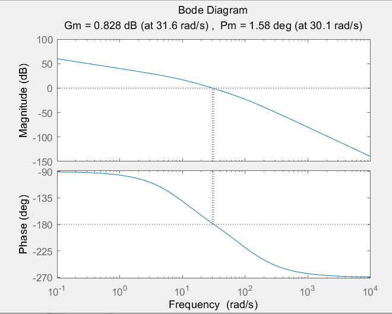

​		超前校正：

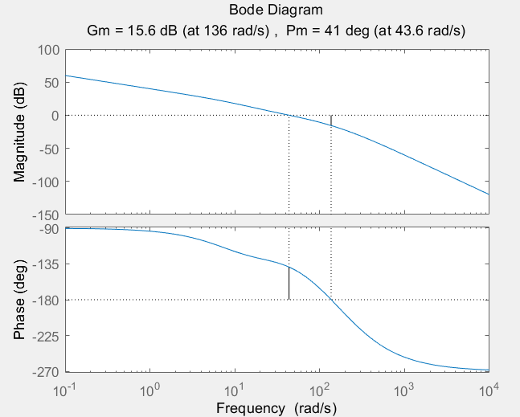

​		滞后校正：

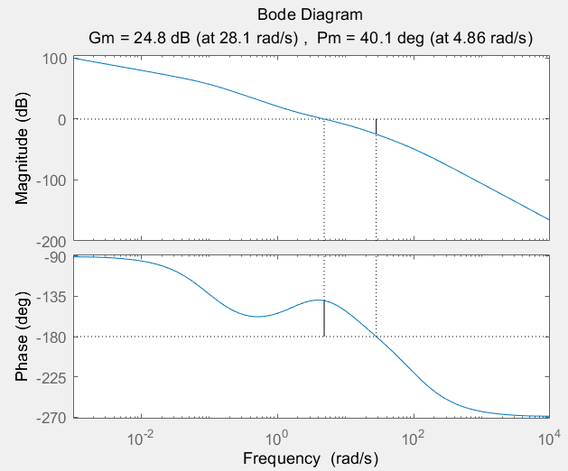

​		根据matlab计算得到系统参数为：

|      物理量       | 固有部分 | 超前校正 | 滞后校正 |
| :---------------: | :------: | :------: | :------: |
|     相角裕度      |   1.58   |    41    |   40.1   |
|  超调量$\sigma$   |  92.48%  |  32.34%  |  38.44%  |
| 过渡过程时间$t_s$ |   7.6    |  0.1076  |  1.079   |

- 用 Matlab/Simlink 搭建仿真模型，以单位阶跃信号为系统输入，观测并记录 3 种情况下系统阶跃响应曲线、超调 $\sigma$ 与过渡过程时间 $t_{s}$ 。

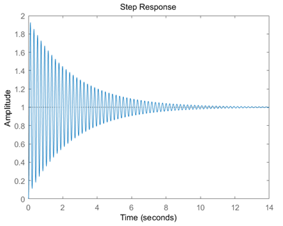

固有响应

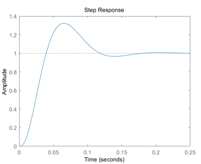

加入超前校正

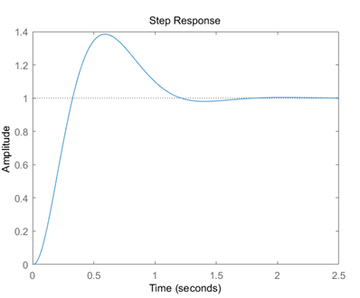

加入滞后校正

|      物理量       | 固有部分 | 超前校正 | 滞后校正 |
| :---------------: | :------: | :------: | :------: |
|  超调量$\sigma$   |  87.5%   |  30.3%   |  37.7%   |
| 过渡过程时间$t_s$ |   6.75   |   0.16   |   1.05   |

## 4 正式实验

### 4.1 二阶系统阶跃响应正式实验

1. 通过改变 $K$, 使 $\xi$ 获得 $0,0.25,0.5,0.75,1.0$ 等值，在输入端加同样幅值的阶跃信号，记录过 渡过程曲线、超调量 $\boldsymbol{\sigma}$ 和过渡过程时间 $t_{s}$，将实验值和理论值进行比较。

- 实验图像

  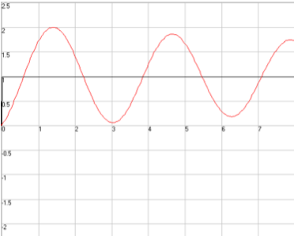

  ​                                                          $\xi$ = 0时的图像

  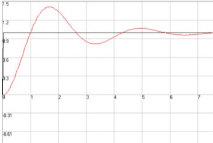

  ​                                                        $\xi$ = 0.25时的图像

  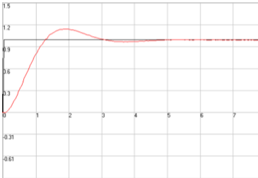

  ​                                                          $\xi$ = 0.5时的图像

  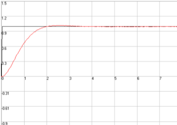

  ​                                                         $\xi$ = 0.75时的图像

​                                                      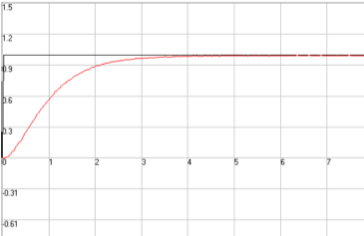

​                                                                 $\xi$ = 1时的图像   

- 实验数据

  |   $\xi$   |    0     | 0.25 | 0.5  | 0.75 | 1.0  |
  | :-------: | :------: | :--: | :--: | :--: | :--: |
  | $\sigma$% |    无    | 41.5 | 16.7 | 1.82 |  0   |
  |   $t_s$   | $\infty$ | 5.1  | 2.7  | 1.82 | 2.93 |

- 对比

​		根据表格可以看出，实验数据和仿真数据的大致图形是一致的，变化趋势也是一致的。且超		调量和过渡过程时间都是一致的，当$\xi$变化时，$t_s$也等比例变化，说明时间常数和过渡过程时		间的尺度是线性的，且随着$T$增加，超调量减少。

2. 当 $\xi=0.5$ 时，令 $T=0.22$ 秒，$0.47$ 秒，$1.0$ 秒 $(T=R C$, 改变两个 $C)$，记录过渡过程曲线、超调量 $\sigma$ 和过渡过程时间 $t_{s}$，比较三条阶跃响应曲线的异同。

- 实验图像

​		

- 实验数据

  |     T      | 0.22 | 0.47 | 1.0  |
  | :--------: | :--: | :--: | :--: |
  | $\sigma\%$ |  14  | 14.2 |  14  |
  |   $t_s$    | 1.53 | 3.02 | 6.13 |

- 对比

​		仿真结果、理论计算、实验测量结果都是近似的，说明都符合同样的规律，具体数值的误差来源计算过程。可见只要时间常数相同，超调量就是相同的，且随着时间常数等比例增大，过渡过程时间也会等比例增大。

### 4.2 连续系统串联校正正式实验

- 实验图像

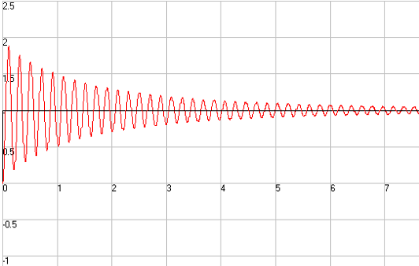

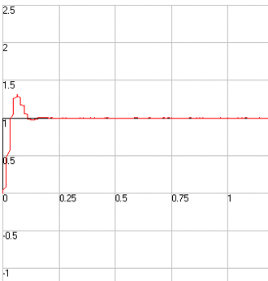

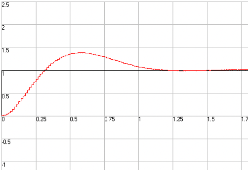

- 实验数据

  |      物理量       | 固有部分 | 超前校正 | 滞后校正 |
  | :---------------: | :------: | :------: | :------: |
  |  超调量$\sigma$   |   90%    |   32%    |   32%    |
  | 过渡过程时间$t_s$ |   6.5    |   0.1    |   1.1    |

- 不同校正作用总结

  - 超前校正

    根据实验图像可以看出，超前校正的主要作用是改善系统动态性能，通过提供超前角，提高了相角裕量和降低了超调量，降低了系统的过渡时间，从而改善了系统响应速度和稳定性。

  - 滞后校正

​		 	 根据实验图像可以看出，滞后校正的主要作用是改善系统的静态性能，提高了系统的稳态			  精度，但是同时也轻微降低了系统的动态性能。		

## 5 实验总结

本次实验内容丰富，主要难点在于电路的搭建，在保证电路没有bug的情况下，可以顺利完成实验。实验结果加深了我对二阶系统性质以及连续系统校正的理解

