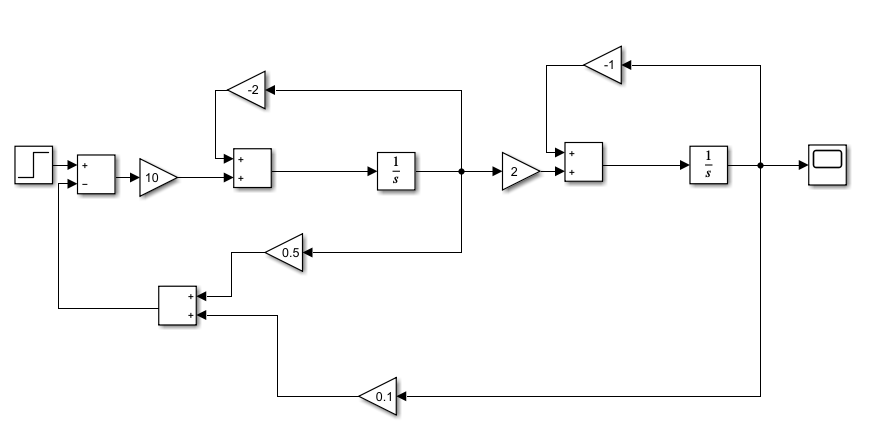
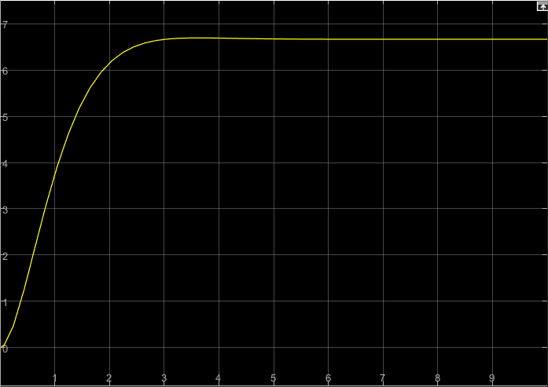
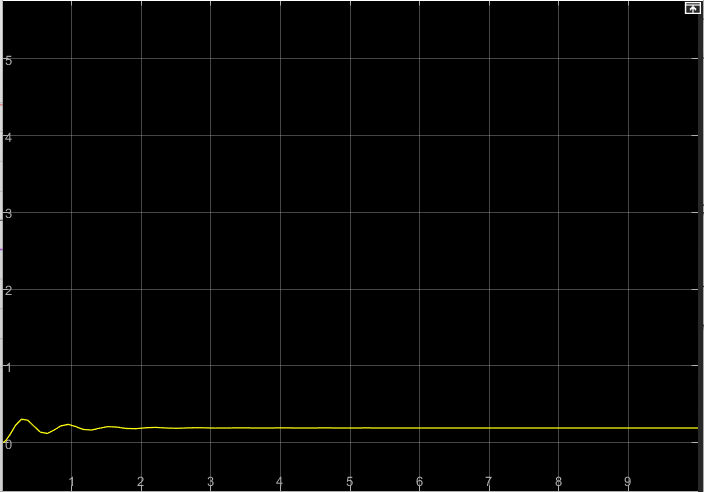
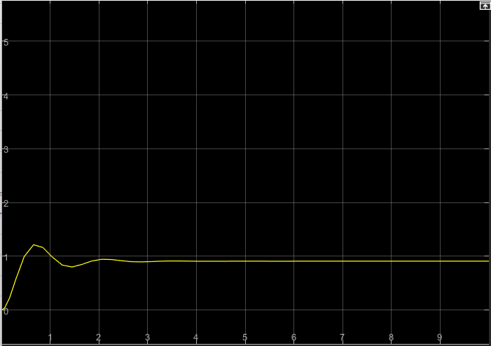
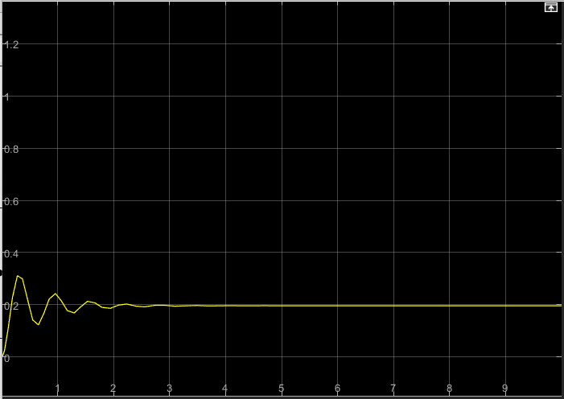
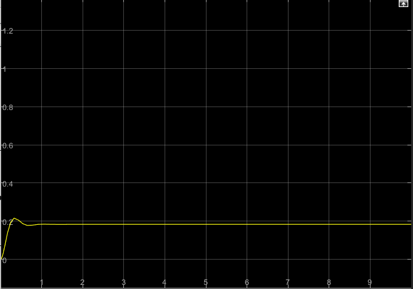
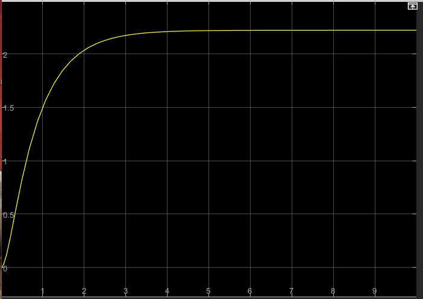
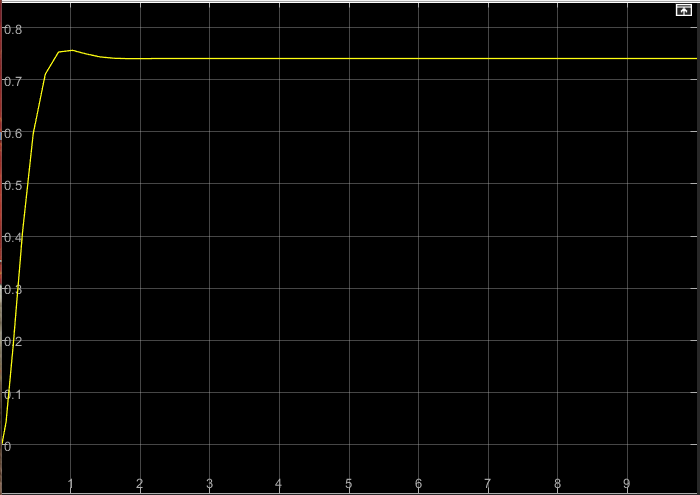
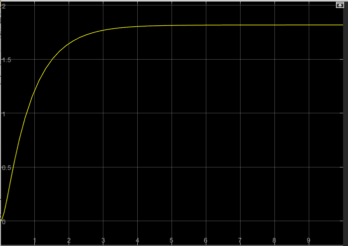

# 实验二 状态反馈控制

何东阳 自96 2019011462

## 1 实验目的

1. 训练设计模拟实验方案的能力。
2. 掌握用状态反馈的方法实现控制系统闭环极点的配置。
3. 观察状态反馈的性能，研究极点配置对系统闭环阶跃响应的影响。

## 2 实验要求

已知对象状态方程:
$$
\begin{aligned}
&{\left[\begin{array}{l}
\dot{x}_{1} \\
\dot{x}_{2}
\end{array}\right]=\left[\begin{array}{cc}
-2 & 0 \\
2 & -1
\end{array}\right]\left[\begin{array}{l}
x_{1} \\
x_{2}
\end{array}\right]+\left[\begin{array}{l}
10 \\
0
\end{array}\right] u} \\
&y=\left[\begin{array}{ll}
0 & 1
\end{array}\right]\left[\begin{array}{l}
x_{1} \\
x_{2}
\end{array}\right]
\end{aligned}
$$
开环传递函数为:
$$
G(s)=\frac{10}{(0.5 s+1)(s+1)}
$$
模拟实现为：

模拟实现图

1. 判断系统能控性、能观性

2. 搭建 **Matlab/Simlink** 仿真模型，以单位阶跃信号为系统输入，观测闭环系统的阶跃响应。

   （1）对于状态反馈有
   $$
   u=r-\left[\begin{array}{ll}
   K_{1} & K_{2}
   \end{array}\right]\left[\begin{array}{l}
   x_{1} \\
   x_{2}
   \end{array}\right]
   $$
   $\mathrm{r}$ 为阶跃信号, 当 $K_{1}=0$ 即为输出反馈。
   调节 $K_{2}$，观测闭环系统的阶跃响应，使闭环系统的输出过渡过程呈无超调、有超调、过渡过程时间较短等三种情况。记录相应的 $K_{2}$ 、超调量 $\sigma$ 和过渡过程时间 $t_{s}$，计算闭环系统的极点。
   （2）计算 $K_{1}=0 、 K_{2}=5$ 和 $K_{1}=0.7 、 K_{2}=5$ 两种情况下的闭环系统极点，观测闭环系统的阶跃响应，记录超调量 $\sigma$ 和过渡过程时间 $t_{s}$
   （3）自行拟定三组 $K_{1} 、 K_{2}$，计算闭环系统的极点在所希望的位置上，分别测出阶跃响应的超调量 $\sigma$ 和 过渡过程时间 $\boldsymbol{t}_{s}$，振荡次数 $N$ 等。

3. 自行设计输出反馈、状态反馈的模拟电路图，在模拟实验箱上完成上述（1）（2）（3）实验内容。

4. 根据实验结果，说明状态反馈优点。

## 3 实验计算

本部分回答**实验要求1、2**的问题

1. 判断系统能控性、能观性：

$$
Q_k=\left[\begin{array}{cc}
10 & -20 \\
0 & 20
\end{array}\right]\\
Q_g = \left[\begin{array}{cc}
0 & 1 \\
2 & -1
\end{array}\right]\\
$$

​		均满足$rank(Q) = 2$，因此此系统是完全能控和完全能观的

使用**matlab/simulink**仿真图如下：

2. 加入反馈后，系统的状态方程变为：
   $$
   \begin{aligned}
   &{\left[\begin{array}{l}
   \dot{x}_{1} \\
   \dot{x}_{2}
   \end{array}\right]=\left[\begin{array}{cc}
   -2-10K_1 & -10K_2 \\
   2 & -1
   \end{array}\right]\left[\begin{array}{l}
   x_{1} \\
   x_{2}
   \end{array}\right]+\left[\begin{array}{l}
   10 \\
   0
   \end{array}\right] u} \\
   &y=\left[\begin{array}{ll}
   0 & 1
   \end{array}\right]\left[\begin{array}{l}
   x_{1} \\
   x_{2}
   \end{array}\right]
   \end{aligned}
   $$
   因此可以算出其传递函数为：
   $$
   \begin{aligned}
   G(s) &= C(sI-A)^{-1}B\\
   & = [\begin{array}{ll}
   0 & 1
   \end{array}]\left[\begin{array}{cc}
   s+2+10K_1 & 10K_2 \\
   -2 & s+1
   \end{array}\right]^{-1}\left[\begin{array}{l}
   10 \\
   0
   \end{array}\right]
   \end{aligned}
   $$
   （1）$K_{1}=0$，调节$K_2$，使得电路图呈现三种状态
   
   
   
   ​																					**无超调**
   
   ​		此时$K_2=0.05$
   
   

   ​																			**过渡过程时间短**

   ​		此时$K_2=5.1$

   

   ​																					**有超调**

   ​		此时$K_2=1$

   ​		相应的超调量 $\sigma$ 和过渡过程时间 $t_{s}$、闭环极点记录如下：	

   |                | $K_2$ | $\sigma$ | $t_{s}$/s | 闭环极点 |
   | -------------- | :---: | :------: | :-------: | :------: |
   | 无超调         | 0.05  |    无    |    2.2    |          |
   | 过渡过程时间短 |  5.1  |   0.57   |   0.66    |          |
   | 有超调         |   1   |   0.31   |   1.67    |          |
   
   （2）计算 $K_{1}=0 、 K_{2}=5$ 和 $K_{1}=0.7 、 K_{2}=5$ 两种情况
   
   

   ​		此时$K_{1}=0 、 K_{2}=5$
   
   
   
   ​		此时$K_{1}=0.7 、 K_{2}=5$ 
   
   ​		相应的超调量 $\sigma$ 和过渡过程时间 $t_{s}$、闭环极点记录如下：
   
   |                        | $\sigma$ | $t_{s}$/s | 闭环极点 |
   | ---------------------- | :------: | :-------: | :------: |
   | $K_{1}=0 、 K_{2}=5$   |   0.56   |   0.61    |          |
   | $K_{1}=0.7 、 K_{2}=5$ |   0.21   |   0.51    |          |
   
   （3）自行拟定三组 $K_{1} 、 K_{2}$，计算闭环系统的极点在所希望的位置上
   
   
   
   ​																		$K_{1}=0.5 、 K_{2}=0.1$  
   
   
   
   ​																		$K_{1}=0.5 、 K_{2}=1$  
   
   
   
   ​																		$K_{1}=0.7 、 K_{2}=0.1$  
   
   相应的超调量 $\sigma$ 和过渡过程时间 $t_{s}$、振荡次数 $N$ 如下：
   
   |      | $\sigma$ | $t_{s}$/s | $N$  |
   | ---- | :------: | :-------: | :--: |
   |      |    无    |   2.45    |  0   |
   |      |  0.021   |   0.63    |  1   |
   |      |    无    |   2.515   |  0   |
   

## 4 正式实验

本部分完成**实验要求3、4**

3. （1）$K_{1}=0$，调节$K_2$

   ​                                                    		

   ​                                                                                      **无超调**

   ​		此时$K_2=0.1$

   ​                                                  

   ​                                                                              **过渡过程时间短**

   ​		此时$K_2=5.1$

   ​                                                  

   ​                                                                                     **有超调**

   ​		此时$K_2=1$

   - 实验数据

     |                | $K_2$ | $\sigma$ | $t_{s}$/s | 闭环极点 |
     | -------------- | :---: | :------: | :-------: | :------: |
     | 无超调         | 0.05  |    无    |    2.2    |          |
     | 过渡过程时间短 |  5.1  |   0.57   |   0.66    |          |
     | 有超调         |   1   |   0.31   |   1.67    |          |
   
   - 实验数据与仿真数据对比
   
     
   
   （2）计算 $K_{1}=0 、 K_{2}=5$ 和 $K_{1}=0.7 、 K_{2}=5$ 两种情况
   
   ​                                                  
   
   ​                                                                          $K_{1}=0 、 K_{2}=5$
   
   ​                                                 
   
   ​                                                                        $K_{1}=0.7 、 K_{2}=5$                
   
   - 实验数据
   
     |                        | $\sigma$ | $t_{s}$/s | 闭环极点 |
     | ---------------------- | :------: | :-------: | :------: |
     | $K_{1}=0 、 K_{2}=5$   |   0.56   |   0.61    |          |
     | $K_{1}=0.7 、 K_{2}=5$ |   0.21   |   0.51    |          |
   
   - 实验数据与仿真数据对比
   
     
   
   （3）自行拟定三组 $K_{1} 、 K_{2}$
   
   

​                                                                             $K_{1}=0.5 、 K_{2}=0.1$  

​                                                                               $K_{1}=0.5 、 K_{2}=1$  

​                                                                           $K_{1}=0.7 、 K_{2}=0.1$  

​		实验数据：

|      | $\sigma$ | $t_{s}$/s | $N$  |
| ---- | :------: | :-------: | :--: |
|      |    无    |   2.45    |  0   |
|      |  0.021   |   0.63    |  1   |
|      |    无    |   2.515   |  0   |

​		实验数据与仿真数据对比：

​		

4. 状态反馈优点

   

## 5 实验总结

