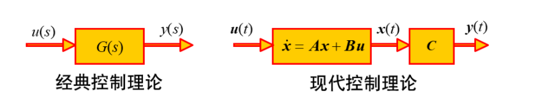

## 状态、状态空间、状态空间描述

1. 状态 (State) : 指能从物理上揭示动态系统内部运行规律的“特征量”

2. 状态变量：指足以完全确定系统运动状态的数目最少的一组变量
   - 在任意时刻 $t=t_{0}$, 该组变量的值 $\left\{x_{1}\left(t_{0}\right), x_{2}\left(t_{0}\right), \cdots, x_{n}\left(t_{0}\right)\right\}$ 都表示系统在该时刻	（称为 “初始时刻” ) 的状态（称为 “初始状态” )；
   - 只要确定了上述初始状态，以及系统在 $t ≥ t_0$的输入，就能将系统从 t0 时刻起的行为完全确定下来。

3. 状态向量：

   如果完全描述一个系统的动态行为需要 $n$ 个状态变量, 那么该 $n$ 个 状态变量 $\left\{x_{1}(t), x_{2}(t), \cdots, x_{n}(t)\right\}$ 作分量所构成的向量称为该系统的状态 向量, 记作：
   $$
   \boldsymbol{x}(t)=\left[\begin{array}{l}
   x_{1}(t) \\
   x_{2}(t) \\
   \vdots \\
   x_{n}(t)
   \end{array}\right] \quad \text { 或 } \quad \boldsymbol{x}(t)=\left[\begin{array}{llll}
   x_{1}(t) & x_{2}(t) & \cdots & x_{n}(t)
   \end{array}\right]^{\mathrm{T}}
   $$

4. 状态空间
   - 以状态变量 $\left\{x_{1}(t), x_{2}(t), \cdots, x_{n}(t)\right\}$ 为坐标构成的 $n$ 维空间称为状态空间。
   - 系统的任何状态, 都可以用状态空间中的一个点来表示。 即在特定时刻 $t$ 状态向量 $\boldsymbol{x}(t)$ 在状态空间中是一个点。已知初始时刻 $t_{0}$ 的 $\boldsymbol{x}\left(t_{0}\right)$, 就得到状态空间中的一个初始点。随着时间的推移, $\boldsymbol{x}(t)$ 将在状态空间中描绘出一条轨迹, 称为状态轨线。

5. 状态方程

   - 描述系统状态变量与系统输入之间关系的一阶微分方程组称为状态方程[^1 ]。

   - 例如：
     $$
     \left[\begin{array}{l}
     \dot{x}_{1} \\
     \dot{x}_{2}
     \end{array}\right]=\left[\begin{array}{cc}
     0 & 1 \\
     0 & -\frac{k}{M}
     \end{array}\right]\left[\begin{array}{l}
     x_{1} \\
     x_{2}
     \end{array}\right]+\left[\begin{array}{c}
     0 \\
     \frac{1}{M}
     \end{array}\right] u
     $$

​				使用守恒定律进行状态方程进行列解

6. 输出方程

   描述系统状态变量与系统输出变量之间关系的一阶代数方程称为输出方程。在小车的运动当中, 若指定位移为系统输出。则对应的输出方程为 $y=x_{1}$. 或者：
   $$
   y=\left[\begin{array}{ll}
   1 & 0
   \end{array}\right]\left[\begin{array}{l}
   x_{1} \\
   x_{2}
   \end{array}\right]
   $$

7. 状态空间描述

   - 状态方程和输出方程一同构成一个系统动态的完整描述称为系统的**状态空间表达式**, 也称为**状态空间描述**。

   - 对于一般单输入单输出线性定常系统，状态空间可表示为：
     $$
     \left\{\begin{array}{l}
     \dot{\boldsymbol{x}}=\boldsymbol{A} \boldsymbol{x}+\boldsymbol{b} u \\
     y=\boldsymbol{c}^{\mathrm{T}} \boldsymbol{x}
     \end{array}\right.
     $$

   - 对于一般多入多出系统，状态空间可表示为：
     $$
     \sum(\boldsymbol{A}, \boldsymbol{B}, \boldsymbol{C}, \boldsymbol{D})=\left\{\begin{array}{l}
     \dot{\boldsymbol{x}}=\boldsymbol{A} \boldsymbol{x}+\boldsymbol{B} \boldsymbol{u} \\
     \boldsymbol{y}=\boldsymbol{C} \boldsymbol{x}+\boldsymbol{D} \boldsymbol{u}
     \end{array}\right.
     $$

   - 离散时间系统的状态空间表达式
     $$
     \Sigma(\boldsymbol{A}, \boldsymbol{B}, \boldsymbol{C}, \boldsymbol{D})=\left\{\begin{array}{l}
     \boldsymbol{x}(t+1)=\boldsymbol{A} \boldsymbol{x}(t)+\boldsymbol{B} \boldsymbol{u}(t) \\
     \boldsymbol{y}(t)=\boldsymbol{C} \boldsymbol{x}(t)+\boldsymbol{D} \boldsymbol{u}(t)
     \end{array}\right.
     $$
     
     其中，
     
     $\boldsymbol{x}$ : 状态向量（$n$ 维）
     $\boldsymbol{u}$ : 输入向量 $(r$ 维 $) \quad \boldsymbol{y}$ : 输出向量 $(m$ 维 $)$
     $\boldsymbol{A}$ : 状态系数矩阵 $n \times n$ 维  或 系统矩阵
     $\boldsymbol{B}$ : 输入系数矩阵 $n \times r$ 维 
     $\boldsymbol{C}$ : 输出系数矩阵 $m \times n$ 维
     $\boldsymbol{D}$ : 输入的直接传递矩阵 $m \times r$ 维 
   
   - 状态空间描述了系统内部状态和输入、输出关系
   
   - 输入引起状态的变化是一个运动过程, 用微分方程组来表示, 即状态方程。状态决定输出的变化则是一个变换过程, 数学上表现为一个变换方程, 即代数方程。
   
     

## 补充

[^1 ]:每个方程必须含有且只能含有1个状态变量的一阶导数

