# 模块二 线性连续定常系统状态方程

## 齐次方程的解

- 线性定常系统的状态方程为:
$$
\begin{aligned}
&\dot{\boldsymbol{x}}=\boldsymbol{A} \boldsymbol{x}+\boldsymbol{B} \boldsymbol{u}, t \geq t_{0} \\
&\boldsymbol{x}\left(t_{0}\right)=\boldsymbol{x}_{0}
\end{aligned}
$$
​		其中, $\boldsymbol{x} \in \mathrm{R}^{n}, \boldsymbol{u} \in \mathrm{R}^{r}, \boldsymbol{A} \in \mathrm{R}^{n \times n}, \boldsymbol{B} \in \mathrm{R}^{n \times r}$ 。这里讨论上述微分方程的求解方法。

一、**齐次方程的解**: 首先考虑简单的情形, 即输入 $\boldsymbol{u}$ 为零的齐次方程
$$
\dot{\boldsymbol{x}}=\boldsymbol{A} \boldsymbol{x}
$$
的解。此时系统处于由初始状态引起的自由运动状态, 所以齐次方程式的解也称 由解。

- 有如下命题:
若初始时刻 $t_{0}$ 时的状态给定为 $\boldsymbol{x}\left(t_{0}\right)=\boldsymbol{x}_{0}$, 则微分方程
$$
\dot{\boldsymbol{x}}=A x
$$
​		存在唯一解:
$$
\boldsymbol{x}(t)=e^{A\left(t-t_{0}\right)} \boldsymbol{x}_{0}, \quad t \geq t_{0}
$$
- 若初始时刻从 $t=0$ 开始, 即 $\boldsymbol{x}(0)=\boldsymbol{x}_{0}$, 则方程 $\dot{\boldsymbol{x}}=\boldsymbol{A} \boldsymbol{x}$ 的解为:
$$
\boldsymbol{x}(t)=e^{A t} \boldsymbol{x}_{0}, \quad t \geq 0
$$
​		其中, $e^{A t} \in \mathrm{R}^{n \times n}$ 或 $e^{A\left(t-t_{0}\right)} \in \mathrm{R}^{n \times n}$ 称为矩阵指数, 表达式为
$$
e^{A t} = \boldsymbol{I}+\boldsymbol{A} t+\frac{1}{2 !} \boldsymbol{A}^{2} t^{2}+\cdots+\frac{1}{k !} \boldsymbol{A}^{k} t^{k}+\cdots=\sum_{k=0}^{\infty} \frac{\boldsymbol{A}^{k} t^{k}}{k !}
$$

- 证明思路[^1 ]

- 线性定常系统的渐近稳定性及判据

  状态方程为:
$$
\begin{aligned}
&\dot{x}=A \boldsymbol{x}+\boldsymbol{B} \boldsymbol{u}, t \geq t_{0} \\
&\boldsymbol{x}\left(t_{0}\right)=\boldsymbol{x}_{0}
\end{aligned}
$$
​		其中, $\boldsymbol{x} \in \mathrm{R}^{n}, \boldsymbol{u} \in \mathrm{R}^{r}, \boldsymbol{A} \in \mathrm{R}^{n \times n}, \boldsymbol{B} \in \mathrm{R}^{n \times r}$ 。当输入信号 $\boldsymbol{u}$ 为零时, 若系统对任意初 始状态 		$x_{0}$ 的自由解
$$
\boldsymbol{x}(t)=e^{A\left(t-t_{0}\right)} \boldsymbol{x}_{0}, \quad t \geq t_{0}
$$
​		总满足 $\lim x(t)=\mathbf{0}$, 那么则称线性系统 $\left({ }^{*}\right)$ 是渐近稳定的。

​		判据: 系统 (${ }^{*}$ ) 是渐近稳定的, 当且仅当 $\boldsymbol{A}$ 的特征值均具有负实部。

​		分析: 可以根据矩阵指数的性质证明。

## 非齐次方程的解

这里我们讨论线性定常系统在控制作用 $\boldsymbol{u}(t)$ 下的强制运动。[^2 ] 考虑一般的非齐次方程
$$
\dot{\boldsymbol{x}}=A \boldsymbol{x}+\boldsymbol{B} \boldsymbol{u} \ \ \ (*)
$$
在初始时刻 $t_{0}$ 时, 初始状态为 $\boldsymbol{x}\left(t_{0}\right)=\boldsymbol{x}_{0}$, 则其解为
$$
\boldsymbol{x}(t)=e^{A\left(t-t_{0}\right)} \boldsymbol{x}_{0}+\int_{t_{0}}^{t} e^{A(t-\tau)} \boldsymbol{B} \boldsymbol{u}(\tau) \mathrm{d} \tau \ \ \ (**)
$$
初始时刻 $t_{0}=0$ 时的状态为 $\boldsymbol{x}\left(t_{0}\right)=\boldsymbol{x}(0)$, 其解为:
$$
\boldsymbol{x}(t)=e^{A t} \boldsymbol{x}(0)+\int_{0}^{t} e^{A(t-\tau)} \boldsymbol{B} \boldsymbol{u}(\tau) \mathrm{d} \tau \ \ \ (***)
$$
显然, 线性系统 $(*)$ 式的解由两部分组成:

- $(* *)$ 和 $(* * *)$ 的第一项表示由初始状态引起的自由运动

-  $(* *)$ 和 $(* * *)$ 的第二项表示由控制作用引起的强制运动

在特殊的控制信号 (如脉冲函数、阶跃函数或斜坡函数) 作用下, 非齐次方程的解可简化为:
(1) $\boldsymbol{u}(t)$ 为脉冲函数时, $\boldsymbol{u}(t)=\boldsymbol{k} \delta(t), \boldsymbol{x}\left(0^{-}\right)=\boldsymbol{x}(0)$, 有:
$$
\boldsymbol{x}(t)=e^{A t} \boldsymbol{x}(0)+e^{A t} \boldsymbol{B} \boldsymbol{k}
$$
其中 $\boldsymbol{k}$ 为常数向量, 与 $\boldsymbol{u}(t)$ 具有相同的维数。
(2) $\boldsymbol{u}(t)$ 为阶跃函数时, $\boldsymbol{u}(t)=\boldsymbol{k} \cdot 1(t), \boldsymbol{x}\left(0^{-}\right)=\boldsymbol{x}(0)$
$$
\boldsymbol{x}(t)=e^{A t} \boldsymbol{x}(0)+\boldsymbol{A}^{-1}\left(e^{A t}-\boldsymbol{I}\right) \boldsymbol{B} \boldsymbol{k}
$$
(3) $\boldsymbol{u}(t)$ 为斜坡函数时, $\boldsymbol{u}(t)=\boldsymbol{k} \cdot t \cdot 1(t), \boldsymbol{x}\left(0^{-}\right)=\boldsymbol{x}(0)$
$$
\boldsymbol{x}(t)=e^{A t} \boldsymbol{x}(0)+\left[\boldsymbol{A}^{-2}\left(e^{A t}-\boldsymbol{I}\right)-\boldsymbol{A}^{-1} t\right] \boldsymbol{B} \boldsymbol{k}
$$

- 与齐次方程类似, 非齐次方程也可利用 Laplace 变换求解 对非齐次方程 $\dot{\boldsymbol{x}}=\boldsymbol{A} \boldsymbol{x}+\boldsymbol{B} \boldsymbol{u}$ 两边进行 Laplace 变换

$$
s \boldsymbol{x}(s)-\boldsymbol{x}(0)=\boldsymbol{A} \boldsymbol{x}(s)+\boldsymbol{B} \boldsymbol{u}(s)
$$
​		化简为:
$$
(s \boldsymbol{I}-\boldsymbol{A}) \boldsymbol{x}(s)=\boldsymbol{x}(0)+\boldsymbol{B} \boldsymbol{u}(s)
$$
​		所以有: $\boldsymbol{x}(s)=(s \boldsymbol{I}-\boldsymbol{A})^{-1}[\boldsymbol{x}(0)+\boldsymbol{B} \boldsymbol{u}(s)]$
​		进一步进行 Laplace 反变换, 可得:
​	                               	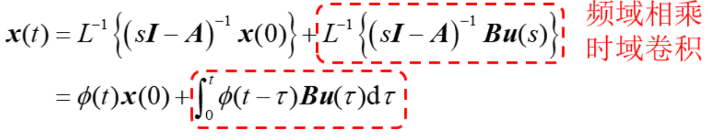

- 例子

  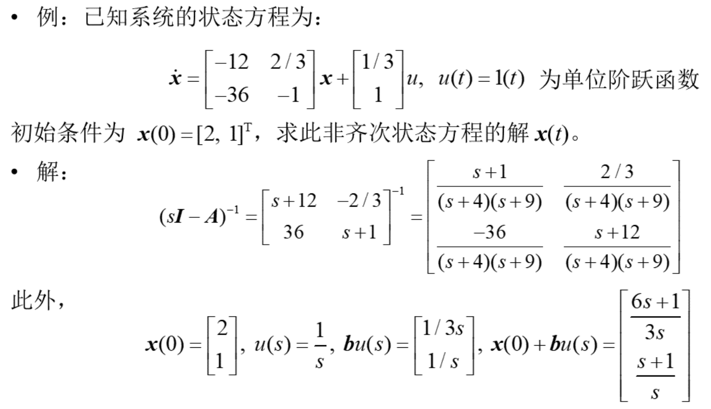

  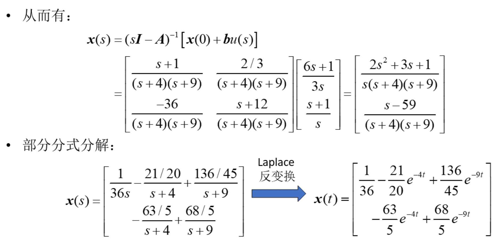

## 状态转移矩阵的定义性质

- 齐次方程 $\dot{\boldsymbol{x}}=\boldsymbol{A} \boldsymbol{x}$ 的自由解为:
$$
\boldsymbol{x}(t)=e^{A t} \boldsymbol{x}(0) \text { 或 } \boldsymbol{x}(t)=e^{A\left(t-t_{0}\right)} \boldsymbol{x}_{0}
$$
上式的物理意义是系统在 $t \geq 0$ 或 $t \geq t_{0}$ 的任意瞬时的状态 $\boldsymbol{x}(t)$, 仅仅是初始状态 向量 $\boldsymbol{x}_{0}$ 的一种变换关系, 变换矩阵为 $e^{A t}$ 或 $e^{A\left(t-t_{0}\right)}$ 。指数矩阵 $e^{A t}$ 或 $e^{A\left(t-t_{0}\right)}$ 是一个 大小为 $n \times n$ 的函数矩阵。这意味着, 它使得状态向量随着时间的推移在不断地作坐标变换, 即不断地在状态空间中作转移。
- 因此指数矩阵 $e^{A t}$ 或 $e^{A\left(t-t_{0}\right)}$ 也称为状态转移矩阵, 通常表示为:
$$
\phi(t)=e^{A t} \text { 或 } \phi\left(t-t_{0}\right)=e^{A\left(t-t_{0}\right)}
$$
其中, $\phi(t)$ 表示从 $\boldsymbol{x}(0)$ 到 $\boldsymbol{x}(t)$ 的状态转移矩阵, $\phi\left(t-t_{0}\right)$ 表示从 $\boldsymbol{x}\left(t_{0}\right)$ 到 $\boldsymbol{x}(t)$ 的状态转移矩阵。

- 因此, 齐次方程 $\dot{\boldsymbol{x}}=\boldsymbol{A} \boldsymbol{x}$ 的解可以表示为:

$$
\boldsymbol{x}(t)=\phi(t) \boldsymbol{x}_{0} \text { 或 } \boldsymbol{x}(t)=\phi\left(t-t_{0}\right) \boldsymbol{x}_{0}
$$

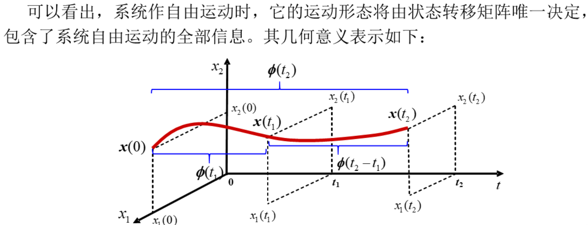

- 图中设 $t=0$ 时, 状态的初态为 $\boldsymbol{x}(0)=\left[\begin{array}{ll}x_{1}(0) & x_{2}(0)\end{array}\right]^{\mathrm{T}}$, 若已 知状态转移矩阵 $\boldsymbol{\phi}\left(t_{1}\right)$, 则 $t=t_{1}$ 的状态为:
$$
\boldsymbol{x}\left(t_{1}\right)=\left[\begin{array}{ll}
x_{1}\left(t_{1}\right) & x_{2}\left(t_{1}\right)
\end{array}\right]^{\mathrm{T}}=\boldsymbol{\phi}\left(t_{1}\right) \boldsymbol{x}(0)
$$
​		若已知状态转移矩阵 $\boldsymbol{\phi}\left(t_{2}\right)$, 则 $t=t_{2}$ 的状态为: $\boldsymbol{x}\left(t_{2}\right)=\left[\begin{array}{ll}x_{1}\left(t_{2}\right) & x_{2}\left(t_{2}\right)\end{array}\right]^{\mathrm{T}}=\boldsymbol{\phi}\left(t_{2}\right) \boldsymbol{x}(0)$

- 表明状态从 $\boldsymbol{x}(0)$ 开始, 随着时间的推移, 它将按 $\boldsymbol{\phi}\left(t_{1}\right)$ 或 $\boldsymbol{\phi}\left(t_{2}\right)$
作自由运动, 最后状态转移到 $\boldsymbol{x}\left(t_{1}\right)$ 或 $\boldsymbol{x}\left(t_{2}\right)$, 相应地在状态
空间中描绘出一条如下图所示的运动轨线。
- 若 $t_{1}$ 为初始时刻, $\boldsymbol{x}\left(t_{1}\right)$ 为初始状态, 则 $t=t_{2}$ 的状态为: 

$$
\begin{array}{ll}
\boldsymbol{x}\left(t_{2}\right)=\phi\left(t_{2}-t_{1}\right) \cdot \boldsymbol{x}\left(t_{1}\right)\\
\boldsymbol{x}\left(t_{1}\right)=\left[\begin{array}{ll}
x_{1}\left(t_{1}\right) & x_{2}\left(t_{1}\right)
\end{array}\right]^{\mathrm{T}}=\phi\left(t_{1}\right) \boldsymbol{x}(0) \\
\boldsymbol{x}\left(t_{2}\right)=\left[\begin{array}{ll}
x_{1}\left(t_{2}\right) & x_{2}\left(t_{2}\right)
\end{array}\right]^{\mathrm{T}}=\phi\left(t_{2}-t_{1}\right) \boldsymbol{x}\left(t_{1}\right)
\end{array}
$$
- 将 $\boldsymbol{x}\left(t_{1}\right)$ 代入上式, 则得 $\boldsymbol{x}\left(t_{2}\right)=\phi\left(t_{2}-t_{1}\right) \cdot \boldsymbol{\phi}\left(t_{1}\right) \cdot \boldsymbol{x}(0)$ 表示从 $\boldsymbol{x}(0)$ 转移到 $\boldsymbol{x}\left(t_{1}\right)$, 再由 $\boldsymbol{x}\left(t_{1}\right)$ 转移到 $\boldsymbol{x}\left(t_{2}\right)$ 的运动轨线。

- 注意到:
$$
\phi\left(t_{2}-t_{1}\right) \phi\left(t_{1}\right)=\phi\left(t_{2}\right) \text { 或 } e^{A\left(t_{2}-t_{1}\right)} e^{A t_{1}}=e^{A t_{2}}
$$
​		这种关系称为组合性质。
- 在经典控制理论中, 通常假定初始时刻 $t=0, \boldsymbol{x}(0)=\mathbf{0}$, 即从零初始条件出发去计算系统的输出响应。
- 而从以上分析中可以看出, 在现代控制理论中, 利用状态转移矩阵, 对任意时刻的状态量 $\boldsymbol{x}(t)$, 可以由任意指定的初始时刻 $t_{0}$ 的初始向量 $\boldsymbol{x}\left(t_{0}\right)$ 求得。
- 性质1: $\phi(t-t)=\phi(0)=\boldsymbol{I}$ 或 $e^{A(t-t)}=e^{A 0}=\boldsymbol{I}$
- 性质2: $\phi(t) \cdot \phi(\tau)=\phi(t+\tau)$ 或 $e^{A t} \cdot e^{A \tau}=e^{A(t+\tau)}$称之为组合性质，意味着从 $t=-\tau$ 转移到 $t=0$，再从 $t=0$ 转移到 $t=t$ 的组合。
- 性质3: $[\phi(t)]^{-1}=\phi(-t)$ 或 $\left(e^{A t}\right)^{-1}=e^{-A t}$
  - 这意味着转移矩阵总是非奇异的, 必有逆矩阵。
  - 利用该性质, 在已知 $\boldsymbol{x}(t)$ 的情况下, 可以反求出所有 $t$ 时刻以前的状态 $\boldsymbol{x}\left(t_{0}\right), \quad t_{0}<t$

- 性质4: $\dot{\phi}(t)=\boldsymbol{A} \cdot \boldsymbol{\phi}(t)=\boldsymbol{\phi}(t) \cdot \boldsymbol{A}$ 或 $\frac{\mathrm{d}}{\mathrm{d} t} e^{A t}=\boldsymbol{A} \cdot e^{A t}=e^{A t} \cdot \boldsymbol{A}$

- 性质5: 设有 $n \times n$ 矩阵 $\boldsymbol{A}$ 和 $\boldsymbol{B}$, 当且仅当 $\boldsymbol{A B}=\boldsymbol{B} \boldsymbol{A}$ 时（即: $\boldsymbol{A}$ 和 $\boldsymbol{B}$ 可交换）, 有
  $$
  e^{A t} \cdot e^{B t}=e^{(A+B) t}
  $$
  而当 $\boldsymbol{A B} \neq \boldsymbol{B} \boldsymbol{A}$ 时, 则有 $e^{A t} \cdot e^{B t} \neq e^{(A+B) t}$ 。

- 性质6: 若 $\boldsymbol{A}$ 为对角阵, 即 $\boldsymbol{A}=\Lambda=\left[\begin{array}{cccc}\lambda_{1} & & & 0 \\ & \lambda_{2} & & \\ & & \ddots & \\ 0 & & & \lambda_{n}\end{array}\right]=\operatorname{diag}\left\{\lambda_{1}, \cdots, \lambda_{n}\right\}$
  $$
  e^{A t}=\phi(t)=\left[\begin{array}{cccc}
  \sum_{k=0}^{\infty} \frac{1}{k !} t^{k} \lambda_{1}^{k} & & & 0 \\
  & \sum_{k=0}^{\infty} \frac{1}{k !} t^{k} \cdot \lambda_{2}^{k} & & \\
  & & \ddots & \\
  0 & & & \sum_{k=0}^{\infty} \frac{1}{k !} t^{k} \lambda_{n}^{k}
  \end{array}\right]=\left[\begin{array}{llll}
  e^{\lambda, t} & & & 0 \\
  & e^{\lambda_{2} t} & & \\
  & & \ddots & \\
  0 & & & e^{\lambda, t}
  \end{array}\right]
  $$

- 性质7: 若 $A$ 能通过非奇异变换进行对角化, 即 $T^{-1} A T=A$, 则有:
  $$
  e^{A t}=\phi(t)=T e^{A t}{T}^{-1}
  $$

- 性质 8 : 若 $\boldsymbol{A}$ 为约当型矩阵$\boldsymbol{A}=\boldsymbol{J}=\left[\begin{array}{llll}\lambda & 1 & & 0 \\ & \lambda & \ddots & \\ & & \ddots & 1 \\ 0 & & & \lambda\end{array}\right]$
  则可得:

$$
e^{J t}=\phi(t)=e^{\lambda t}\left[\begin{array}{ccccc}
1 & t & \frac{1}{2 !} t^{2} & \cdots & \frac{1}{(n-1) !} t^{n-1} \\
0 & 1 & t & \cdots & \frac{1}{(n-2) !} t^{n-2} \\
\vdots & \vdots & 1 & \ddots & \vdots \\
\vdots & \vdots & \vdots & \ddots & \frac{1}{2 !} t^{2} \\
0 & 0 & 0 & \cdots & t \\
0 & 0 & 0 & \cdots & 1
\end{array}\right]
$$

- 性质9: 若 $A$ 能通过非奇异变换变成约当标准型, 即 $T^{-1} A T=J$, 则 有:
  $$
  e^{A t}=\phi(t)=\boldsymbol{T} e^{J t} \boldsymbol{T}^{-1}
  $$

## 状态转移矩阵的计算方法

- 在具体分析线性定常系统时, 不可避免地要遇到计算 $\boldsymbol{\phi}(t)$ 和 $e^{A t}$ 的问题。下面讨论状态转移矩阵的几种计算方法:
- 1. 直接利用 $e^{A t}$ 的级数展开。根据矩阵指数的定义, $e^{A t}$ 可以展开成幂级数:
$$
e^{A t} = \boldsymbol{I}+\boldsymbol{A} t+\frac{1}{2 !} \boldsymbol{A}^{2} t^{2}+\cdots+\frac{1}{k !} \boldsymbol{A}^{k} t^{k}+\cdots=\sum_{k=0}^{\infty} \frac{\boldsymbol{A}^{k} t^{k}}{k !}
$$
​		即:
$$
=\boldsymbol{I}+\frac{\boldsymbol{A} t}{1 !}+\frac{\boldsymbol{A} t}{2}\left(\frac{A t}{1 !}\right)+\frac{A t}{3}\left(\frac{\boldsymbol{A}^{2} t^{2}}{2 !}\right)+\cdots+\frac{A t}{k}\left(\frac{\boldsymbol{A}^{k-1} t^{k-1}}{(k-1) !}\right)+\cdots \cdots
$$
​		显然, 即使 $A$ 结构简单, 利用上式计算也并不容易。式 $(* *)$ 中圆括号内每一项 完全等于前一		项。它给出了一种方便的递推方案, 易于编程实现。
- 然而, 由于 $e^{A t}$ 的收玫较慢, 与其它方法相比, 这种方法计算时间较长。
- 2. 利用 Laplace 反变换法求 $e^{A t}$

$$
e^{A t}=L^{-1}\left[(s \boldsymbol{I}-\boldsymbol{A})^{-1}\right]
$$
​		这种方法归结为计算 $(s \boldsymbol{I}-\boldsymbol{A})^{-1},(s \boldsymbol{I}-\boldsymbol{A})^{-1}$ 称为预解矩阵。 根据如下公式计算:
$$
(s \boldsymbol{I}-\boldsymbol{A})^{-1}=\frac{\operatorname{adj}(s \boldsymbol{I}-\boldsymbol{A})}{|s \boldsymbol{I}-\boldsymbol{A}|}
$$
​		这是一种最为常用的计算方法, 在维数较小时非常实用、然而, 在维数较大时 计算比较复杂, 		需要熟悉常用的 Laplace 反变换。

- 3. 变换 $\boldsymbol{A}$ 为对角标准型或约当标准型来计算 $e^{A t}$ 

     **情形1**: $A$ 特征值互异。当 $A$ 有两两相异特征值时, 必能找到非奇异矩阵 $T$, 使下式成立:
     $$
     \boldsymbol{\Lambda}=\boldsymbol{T}^{-1} \boldsymbol{A} \boldsymbol{T}
     $$
     由性质7可得: $e^{A t}=\phi(t)=\boldsymbol{T} \cdot e^{A t} \cdot \boldsymbol{T}^{-1}$

​			  **例子**：

​				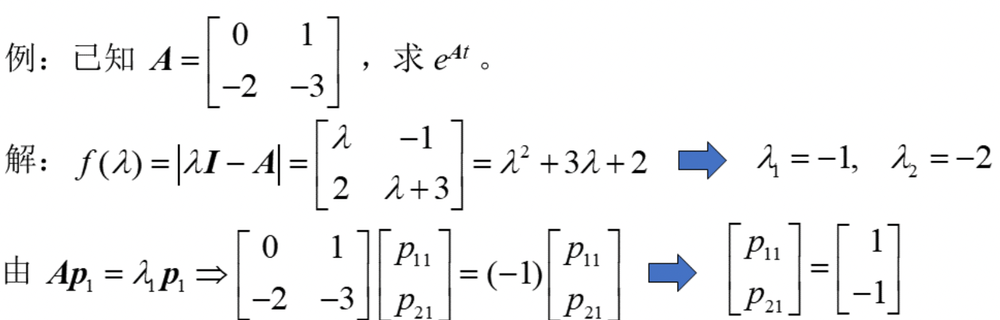

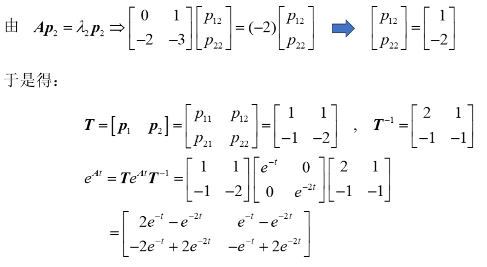

​				**情形2**：有重根的情况看看即可

# 模块3 状态变量的能控性与能观性

- 在现代控制理论中, 是把反映系统内部运动状态的状态向量作为被控量, 而 且它们不一定是实际上可观测到的物理量, 至于输出量则是状态向量的线性 组合，这就产生了从输入量 $\boldsymbol{u}(t)$ 到状态量 $\boldsymbol{x}(t)$ 的能控性问题和从输出量 $\boldsymbol{y}(t)$ 到状态量 $\boldsymbol{x}(t)$ 的能观测性问题。

## 能控性与能观性定义

### 能控性

- 能控性涉及到**一个线性系统输入对状态的影响程度。**

- 能控性概念理论计算推导[^6 ]

- 例子

  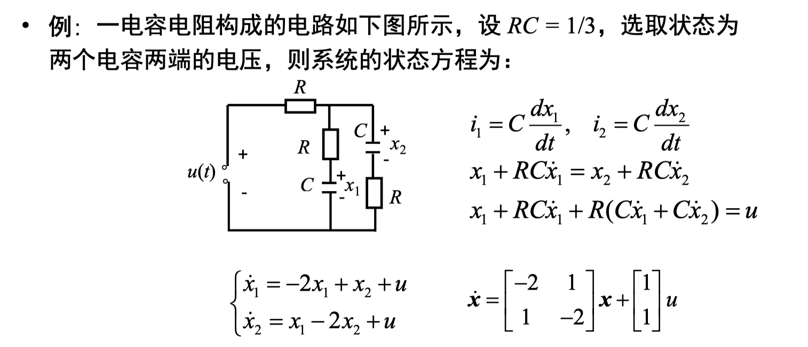

  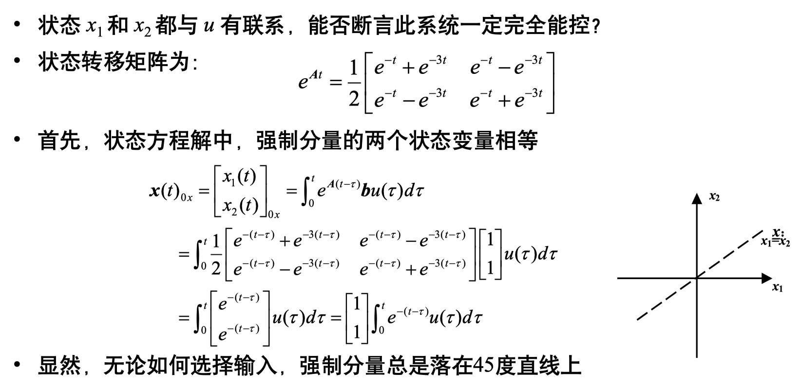

  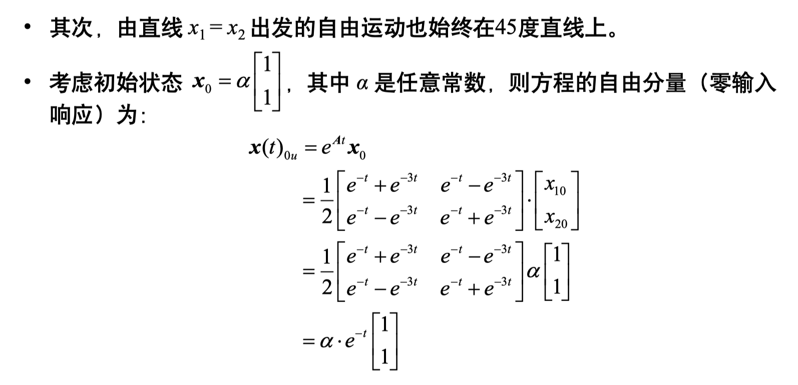

  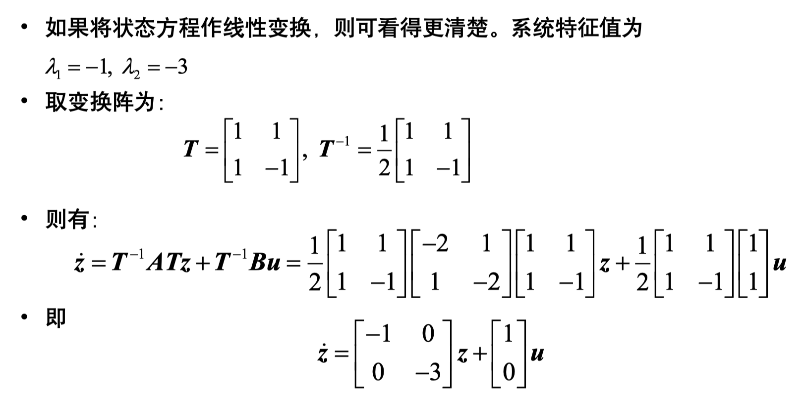

  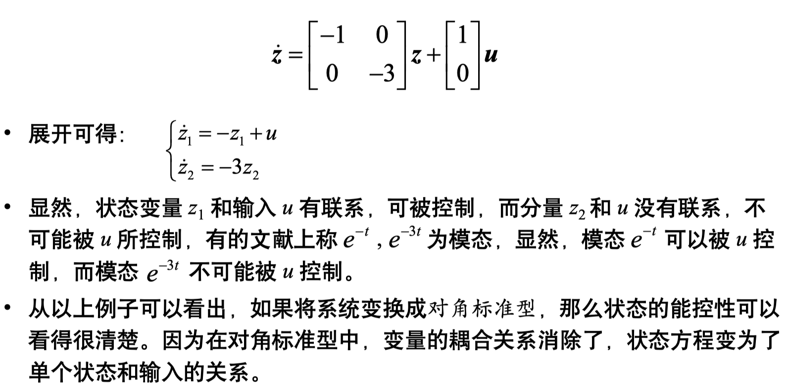

- 如果将系统变换成**对角标准型**，那么状态的能控性可以看得很清楚。因为在对角标准型中，变量的耦合关系消除了，状态方程变为了单个状态和输入的关系。

- 能控性所研究的只是系统在 $u(t)$ 的控制作用下，状态向量$\boldsymbol{x}(t)$ 的转移情况。这与输出 $\boldsymbol{y}(t)$ 无关，所以只需要研究系统的状态方程 $\dot{\boldsymbol{x}}=\boldsymbol{A} \boldsymbol{x}+\boldsymbol{B u}\left({ }^{*}\right)$
- 对初始时刻 $t_{0}$，在系统的时间定义域内存在着另一时刻 $t_{\alpha}>t_{0}$，可找到无约束的控制向量 $\boldsymbol{u}(t)$，使得系统从初始状态 $\boldsymbol{x}\left(t_{0}\right)=\overline{\boldsymbol{x}}$ 推向状态 $\boldsymbol{x}\left(t_{\alpha}\right)=\mathbf{0}$，则称系统$(*)$ 的这一特定的状态 $\bar{x}$ 是能 (可) 控的。
- 若 $\bar{x}$ 为状态空间中任意一点，那么就称此系统是状态完全能 (可) 控的, 简称系统是能控的或能控系统。若系统存在某个状态不满足上述条件, 那么是不能控系统。
- 给定区间 $\left[t_{0}, t_{\alpha}\right]$, 如果存在将系统 $\left(^{*}\right)$ 从零初始状态 $\boldsymbol{x}\left(t_{0}\right)=\mathbf{0}$ 推向末态 $\boldsymbol{x}\left(t_{\alpha}\right)=\overline{\boldsymbol{x}}$ 的控制作用 $u(t)$, 则称 $\bar{x}$ 是能达到的; 若 $\bar{x}$ 可为状态空间的任一点, 则称系统$\left(^{*}\right)$ 式是在区间 $\left[t_{0}, t_{a}\right]$ 上状态完全能 (可) 达的。

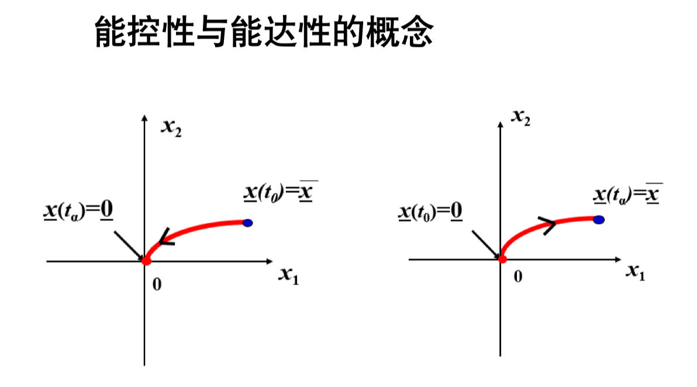

- 更多推导[^4 ]
- 能控性概念的若干条说明[^5 ]

### 能观性

- **能观性涉及到系统**的状态由输出的完全反映性。

- 即，**能否通过对输出量的有限时间的量测，把系统状态完全识别出来**。为说明能观性概念，本节也从具体例子入手说明系统的状态确实存在可观测性问题，从而引出能观性定义。

- 例子计算

  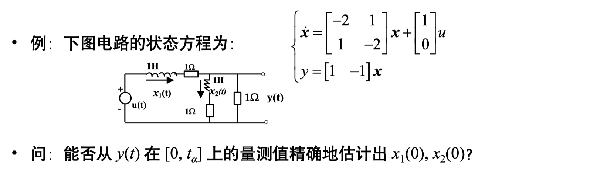

  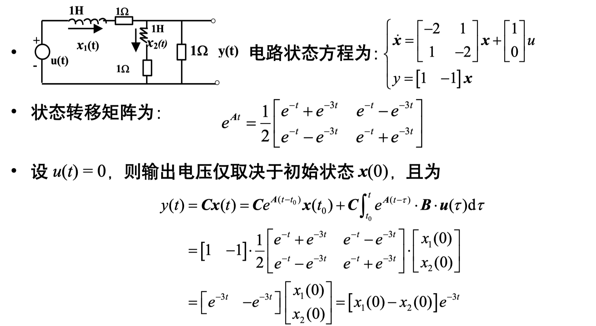

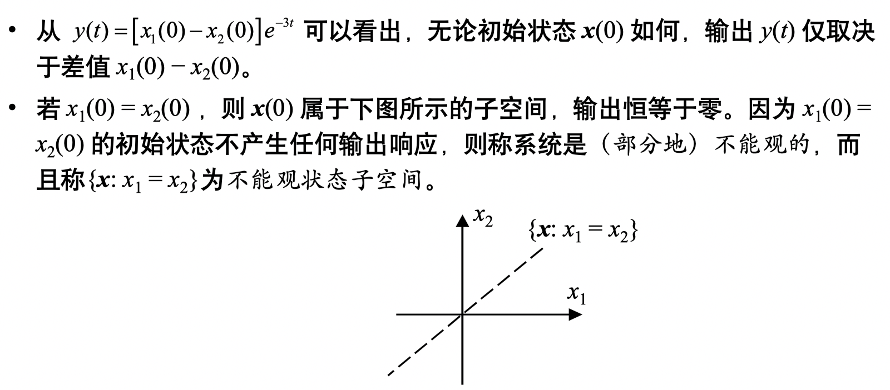

- 考虑如下线性系统: $\left\{\begin{array}{l}\dot{x}=A x+B u \\ y=C x\end{array}\right.$
- 对初始时刻 $t_{0}$, 如果线性系统在时间定义域内存在着另一时刻 $t_{\alpha}>t_{0}$, 根据在有限时间区间 $\left[t_{0}, t_{\alpha}\right]$ 量测到的输出 $\boldsymbol{y}(t)$, 能够唯一确定系统在时刻的初始状态 $\boldsymbol{x}_{0}$, 则称状态 $\boldsymbol{x}_{0}$ 在 $\left[t_{0}, t_{\alpha}\right]$ 上是能 (可) 观的。
- 若系统在 $t_{0}$ 时刻的所有初始状态都是能观的, 则称状态是完全能 (可) 观的, 简称系统是能观的或能观系统。
- 如果根据 $\left[t_{0}, t_{\alpha}\right]$ 上 $\boldsymbol{y}(t)$ 的观测值, 能够唯一地确定系统在 $t_{\alpha}$ 时刻的任意末态 $\boldsymbol{x}_{\alpha}$, 则称系统在 $\left[t_{0}, t_{\alpha}\right]$ 上是状态完全能 (可) 重构的。

## 补充

[^1 ]: 第十一周第5页
[^2 ]: 第十一周第12页
[^3 ]: 考试时不会出现复数
[^4 ]: 第十一周第15页
[^5 ]:第三章ppt第17页
[^6 ]: 第三章ppt第8页
