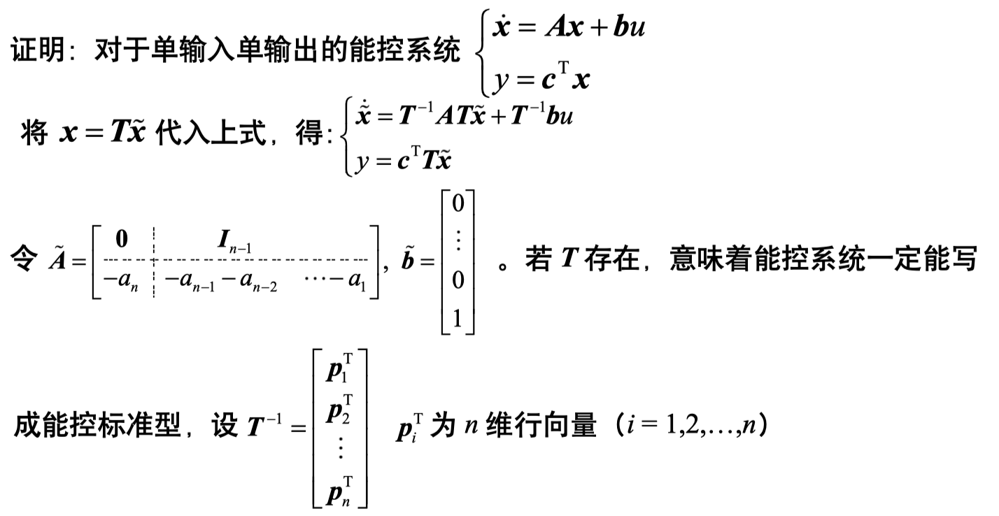
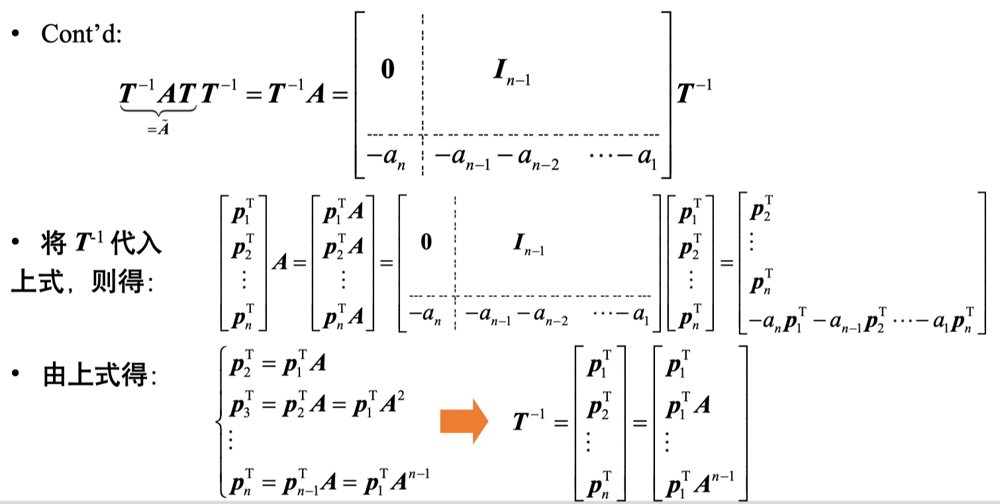
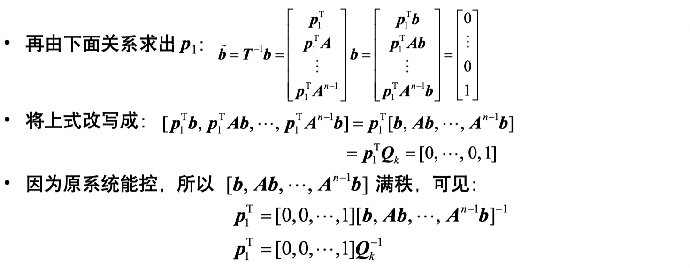
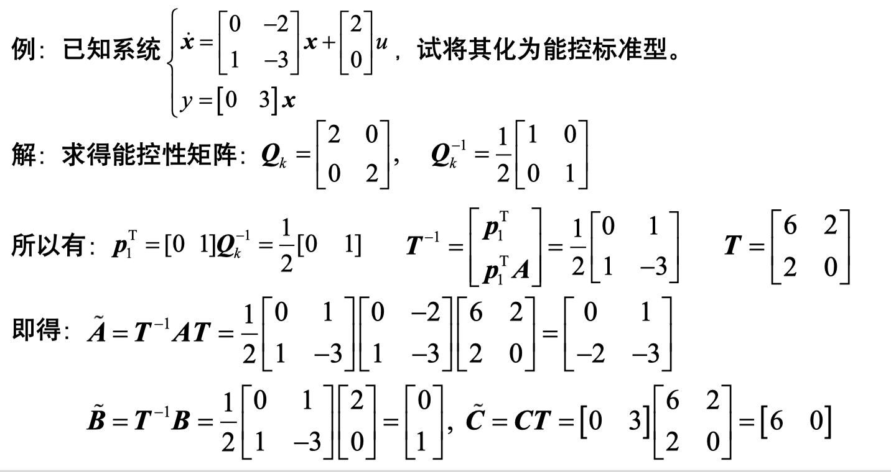
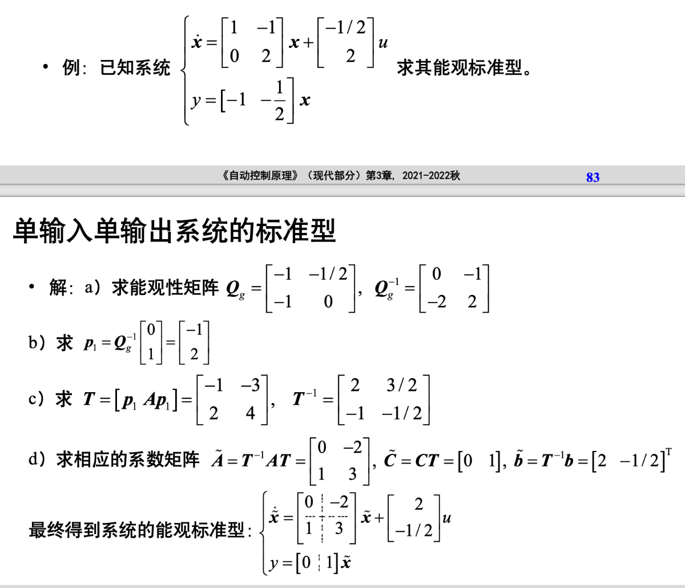
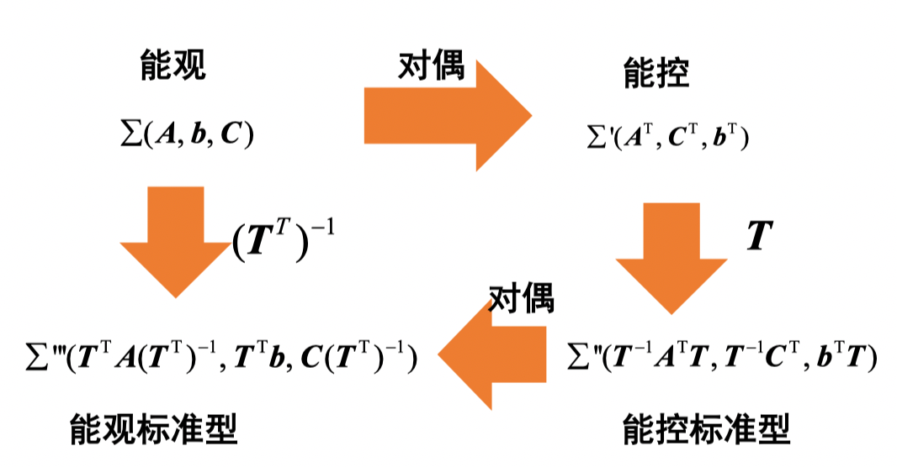
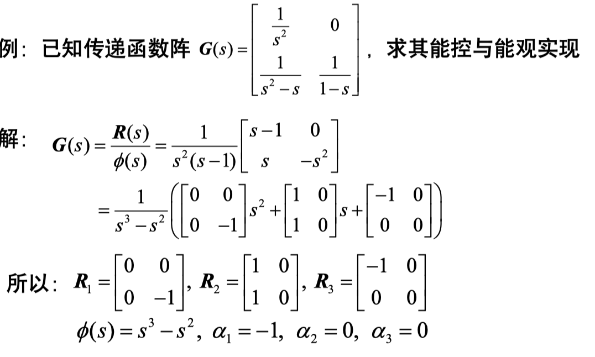
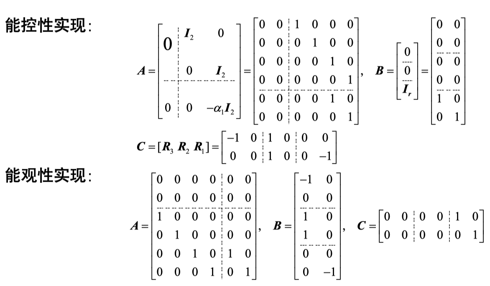

# 模块三 状态变量的能控性与能观性

## 能控标准型与能观标准型

- 单输入单输出系统的标准型

  1. 化状态方程为能控标准型

     设有单输入一单输出系统
     $$
     \left\{\begin{array}{l}
     \dot{\tilde{\boldsymbol{x}}}=\tilde{\boldsymbol{A}} \tilde{\boldsymbol{x}}+\tilde{\boldsymbol{b}} u \\
     y=\tilde{\boldsymbol{c}}^{\mathrm{T}} \tilde{\boldsymbol{x}}
     \end{array}\right.
     $$
     为能控标准型（指能控标准 I 型, 以后不加指明），则
     $$
     \tilde{\boldsymbol{A}}=\left[\begin{array}{c:cc}
     \mathbf{0} & \boldsymbol{I}_{n-1} & \\
     \hdashline-a_{n} & -a_{n-1}-a_{n-2} & \cdots-a_{1}
     \end{array}\right], \tilde{\boldsymbol{b}}=\left[\begin{array}{c}
     0 \\
     \vdots \\
     0 \\
     1
     \end{array}\right], \tilde{\boldsymbol{c}}=\left[\begin{array}{c}
     \alpha_{n} \\
     \alpha_{n-1} \\
     \vdots \\
     \alpha_{1}
     \end{array}\right]
     $$
     其中， $\alpha_{i}(i=1,2, \cdots, n)$ 为任意实数。显然系统的能控性矩阵为：
     $$
     \tilde{\boldsymbol{Q}}_{k}=\left[\tilde{\boldsymbol{b}}, \tilde{A} \tilde{\boldsymbol{b}}, \cdots, \tilde{A}^{n-1} \tilde{\boldsymbol{b}}\right]=\left[\begin{array}{cccc}
     0 & 0 & \cdots & 1 \\
     0 & 0 & \ddots & -a_{1} \\
     \vdots & \ddots & \ddots & * \\
     1 & -a_{1} & * & *
     \end{array}\right]
     $$
     可得为能控标准型。进一步地，有如下命题：**若系统是能控的，那么一定能经过某种非奇异变换， 将原系统变成能控标准型。**

     - **转换为能控标准型的方法**

     

     

     

     - **例子**：

       

  2. 化状态方程为能观标准型

     设有单输入一单输出系统 $\left\{\begin{array}{l}\dot{\tilde{\boldsymbol{x}}}=\tilde{\boldsymbol{A}} \tilde{\boldsymbol{x}}+\tilde{\boldsymbol{b}} u \\ y=\tilde{\boldsymbol{c}}^{\mathrm{T}} \tilde{\boldsymbol{x}}\end{array}\right.$
     为能观标准型（指能观标准 II 型，以后不加指明）, 则
     $$
     \begin{aligned}
     &\tilde{A}=\left[\begin{array}{c:c}
     0 & -a_{n} \\
     \hdashline \boldsymbol{I}_{n-1} & \vdots \\
     & -a_{1}
     \end{array}\right], \tilde{\boldsymbol{b}}=\left[\begin{array}{c}
     \alpha_{n} \\
     \alpha_{n-1} \\
     \vdots \\
     \alpha_{1}
     \end{array}\right], \tilde{\boldsymbol{c}}^{\mathrm{T}}=[0,0, \cdots, 1] \text { 其中 } \alpha_{i}(i=1,2, \cdots, n) \text { 可为任意实数 }\\
     &\text { 显然其能观性矩阵为: } \tilde{Q}_{g}=\left[\begin{array}{c}
     \tilde{c}^{\mathrm{T}} \\
     \tilde{c}^{\mathrm{T}} \tilde{\boldsymbol{A}} \\
     \vdots \\
     \tilde{\boldsymbol{c}}^{\mathrm{T}} \tilde{\boldsymbol{A}}^{n-1}
     \end{array}\right]=\left[\begin{array}{cccc}
     0 & 0 & 0 & 1 \\
     0 & 0 & \ddots & -a_{1} \\
     0 & \ddots & \ddots & * \\
     1 & -a_{1} & * & *
     \end{array}\right] \begin{gathered}
     \text { 满秩, 即 } \operatorname{rank} \boldsymbol{Q}_{g}=n \text {, 所以 } \\
     \text { 能观标准型一定完全能观 } \\
     \text { 同样: 若系统是能观的, 那 } \\
     \text { 么一定能经过线性变换, 将 }
     \end{gathered}
     \end{aligned}
     $$

     - 标准方法

       a) 求出原系统能观性矩阵 $Q_{g}$
       b) 取出 $\boldsymbol{Q}_{g}^{-1}$ 的最后一列，即 $\boldsymbol{p}_{1}=\boldsymbol{Q}_{g}^{-1}\left[\begin{array}{llll}0 & \cdots & 0 & 1\end{array}\right]^{\mathrm{T}}$
       c) 按照列构成 $T: T=\left[p_{1}, A p_{1}, \cdots, A^{n-1} p_{1}\right]$

     - 例子

       

  - 对偶特性

    

## 状态空间模型的实现问题

### 多变量系统的能控与能观实现

对于多变量系统, $\boldsymbol{G}(s)$ 为一个传递函数矩阵，设 $m \times r$ 传递函数阵 $\boldsymbol{G}(s)$ 给定为:
$$
\boldsymbol{G}(s)_{m \times r}=\frac{\boldsymbol{R}(s)}{\phi(s)}=\frac{\boldsymbol{R}_{l} s^{l-1}+\boldsymbol{R}_{2} s^{l-2}+\cdots+\boldsymbol{R}_{l}}{s^{l}+\alpha s^{l-1}+\cdots+\alpha_{a} s+\alpha_{t}}
$$

- 其中 $\phi(s)$ 是 $\boldsymbol{G}(s)$ 诸元分母多项式的最小公分母, $\boldsymbol{R}_{i}(i=1,2, \cdots, l)$ 为 $m \times r$ 的常值矩阵。则其能控性实现 $(A, B, C)$ 为: 

$$
\begin{aligned}
\boldsymbol{A} &\left.=\left[\begin{array}{c:ccc}
\mathbf{0}_{(l-1) r \times r} & {\boldsymbol{I}_{r}} & 0 & 0 \\
& 0 & \ddots & 0 \\
& 0 & 0 & \boldsymbol{I}_{r} \\
\hdashline-\alpha_{l} \boldsymbol{I}_{r} & -a_{l-1} & \boldsymbol{I}_{r} & \cdots & -a_{1} \boldsymbol{I}_{r}
\end{array}\right]\right\} l \cdot r\text {行, }\boldsymbol{b}=\left[\begin{array}{c}
0 \\
\vdots \\
0 \\
\boldsymbol{I}_{r}
\end{array}\right] \\
\boldsymbol{C} &=\left[\begin{array}{llll}
\boldsymbol{R}_{l} & \boldsymbol{R}_{l-1} & \cdots & \boldsymbol{R}_{1}
\end{array}\right]
\end{aligned}
$$

- 其中 $\phi(s)$ 是 $\boldsymbol{G}(s)$ 诸元分母多项式的最小公分母, $\boldsymbol{R}_{i}(i=1,2, \cdots, l)$ 为 $m \times r$ 的常 值矩阵。则其能观性实现 $(A, B, C)$ 为:
  $$
  \begin{aligned}
  \boldsymbol{A}=&\left.\left[\begin{array}{ccc:c}
  \mathbf{0}_{m \times(l-1) m} & -\alpha_{l} \boldsymbol{I}_{m} \\
  \hdashline \boldsymbol{I}_{m} & 0 & 0 & -a_{l-1} \boldsymbol{I}_{m} \\
  0 & \ddots & 0 & \vdots \\
  0 & 0 & \boldsymbol{I}_{m} & -a_{1} \boldsymbol{I}_{m}
  \end{array}\right]\right\} l \cdot m \text { 行, } \boldsymbol{b}=\left[\begin{array}{c}
  \boldsymbol{R}_{l} \\
  \vdots \\
  \boldsymbol{R}_{2} \\
  \boldsymbol{R}_{1}
  \end{array}\right] \\
  \boldsymbol{C} &=\left[\begin{array}{llll}
  \mathbf{0} & \mathbf{0} & \cdots & \boldsymbol{I}_{m}
  \end{array}\right]
  \end{aligned}
  $$

- 例子

  

### 最小实现

- 一般我们希望阶数越小越好，即模型结构越简单越好。在 $G(s)$ 的 所有实现中，其中**阶数最小的实现称为 $G(s)$ 的最小实现** (Minimal Realization)。

- 命题：系统 $\Sigma=(\boldsymbol{A}, \boldsymbol{B}, \boldsymbol{C})$ 为最小实现的充分必要条件是系统完全能控并且完全能观

- 最小实现的维数是唯一的。

- 两个最小实现是代数等价的
- 构造方法：多种知名的方法