- 例子

  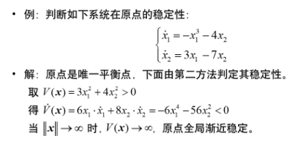

- 下图是该例子中 $V(\boldsymbol{x})=C \quad\left(C_{3}>C_{2}>C_{1}>0\right)$ 的图形. 它是一 族包围原点的。闭的. 随 $C \rightarrow 0$ 向原点收缩的椭圆。

  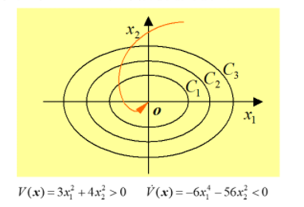

- 例子

  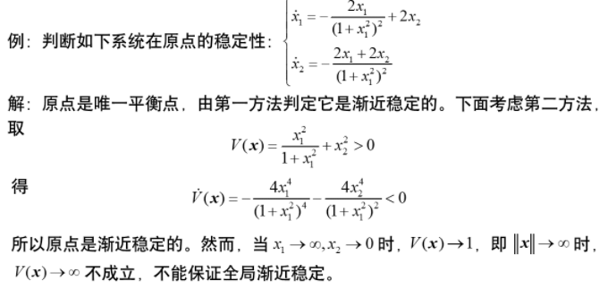

- 下图是该例中 $V(x)=C$ 的图形, 当 $C<1$ 时, 它是一族包围原点 的、闭的、随 $C \rightarrow 0$ 向原点退缩的曲线。但当 $C \geq 1$ 时, 曲线不 再是闭的。从 $A(C<1)$ 出发的轨线趋向原点; 而从 $B$ 出发 $(C>1)$ 的轨线沿着 $x_{1}$ 轴趋向无穷远, 尽管始终有 $V>0, \dot{V}<0$ 。

  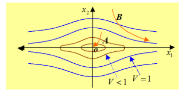

- 例子

  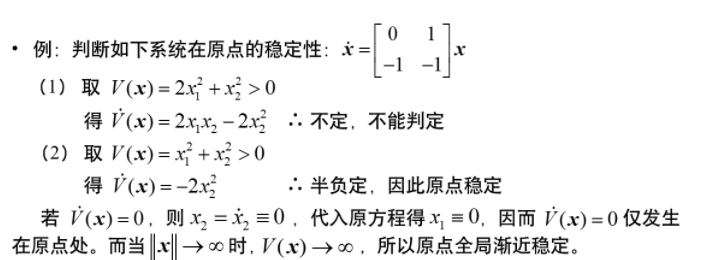

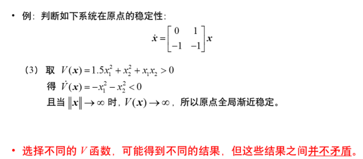

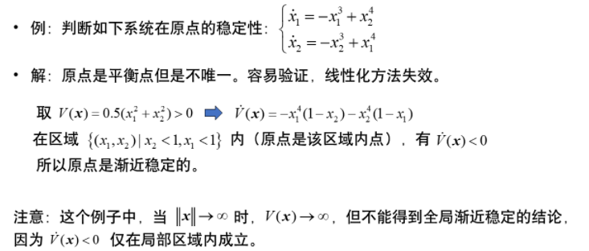

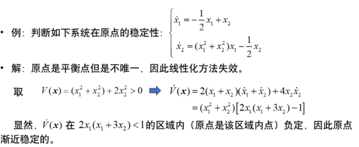

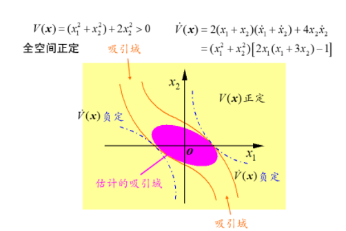

## 李阿普诺夫函数的构造方法

### 克拉索夫斯基方法

- 考虑非线性系统 $\dot{x}=f(x)$, 其中 $f(x)$ 存在连续偏导数。定义 雅可比 (Jacobi) 矩阵为:
$$
\boldsymbol{F}(\boldsymbol{x}) = \frac{\partial \boldsymbol{f}(\boldsymbol{x})}{\partial \boldsymbol{x}^{\mathrm{T}}}=\left[\begin{array}{ccc}
\frac{\partial f_{1}}{\partial x_{1}} & \cdots & \frac{\partial f_{1}}{\partial x_{n}} \\
\vdots & \vdots & \vdots \\
\frac{\partial f_{n}}{\partial x_{1}} & \cdots & \frac{\partial f_{n}}{\partial x_{n}}
\end{array}\right]
$$
- [定理3.1] 设 $f(0)=0$, 且在原点的一个邻域上, $F(x)+F^{\mathrm{T}}(x)$ 负定（正定）, 则在此邻域内除原点外, $f(x) \neq 0$ 。
- [定理3.2] 设原点是 $\dot{x}=f(x)$ 的平衡状态, 若 $F(x)+F^{\mathrm{T}}(x)$ 负定, 则原点是渐 近稳定的。进一步, 当 $\|x\| \rightarrow \infty$ 时, 有 $\|f(x)\| \rightarrow \infty$, 则原点是全局渐近稳定 的。

- [定理3.2] 设原点是 $\dot{\boldsymbol{x}}=\boldsymbol{f}(\boldsymbol{x})$ 的平衡状态, 若 $\boldsymbol{F}(\boldsymbol{x})+\boldsymbol{F}^{\mathrm{T}}(\boldsymbol{x})$ 负定, 则原点是渐近稳定的。进一步, 当 $\|x\| \rightarrow \infty$ 时,有 $V(x) \rightarrow \infty$, 则原点是全局渐近稳定的。

- 例子

  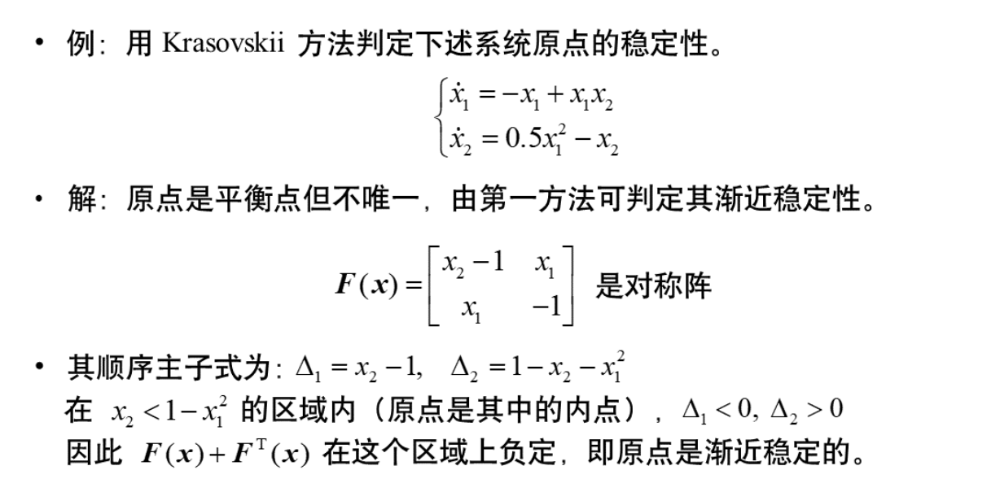

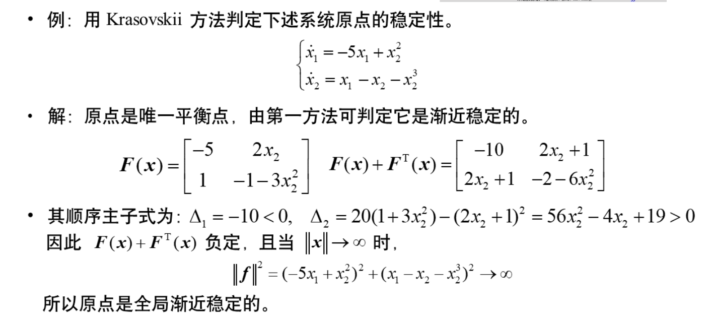

### 变量梯度法

- 思路：先找 $\dot{V}(\boldsymbol{x})$, 再找 $V(\boldsymbol{x})$ 。
- Step 4: 构成梯度, 使其满足条件 $\frac{\partial \nabla_{i}}{\partial x_{j}}=\frac{\partial \nabla_{j}}{\partial x_{i}}, i \neq j$
- Step 5: 选择一条简单的积分路径
上述条件满足时, 选择按坐标的逐次积分是最方便的:
$$
V(\boldsymbol{x})=\int_{0}^{x_{1}} \nabla_{1} \mathrm{~d} x_{1}+\int_{0}^{x_{2}} \nabla_{2} \mathrm{~d} x_{2}+\cdots+\int_{0}^{x_{n}} \nabla_{n} \mathrm{~d} x_{n}
$$
​		注意: $\int_{0}^{x_{1}} \nabla_{1} \mathrm{~d} x_{1}$ 时, $x_{2}=\cdots=x_{n}=0$
$$
\int_{0}^{x_{2}} \nabla_{2} \mathrm{~d} x_{2} \text { 时, } x_{1}=x_{1}, x_{3}=\cdots=x_{n}=0 \text {, 其余类推。 }
$$

- 例子

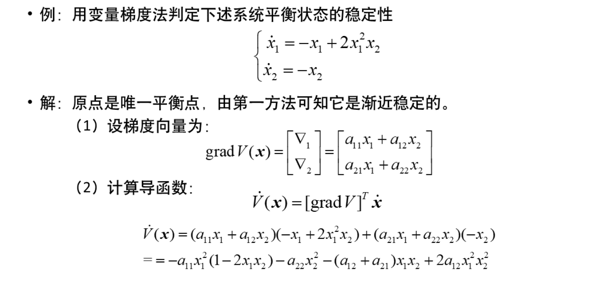

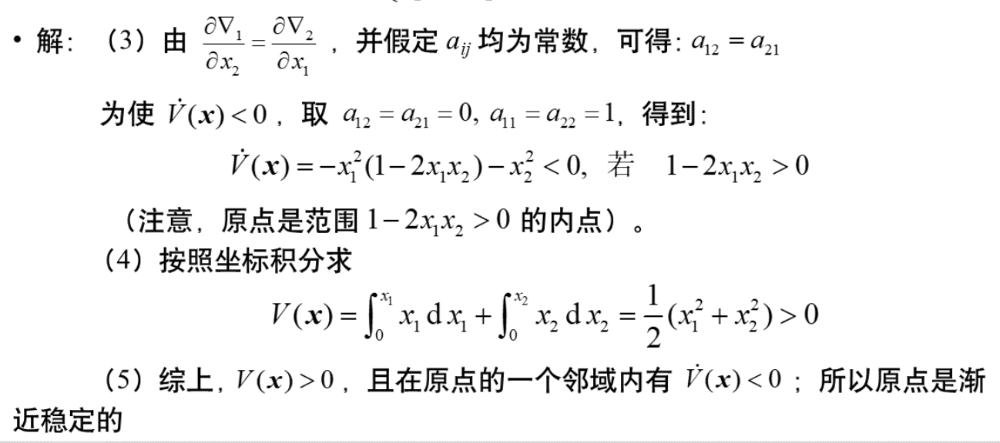

### 偶函数法

- 考虑具有如下特殊形式的函数 $V(\boldsymbol{x}): V(\boldsymbol{x})=\sum_{i=1}^{n} a_{i}\left(x_{i}\right)$ - 其中, $a_{i}\left(x_{i}\right)$ 是关于 $\boldsymbol{x}_{i}$ 的偶正 定函数, 则：
$$
\dot{V}(\boldsymbol{x})=\sum_{i=1}^{n} \frac{\partial a_{i}\left(x_{i}\right)}{\partial x_{i}} f_{i}(\boldsymbol{x})
$$
- 思路: 选取 $a_{i}\left(x_{i}\right)$ 使得 $\dot{V}(\boldsymbol{x})<0$ 。
- 注意偶正定函数的特性:
  - (1) $\frac{\partial a_{i}\left(x_{i}\right)}{\partial x_{i}}$ 是奇函数
  - (2) $\frac{\partial a_{i}\left(x_{i}\right)}{\partial x_{i}} x_{j}(i \neq j)$ 是不定号的
  - (3) 若 $b_{i}\left(x_{i}\right)$ 是 $x_{i}$ 的奇函数, 则 $\frac{\partial a_{i}\left(x_{i}\right)}{\partial x_{i}} b_{i}\left(x_{i}\right)$ 可能是定号的。

- 例子

  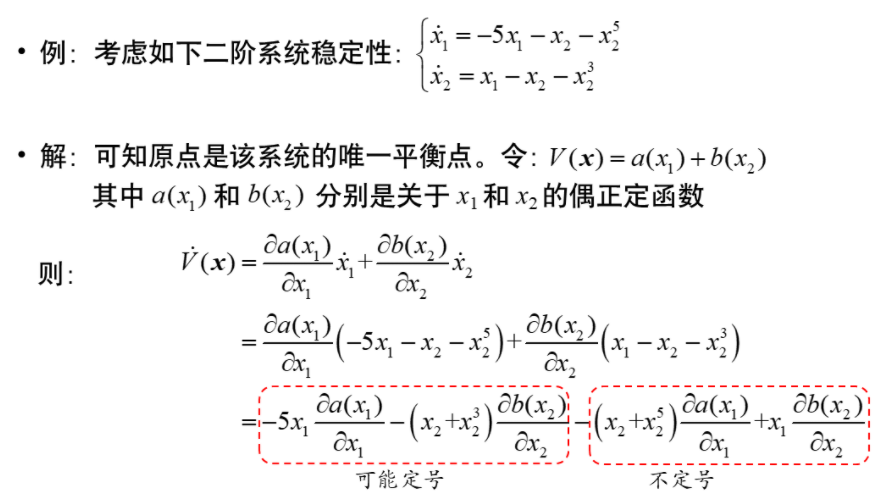

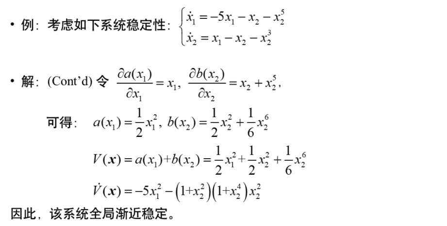

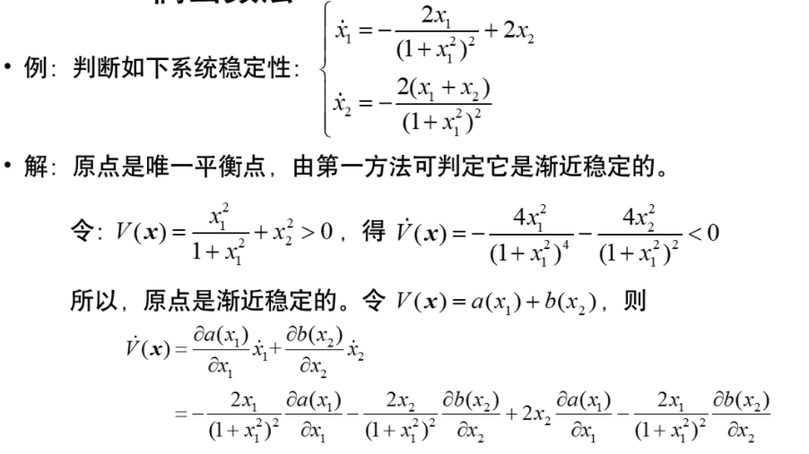

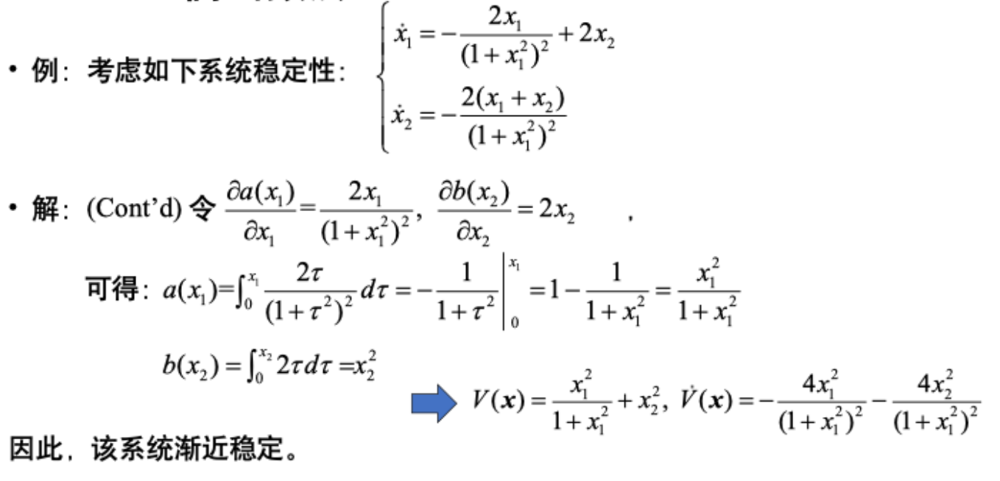

## 线性定常系统的稳定性

- 考虑线性定常系统
  $$
  \dot{\boldsymbol{x}}=\mathbf{A} \boldsymbol{x}
  $$

- 其为渐近稳定的充要条件是: $\mathrm{A}$ 的所有特征值的实部都为负。

- 线性定常系统为渐近稳定时, 原点是唯一的平衡点, 并且必然是全局渐近稳定
  的。

- 线性定常系统为渐近稳定时, $e^{A t} \rightarrow 0, t \rightarrow \infty$ 。

- 其为稳定的充要条件是: $\mathrm{A}$ 的所有特征值在左半闭平面内, 且虚轴上特征值对
  应的约当块均为 1 阶。

- 如果 $\mathrm{A}$ 有实部为正的特征值, 线性定常系统不稳定。

- [**定理4-1**] 系统 $\dot{x}=A x$ 为渐近稳定的**充要条件**是: 对于任意给定的正定阵 $\mathbf{Q}$，存在正定阵 $\mathbf{P}$ 满足李雅普诺夫方程:
  $$
  \mathbf{A}^{\mathrm{T}} \mathbf{P}+\mathbf{P}^{\mathrm{T}} \mathbf{A}=-\mathbf{Q}
  $$

- 先任取正定阵 $\mathbf{Q}$，由李雅普诺夫方程 $\mathbf{A}^{\mathrm{T}} \mathbf{P}+\mathbf{P A}=-\mathbf{Q}$ 求取 $\mathbf{P}$;
  若 P 正定（负定）, 系统渐近稳定（不稳定）, 否则, 不渐近 稳定。

- 先任取正定阵 $\mathbf{P}$，由李雅普诺夫方程 $\mathbf{A}^{\mathrm{T}} \mathbf{P}+\mathbf{P A}=-\mathbf{Q}$ 求取 $\mathbf{Q}$; 若 $\mathbf{Q}$ 正定（负 定）, 系统渐近稳定（不稳定）；否则，不能下任何结论。

- [**定理4-2**] 给定任意正定阵 $\mathbf{Q}$, 李雅普诺夫方程 $\mathbf{A}^{\mathrm{T}} \mathbf{P}+\mathbf{P A}=-\mathbf{Q}$ 有唯一解的充 要条件是: 矩阵 $\mathbf{A}$ 没有互为相反数的特征值。

- 例子

  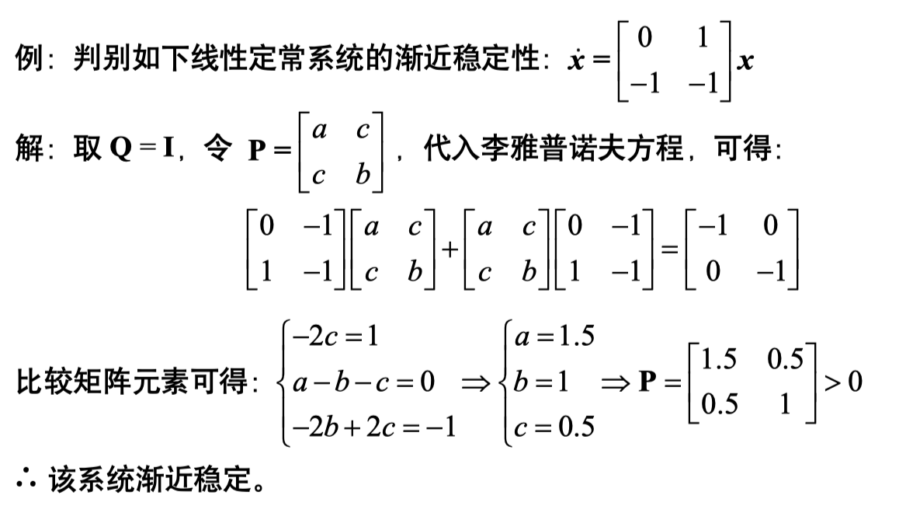

- [**定理4-3**] 矩阵 $\mathbf{A}$ 所有特征值的实部均小于 $-\sigma$ 的充要条件 是: 对任意给定的正定矩阵 $\mathbf{Q}$, 存在正定矩阵 $\mathbf{P}$ 满足:

$$
\mathbf{A}^{\mathrm{T}} \mathbf{P}+\mathbf{P} \mathbf{A}+2 \sigma \mathbf{P}=-\mathbf{Q}
$$

- 例子

  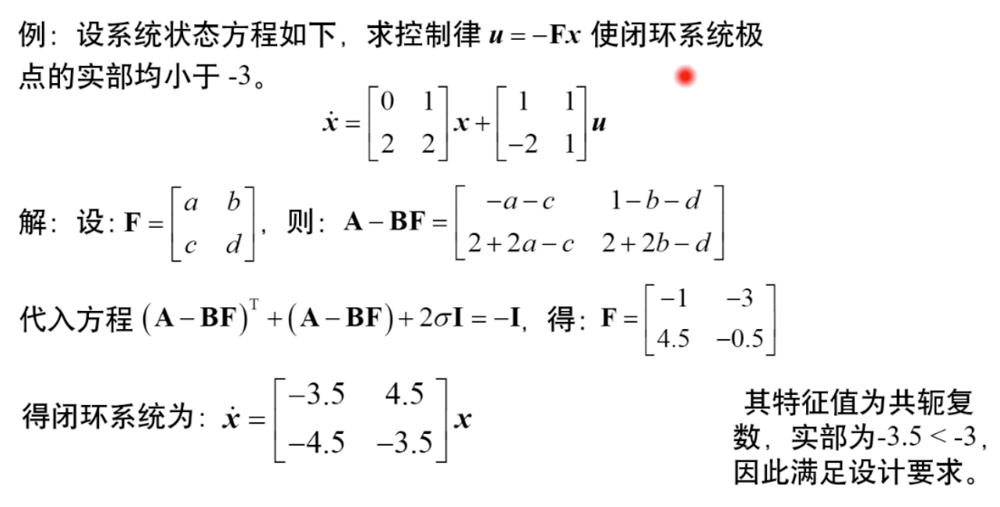