## 多输入多输出系统的状态空间表达式

- 已知系统的状态空间表达式为;

  

- 假设初始状态为0，对上做laplace变换得：
  $$
  \left\{\begin{array}{l}
  \boldsymbol{x}(s)=(s \boldsymbol{I}-\boldsymbol{A})^{-1} \boldsymbol{B} \boldsymbol{u}(s) \\
  \boldsymbol{y}(s)=\boldsymbol{C} \boldsymbol{x}(s)+\boldsymbol{D} \boldsymbol{u}(s)
  \end{array}\right.
  $$
  得到系统传递函数阵 $\boldsymbol{G}(s)=\boldsymbol{C}(s \boldsymbol{I}-\boldsymbol{A})^{-1} \boldsymbol{B}+\boldsymbol{D} \quad \boldsymbol{y}(s)=\boldsymbol{G}(s) \boldsymbol{u}(s)$

- 系统的传递函数$G(s)$是一个$m\times r$维的矩阵函数，可表示为：
  $$
  \boldsymbol{G}(s)=\left[\begin{array}{ccc}
  g_{11}(s) & \cdots & g_{1 r}(s) \\
  \vdots & \ddots & \vdots \\
  g_{m 1}(s) & \cdots & g_{m r}(s)
  \end{array}\right]
  $$
   $g_{i j}(s)$ 都是标量函数, 在物理上表示为第 $j$ 个输入对第 $i$ 个输出的传递关系。当 $i \neq j$ 时, 意味着不同标号的输入与输出有相互关联, 称为耦合关系。

- 多变量函数**例子**：

  考虑如下系统, 其状态方程和输出方程分别为:
  $$
  \left[\begin{array}{l}
  \dot{x}_{1} \\
  \dot{x}_{2}
  \end{array}\right]=\left[\begin{array}{cc}
  0 & 1 \\
  -2 & -3
  \end{array}\right]\left[\begin{array}{l}
  x_{1} \\
  x_{2}
  \end{array}\right]+\left[\begin{array}{ll}
  1 & 0 \\
  1 & 1
  \end{array}\right]\left[\begin{array}{l}
  u_{1} \\
  u_{2}
  \end{array}\right],\left[\begin{array}{l}
  y_{1} \\
  y_{2} \\
  y_{3}
  \end{array}\right]=\left[\begin{array}{ll}
  1 & 0 \\
  1 & 1 \\
  0 & 2
  \end{array}\right]\left[\begin{array}{l}
  x_{1} \\
  x_{2}
  \end{array}\right]+\left[\begin{array}{ll}
  0 & 0 \\
  1 & 0 \\
  0 & 1
  \end{array}\right]\left[\begin{array}{l}
  u_{1} \\
  u_{2}
  \end{array}\right]
  $$
  求系统的传递函数矩阵。

  

  

  

## 组合系统的空间表达式及传递函数阵

- 实际控制系统由多个子系统组合而成，串联、并联、或反馈连接，这种系统成为**组合系统**。

- **并联组合系统**：

  

  $\boldsymbol{u}_{1}=\boldsymbol{u}_{2}=\boldsymbol{u}, \boldsymbol{y}=\boldsymbol{y}_{1}+\boldsymbol{y}_{2}$

  并联子系统的状态空间表达式:
  $$
  \left\{\begin{array}{l}
  {\left[\begin{array}{l}
  \dot{x}_{1} \\
  \dot{x}_{2}
  \end{array}\right]=\left[\begin{array}{cc}
  A_{1} & 0 \\
  0 & A_{2}
  \end{array}\right]\left[\begin{array}{l}
  x_{1} \\
  x_{2}
  \end{array}\right]+\left[\begin{array}{l}
  B_{1} \\
  B_{2}
  \end{array}\right] u} \\
  y=\left[\begin{array}{ll}
  C_{1} & C_{2}
  \end{array}\right]\left[\begin{array}{l}
  x_{1} \\
  x_{2}
  \end{array}\right]+\left(D_{1}+D_{2}\right) u
  \end{array}\right.
  $$
  从而组合系统的传递函数阵为:
  $$
  \begin{aligned}
  \boldsymbol{G}(s) &=\left[\begin{array}{ll}
  \boldsymbol{C}_{1} & \boldsymbol{C}_{2}
  \end{array}\right]\left[\begin{array}{cc}
  \left(s \boldsymbol{I}-\boldsymbol{A}_{1}\right)^{-1} & \boldsymbol{0} \\
  \mathbf{0} & \left(s \boldsymbol{I}-\boldsymbol{A}_{2}\right)^{-1}
  \end{array}\right]\left[\begin{array}{l}
  \boldsymbol{B}_{1} \\
  \boldsymbol{B}_{2}
  \end{array}\right]+\left(\boldsymbol{D}_{1}+\boldsymbol{D}_{2}\right) \\
  &=
  [\boldsymbol{C}_{1}\left(s \boldsymbol{I}-\boldsymbol{A}_{1}\right)^{-1} \boldsymbol{B}_{1}+\boldsymbol{D}_{1}]+ [\boldsymbol{C}_{2}\left(s \boldsymbol{I}-\boldsymbol{A}_{2}\right)^{-1} \boldsymbol{B}_{2}+\boldsymbol{D}_{2}] \\
  & =\boldsymbol{G}_{1}(s)+\boldsymbol{G}_{2}(s)
  \end{aligned}
  $$
  因此, **系统并联时, 系统传递函数阵等于子系统的传递函数阵之和。**

- **串联组合系统**

  

  $\boldsymbol{u}=\boldsymbol{u}_{1}, \boldsymbol{y}_{1}=\boldsymbol{u}_{2}, \boldsymbol{y}=\boldsymbol{y}_{2}$
  $$
  G(s) = G_2(s)\cdot G_1(s)
  $$
  因此, **系统串联时, 系统传递函数阵等于子系统的传递函数阵之积**[^1]，注意，子系统的先后顺序不能颠倒。

- **具有输出反馈的系统**

  

  系统开环传递函数矩阵为 $\boldsymbol{G}_{o}(s)=\boldsymbol{C}(s \boldsymbol{I}-\boldsymbol{A})^{-1} \boldsymbol{B}$ 

  闭环系统状态空间表达式: $\left\{\begin{array}{l}\dot{x}=A x+B(u-H y)=(A-B H C) x+B u \\ y=C x\end{array}\right.$ 故

  常数反馈系统传递函数阵为: $\boldsymbol{G}(s)=\boldsymbol{C}(s \boldsymbol{I}-\boldsymbol{A}+\boldsymbol{B} \boldsymbol{H} \boldsymbol{C})^{-1} \boldsymbol{B}$

  且开环传递函数和闭环传递函数关系[^2]为：$\boldsymbol{G}(s)=\left[\boldsymbol{I}+\boldsymbol{G}_{o}(s) \boldsymbol{H}\right]^{-1} \boldsymbol{G}_{o}(s)$

  同理, $\boldsymbol{G}(s)=\boldsymbol{G}_{o}(s)\left[\boldsymbol{I}+\boldsymbol{H} \boldsymbol{G}_{o}(s)\right]^{-1}$

- **动力反馈系统**

  

  动态反馈系统的子系统状态方程:
  $$
  \Sigma_{1}:\left\{\begin{array}{l}
  \dot{x}_{1}=A_{1} x_{1}+B_{1} u_{1} \\
  y_{1}=C_{1} x_{1}
  \end{array} \quad \Sigma_{2}:\left\{\begin{array}{l}
  \dot{x}_{2}=A_{2} x_{2}+B_{2} u_{2} \\
  y_{2}=C_{2} x_{2}
  \end{array}\right.\right.\\
  \boldsymbol{u}_{1}=\boldsymbol{u}-\boldsymbol{y}_{2}, \boldsymbol{y}=\boldsymbol{y}_{1}=\boldsymbol{u}_{2}
  $$
  由此可得动态反馈系统的状态空间表达式为: $\left\{\begin{array}{l}\dot{x}_{1}=A_{1} x_{1}+B_{1} u-B_{1} C_{2} x_{2} \\ \dot{x}_{2}=A_{2} x_{2}+B_{2} C_{1} x_{1} \\ y=C_{1} x_{1}\end{array}\right.$
  写成矩阵形式: $\left[\begin{array}{c}\dot{x}_{1} \\ \dot{x}_{2}\end{array}\right]=\left[\begin{array}{cc}A_{1} & -B_{1} C_{2} \\ B_{2} C_{1} & A_{2}\end{array}\right]\left[\begin{array}{c}x_{1} \\ x_{2}\end{array}\right]+\left[\begin{array}{c}B_{1} \\ 0\end{array}\right] u$
  $$
  \boldsymbol{y}=\left[\begin{array}{ll}
  \boldsymbol{C}_{1} & \mathbf{0}
  \end{array}\right]\left[\begin{array}{l}
  \boldsymbol{x}_{1} \\
  \boldsymbol{x}_{2}
  \end{array}\right]
  $$
  可得[^3 ]: $\boldsymbol{G}(s)=\left[\boldsymbol{I}+\boldsymbol{G}_{1}(s) \boldsymbol{G}_{2}(s)\right]^{-1} \boldsymbol{G}_{1}(s)$
  同理, $\boldsymbol{G}(s)=\boldsymbol{G}_{1}(s)\left[\boldsymbol{I}+\boldsymbol{G}_{2}(s) \boldsymbol{G}_{1}(s)\right]^{-1}$

## 系统的时域描述及状态空间表达式

- 对于一个单输入单输出线性定常系统, 在经典控制理论中通常由 一个 $n$ 阶线性常系数微分方程来描述:

$$
\begin{aligned}
&y^{(n)}+a_{1} y^{(n-1)}+\cdots+a_{n-1} \dot{y}+a_{n} y \\
&=b_{0} u^{(m)}+b_{1} u^{(m-1)}+\cdots+b_{m-1} \dot{u}+b_{m} u
\end{aligned}
$$

- 单输入单输出线性定常系统的状态空间表达式:

$$
\left\{\begin{array}{l}
\dot{x}=A x+b u \\
y=c^{\mathrm{T}} x+d u
\end{array}\right.
$$

- 高阶微分方程中含有作用函数导数项：

  例: 三阶系统 $y^{(3)}+a_{1} y^{(2)}+a_{2} \dot{y}+a_{3} y=b_{1} u^{(2)}+b_{2} \dot{u}+b_{3} u$

- 推广至一般的 $n$ 阶系统:
$$
\begin{gathered}
y^{(n)}+a_{1} y^{(n-1)}+\cdots+a_{n-1} \dot{y}+a_{n} y \\
=b_{0} u^{(n)}+b_{1} u^{(n-1)}+\cdots+b_{n-1} \dot{u}+b_{n} u
\end{gathered}
$$
得到:

- 该形式的状态空间表达式称为**能控标准I型**, 也称控制器规范型（或第二可控规范型）。

- 例子：

  

- 小结：

  

## 基于模拟结构图写出状态空间表达式

### 基于串并联分解

- 当系统的描述是以方块图给出时, 基于各模块的串并联分解可 直接导出相应的状态空间表达式

- 模拟图的基本单元实现：

  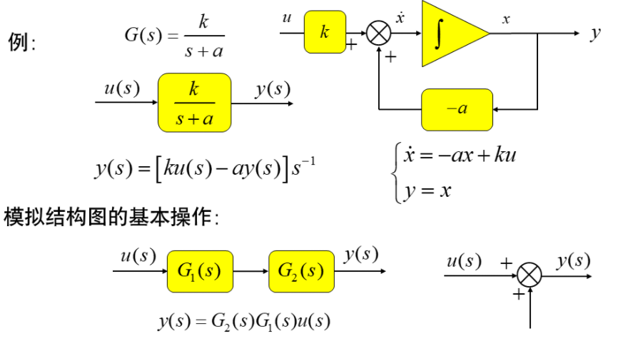

- 例一：

- 例二：

  

### 基于部分分式分解

- 将传递函数展开成部分分式, 根据此部分分式画出其模拟结构图, 然后由此模拟结构图写出的状态空间表达式是具有一定特点的约当标准型。
- 设单输入一单输出系统的传递函数如下:
$$
g(s)=\frac{b_{0} s^{n}+b_{1} s^{n-1}+\cdots+b_{n-1} s+b_{n}}{s^{n}+a_{1} s^{n-1}+\cdots+a_{n-1} s+a_{n}}
$$
- 分两种情况进行讨论
  - 情形 (1): 所有的特征值都是两两相异的
  - 情形 (2): 存在部分特征值是相同的

- （1）设传递函数具有两两相异的特征值 $\lambda_{1}, \lambda_{2}, \cdots, \lambda_{n}$, 则 $g(s)$ 可 展开为如下部分分式
$$
g(s)=\frac{y(s)}{u(s)}=\frac{\alpha_{1}}{s-\lambda_{1}}+\frac{\alpha_{2}}{s-\lambda_{2}}+\cdots+\frac{\alpha_{n}}{s-\lambda_{n}}+\delta
$$
- 其中:

$$
\begin{aligned}
\alpha_{i} &=\lim _{s \rightarrow \lambda_{1}}\left(s-\lambda_{i}\right) \cdot g(s) \quad i=1,2, \cdots, n \\
y(s) &=\sum_{i=1}^{n} \frac{\alpha_{i}}{s-\lambda_{i}} u(s)+\delta u(s) \quad i=1,2, \cdots, n
\end{aligned}
$$

- 这种结构的显著特点是积分器不再是前后串联形式而是并联形式。

- 取上图中的状态变量, 则状态方程和输出方程可表示为:

  

- 两式互为对偶, 两式的系数矩阵 $A$ 均为对角矩阵, 对角线上各元素 是互异的 $n$ 个特征值, 故称为**对角线标准型**或**解耦标准型**, 即变量之间不存在耦合关系。一般地, 它属于如下的**约当标准型**:

$$
g(s)=\frac{b_{0} s^{n}+b_{1} s^{n-1}+\cdots+b_{n-1} s+b_{n}}{s^{n}+a_{1} s^{n-1}+\cdots+a_{n-1} s+a_{n}}
$$

- （2）考虑特征方程式具有**重根**的情况。考虑一个简单的例子，设 $\lambda_{1}$ 为三重根, $\lambda_{4} \sim \lambda_{n}$ 为互异的根, 于是可得:
  $$
  g(s)=\frac{\alpha_{11}}{s-\lambda_{1}}+\frac{\alpha_{12}}{\left(s-\lambda_{1}\right)^{2}}+\frac{\alpha_{13}}{\left(s-\lambda_{1}\right)^{3}}+\frac{\alpha_{4}}{s-\lambda_{4}}+\cdots+\frac{\alpha_{n}}{s-\lambda_{n}}+\delta
  $$

​		其中，
$$
\begin{array}{ll}
\alpha_{13}=\lim _{s \rightarrow \lambda_{1}}\left[\left(s-\lambda_{1}\right)^{3} \cdot g(s)\right] & \alpha_{11}=\frac{1}{2 !} \lim _{s \rightarrow \lambda_{1}}\left[\frac{\mathrm{d}^{2}\left\{\left(s-\lambda_{1}\right)^{3} \cdot g(s)\right\}}{\mathrm{d} s^{2}}\right] \\
\alpha_{12}=\lim _{s \rightarrow i}\left[\frac{\mathrm{d}\left\{\left(s-\lambda_{1}\right)^{3} \cdot g(s)\right\}}{\mathrm{d} s}\right] & \alpha_{i}=\lim _{s \rightarrow \lambda_{1}}\left(s-\lambda_{i}\right) \cdot g(s) \quad i=4,5, \cdots, n
\end{array}
$$

- 约当标准型的模拟结构图

  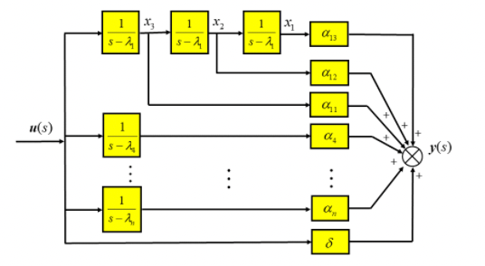

- 相应的状态空间表达式为
  $$
  \left\{\begin{array}{l}
  \dot{x}_{1}=\lambda_{1} x_{1}+x_{2} \\
  \dot{x}_{2}=\lambda_{1} x_{2}+x_{3} \\
  \dot{x}_{3}=\lambda_{1} x_{3}+u \\
  \dot{x}_{4}=\lambda_{4} x_{4}+u \\
  \quad \vdots \\
  \dot{x}_{n}=\lambda_{n} x_{n}+u \\
  y=\alpha_{13} x_{1}+\alpha_{12} x_{2}+\alpha_{11} x_{3}+\alpha_{4} x_{4}+\cdots+\alpha_{n} x_{n}+\delta u
  \end{array}\right.
  $$

- 写成矩阵形式

  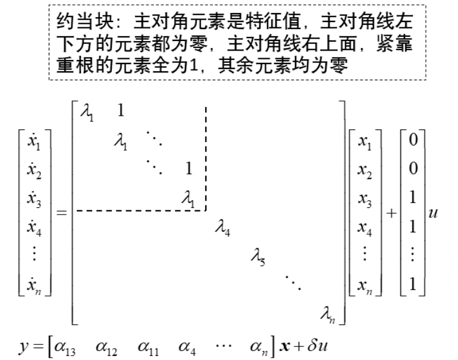

​		上式称为约旦标准型。**系统约当块的数量 = 多重根的数量**

- 例：

  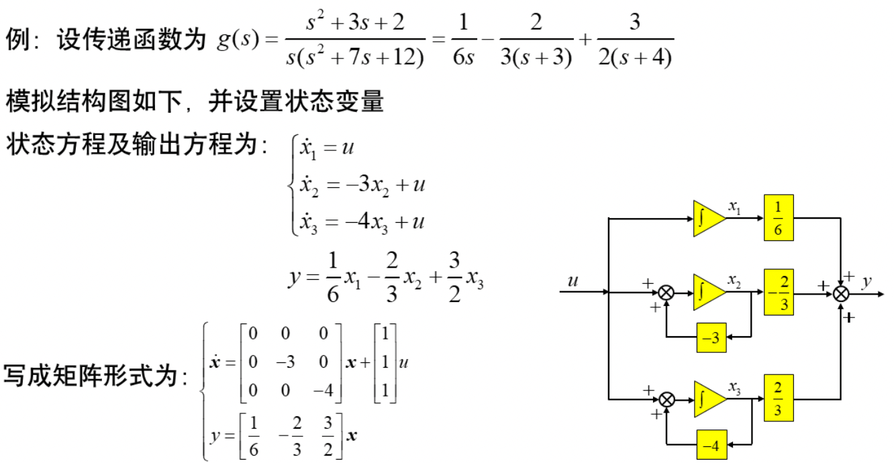

- **基于积分器串+常值反馈**

​		由于前面的方法需要得到系统的零极点，在阶次较高时，有时难以计算，因此使用此方法。

1. 能控标准I型

$$
y^{(3)}+a_{1} y^{(2)}+a_{2} \dot{y}+a_{3} y=b_{0} u^{(3)}+b_{1} u^{(2)}+b_{2} \dot{u}+b_{3} u
$$
​		传递函数为: $g(s)=\frac{b_{0} s^{3}+b_{1} s^{2}+b_{2} s+b_{3}}{s^{3}+a_{1} s^{2}+a_{2} s+a_{3}}$
​		可变换为: $\quad g(s)=\frac{y(s)}{u(s)}=b_{0}+\frac{\left(b_{1}-a_{1} b_{0}\right) s^{-1}+\left(b_{2}-a_{2} b_{0}\right) s^{-2}+\left(b_{3}-a_{3} b_{0}\right) s^{-3}}{1+a_{1} s^{-1}+a_{2} s^{-2}+a_{3} s^{-3}}$ 

​		令 $e(s)=\frac{1}{1+a_{1} s^{-1}+a_{2} s^{-2}+a_{3} s^{-3}} u(s)$
​		则有: $e(s)=u(s)-a_{1} e(s) s^{-1}-a_{2} e(s) s^{-2}-a_{3} e(s) s^{-3}$

​									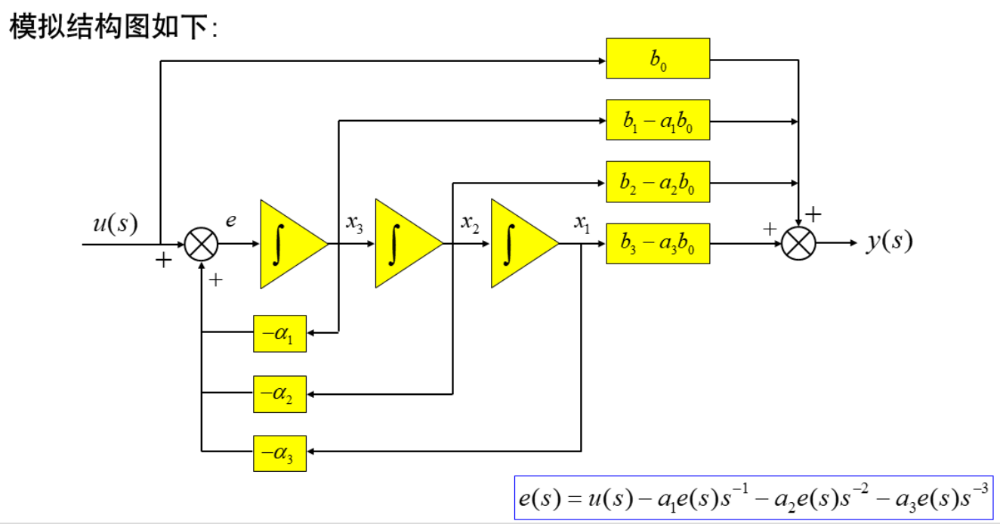

​		设置状态变量, 则得状态空间表达式为:
$$
\begin{aligned}
&\left\{\begin{array}{l}
\dot{x}_{1}=x_{2} \\
\dot{x}_{2}=x_{3} \\
\dot{x}_{3}=-a_{3} x_{1}-a_{2} x_{2}-a_{1} x_{3}+u
\end{array}\right. \\
&y=\left(b_{3}-a_{3} b_{0}\right) x_{1}+\left(b_{2}-a_{2} b_{0}\right) x_{2}+\left(b_{1}-a_{1} b_{0}\right) x_{3}+b_{0} u
\end{aligned}
$$
​		写成矩阵向量形式:
$$
\left\{\begin{array}{l}
\dot{x}=\left[\begin{array}{ccc}
0 & 1 & 0 \\
0 & 0 & 1 \\
-a_{3} & -a_{2} & -a_{1}
\end{array}\right] \boldsymbol{x}+\left[\begin{array}{l}
0 \\
0 \\
1
\end{array}\right] u \\
y=\left[\begin{array}{lll}
b_{3}-a_{3} b_{0} & b_{2}-a_{2} b_{0} & b_{1}-a_{1} b_{0}
\end{array}\right] \boldsymbol{x}+b_{0} u
\end{array}\right.
$$
​		这种方法也称为**直接程序法**。

​		推广到 $n$ 阶系统
$$
\begin{aligned}
\left[\begin{array}{c}
\dot{x}_{1} \\
\dot{x}_{2} \\
\vdots \\
\dot{x}_{n}
\end{array}\right] &=\left[\begin{array}{ccccc}
0 & 1 & 0 & \cdots & 0 \\
\vdots & 0 & 1 & \cdots & 0 \\
\vdots & \vdots & \ddots & \ddots & \vdots \\
0 & \cdots & \cdots & 0 & 1 \\
-a_{n} & -a_{n-1} & -a_{n-2} & \cdots & -a_{1}
\end{array}\right]\left[\begin{array}{c}
x_{1} \\
x_{2} \\
\vdots \\
x_{n}
\end{array}\right]+\left[\begin{array}{c}
0 \\
0 \\
\vdots \\
1
\end{array}\right] u \\
y &=\left[\begin{array}{lllll}
b_{n}-a_{n} b_{0} & b_{n-1}-a_{n-1} b_{0} & \cdots & b_{1}-a_{1} b_{0}
\end{array}\right] \boldsymbol{x}+b_{0} u
\end{aligned}
$$
​		能控标准 I 型, 也称控制器规范型

2. 能控标准II型
   $$
   y^{(3)}+a_{1} y^{(2)}+a_{2} \dot{y}+a_{3} y=b_{0} u^{(3)}+b_{1} u^{(2)}+b_{2} \dot{u}+b_{3} u
   $$
   传递函数可变换为:
   $$
   g(s)=\frac{b_{0} s^{3}+b_{1} s^{2}+b_{2} s+b_{3}}{s^{3}+a_{1} s^{2}+a_{2} s+a_{3}}=\frac{b_{0}+b_{1} s^{-1}+b_{2} s^{-2}+b_{3} s^{-3}}{1+a_{1} s^{-1}+a_{2} s^{-2}+a_{3} s^{-3}}
   $$
   则有:
   $$
   \begin{aligned}
   &y(s)+a_{1} s^{-1} y(s)+a_{2} s^{-2} y(s)+a_{3} s^{-3} y(s) \\
   &=b_{0} u(s)+b_{1} s^{-1} u(s)+b_{2} s^{-2} u(s)+b_{3} s^{-3} u(s)
   \end{aligned}
   $$

​		推出$\begin{aligned} & y(s) = b_{0} u(s)+s^{-1}\left[b_{1} u(s)-a_{1} y(s)\right]+s^{-2}\left[b_{2} u(s)-a_{2} y(s)\right]+s^{-3}\left[b_{3} u(s)-a_{3} y(s)\right] \end{aligned}$

​		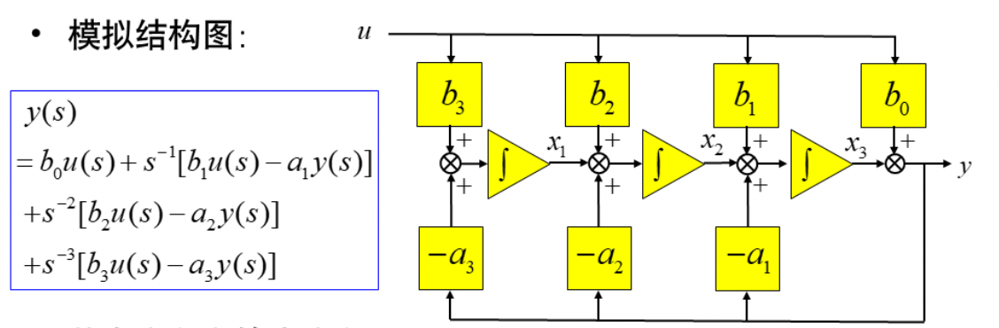

​		状态方程和输出方程:
$$
\begin{aligned}
&\begin{array}{l}
\dot{x}_{1}=-a_{3}\left(x_{3}+b_{0} u\right)+b_{3} u \\
\dot{x}_{2}=x_{1}-a_{2}\left(x_{3}+b_{0} u\right)+b_{2} u \\
\dot{x}_{3}=x_{2}-a_{1}\left(x_{3}+b_{0} u\right)+b_{1} u
\end{array} \\
&y=b_{0} u+x_{3}
\end{aligned} \quad\left\{\begin{array}{l}
\dot{x}=\left[\begin{array}{ccc}
0 & 0 & -a_{3} \\
1 & 0 & -a_{2} \\
0 & 1 & -a_{1}
\end{array}\right] \boldsymbol{x}+\left[\begin{array}{l}
b_{3}-a_{3} b_{0} \\
b_{2}-a_{2} b_{0} \\
b_{1}-a_{1} b_{0}
\end{array}\right] u \\
y=\left[\begin{array}{ccc}
0 & 0 & 1
\end{array}\right] \boldsymbol{x}+b_{0} u
\end{array}\right.
$$
​		这种方法也称为多层积分法。

​		推广到 $n$ 阶系统
$$
\begin{aligned}
&{\left[\begin{array}{c}
\dot{x}_{1} \\
\dot{x}_{2} \\
\vdots \\
\dot{x}_{n}
\end{array}\right]=\left[\begin{array}{ccccc}
0 & 0 & \cdots & 0 & -a_{n} \\
1 & 0 & \cdots & 0 & -a_{n-1} \\
0 & 1 & \cdots & 0 & -a_{n-2} \\
\vdots & \vdots & \ddots & \vdots & \vdots \\
0 & 0 & \cdots & 1 & -a_{1}
\end{array}\right]\left[\begin{array}{c}
x_{1} \\
x_{2} \\
\vdots \\
x_{n}
\end{array}\right]+\left[\begin{array}{c}
b_{n}-a_{n} b_{0} \\
b_{n-1}-a_{n-1} b_{0} \\
\vdots \\
b_{1}-a_{1} b_{0}
\end{array}\right] u} \\
&y=\left[\begin{array}{cccc}
0 & 0 & \cdots & 1
\end{array}\right] \boldsymbol{x}+b_{0} u
\end{aligned}
$$
- 这就是**能观标准 II 型**
  能控标准 I 型、能观标准 II 型使用较为普遍。
  一般用 I 型指代能控标准 I 型, 用 II 型指代能观标准 II 型。

- 例子

  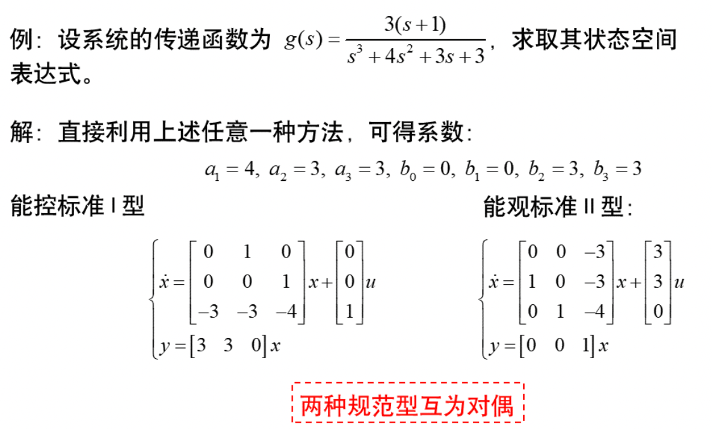

## 系统的等价变化及其应用

- 一、线性变换

  不同的状态变量组之 间的关系实质上是一种线性变换的关系, 或称坐标变换。给定系统为：
  $$
  \left\{\begin{array}{l}
  \dot{x}=A x+B u \\
  y=C x+D u
  \end{array}\right.
  $$

​		总可以找到任意一个非奇异阵 $T$, 将原状态向量 $x$ 进行线性变换, 得到另一个状 态向量 $z$, 即:
$$
x=T z \text { 或 } z=T^{-1} x
$$
​		带入得到：

​		                                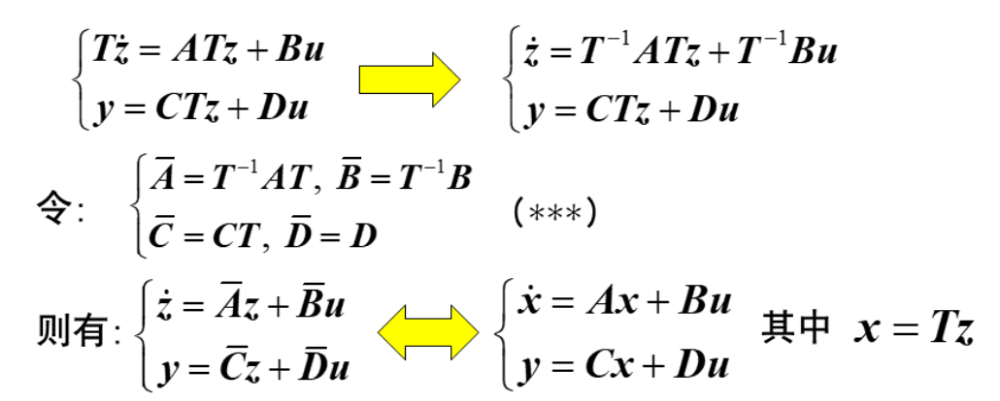

- 例子

  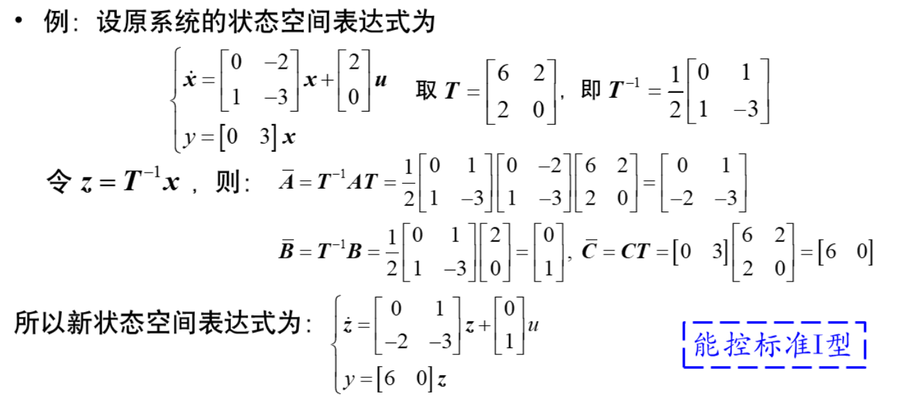

- 二、系统特征值不变性及系统不变量

  系统的特征值就是状态矩阵A的特征值，也即特征方程
  $$
  |\lambda \boldsymbol{I}-\boldsymbol{A}|=0
  $$

​		的根，方阵 $A$ 有 $n$ 个特征值。

​		例子：

​		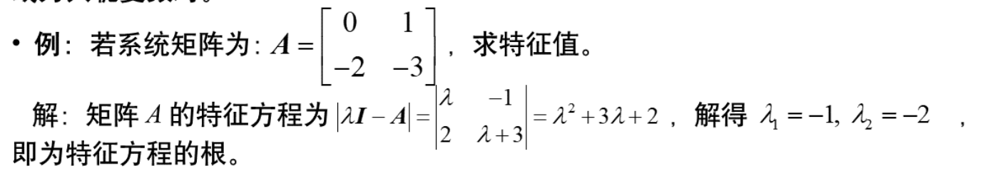

​		状态矩阵 $A$ 的一个重要性质是**其特征值的不变性**，新老状态方程的 $A$ 阵和 $\bar{A}$ 阵的特征值是相同的。

​		令系统特征方程为:
$$
|\lambda \boldsymbol{I}-\boldsymbol{A}|=\lambda^{n}+\alpha_{1} \lambda^{n-1}+\alpha_{2} \lambda^{n-2}+\cdots+\alpha_{n-1} \lambda+\alpha_{n}=0
$$
​		则特征多项式的系数为系统的不变量。

- **一切代数上等价的线性系统都有相同的传递函数矩阵。**[^4 ]

- 三、特征向量

  设 $\boldsymbol{p}_{i}$ 为 $n$ 维非零向量, $\lambda_{i}$ 为矩阵 $\boldsymbol{A}$ 的特征值, 若下式成立:
  $$
  \boldsymbol{A p}_{i}=\lambda_{i} \boldsymbol{p}_{i}
  $$
  则称向量 $\boldsymbol{p}_{i}$ 为矩阵 $\boldsymbol{A}$ 的对应于特征值 $\lambda_{i}$ 的特征向量。从上式

- 四、化状态空间表达式为约当标准型

​		若矩阵有两两相异的特征值, 则可化为对角标准型; 

​		若系统矩阵有重根，则可化为一般的约当标准型。

1. 状态矩阵 $A$ 无重根

​		对线性定常系统: $\dot{x}=A x+B u$
​		如果 $A$ 有 $n$ 个两两相异特征值, 则存在非奇异矩阵 $T$, 通过线性变换 $\hat{x}=T^{-1} x$

​		使之化为对角线规范形式:$\hat{\dot{\boldsymbol{x}}}=\hat{A} \hat{\hat{x}}+\hat{\boldsymbol{B}} \hat{\boldsymbol{u}}$, 其中: $\hat{\boldsymbol{A}}=\operatorname{diag}\left\{\lambda_{1}, \cdots, \lambda_{n}\right\}$, 包含了 $A$ 的 $n$ 个特征

- 例子：

  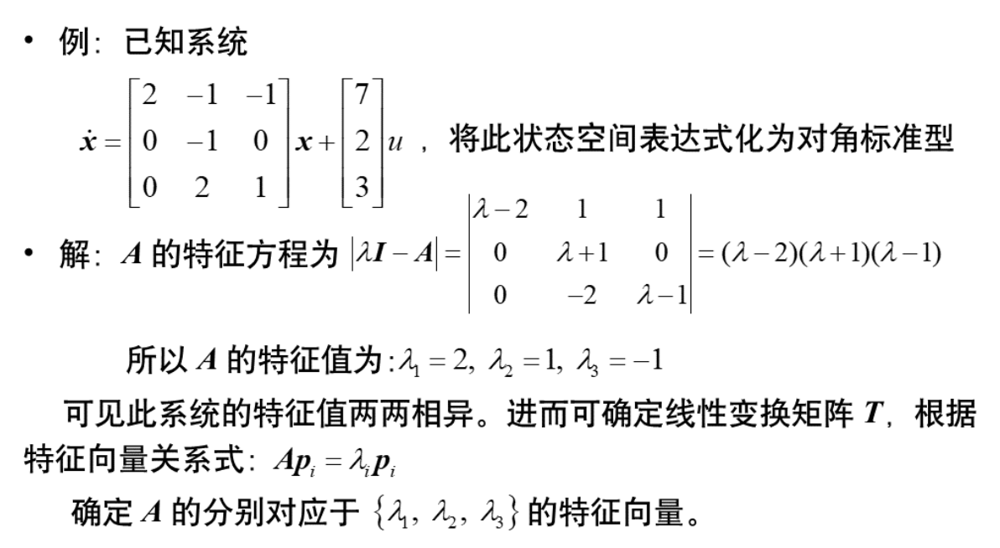

​		                    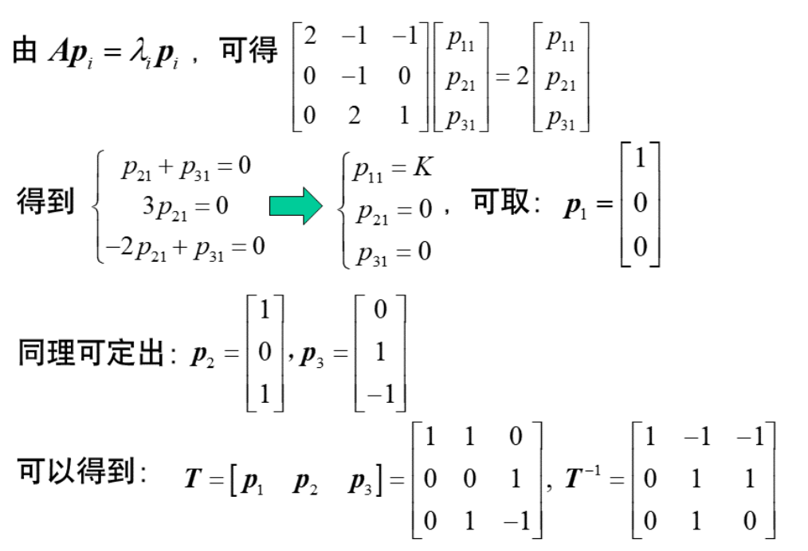

​                         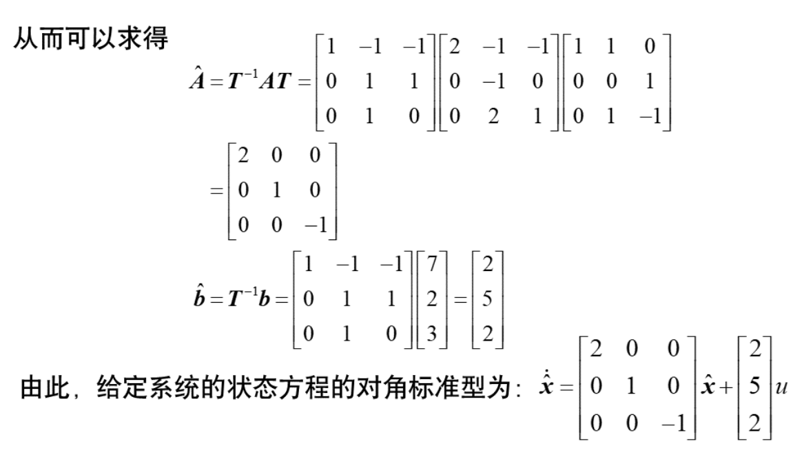   

2. 状态矩阵 $A$ 有重根时

   

## 补充

[^1 ]: 具体推导参见第十周课件第30页
[^2 ]: 具体推导参见第十周课件第37页
[^3 ]: 具体推导参见第十周课件第40页
[^4 ]: 具体推导见第十周周四课件第83页

