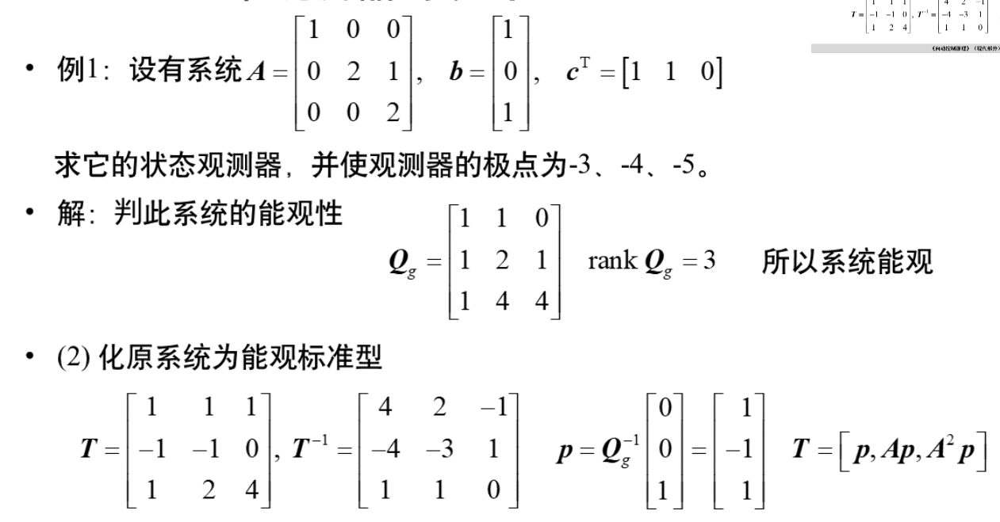

- 例子1（**不会考**，考试会给定极点）                                                     

  

​                                                

- 例子2（待定系数法）

- 总结

  由极点配置定理可知，系统完全能控是闭环极点任意配置的条件。换言之，系统完全能控, 则可以任意配置全部 $n$ 个闭环极点。并且, 对于单变量系统，实现极点配置的状态反馈阵 $\boldsymbol{k}^{\mathrm{T}}$ 是唯一的。当不满足条件时, 显然不能任意配置闭环极点, 但是, 有可能配置一些特 定的极点组。

  **问：若系统不完全能控, 能否实现极点任意配置?**
  系统不完全能控，则不能任意配置全部 $n$ 个闭环极点：
  若系统能控子系统的维数为 $r(r<n)$, 则只能任意配置可控的 $r$ 个极点; 当 其余 $(n-r)$ 个不能控的极点恰好出现在所期望的极点组中，则可以配置该特定的 极点组。
  由于状态反馈无法改变系统的不能控模态，当系统不完全能控时，若希望的极点组中包含了系统所有不能控模态时, 这组期望极点也是可以配置的。

- 例子（不完全能控）

  

## 镇定问题

假定线性系统 $\Sigma(\boldsymbol{A}, \boldsymbol{B}, \boldsymbol{C})$ 完全能控, 则一定存在线性状态反馈 $\boldsymbol{K}$, 使闭环系 统 $\Sigma_{K}(\boldsymbol{A}-\boldsymbol{B} \boldsymbol{K}, \boldsymbol{B}, \boldsymbol{C})$ 极点可任意配置。换言之, 对完全能控的不稳定系统, 总可以求得线性状态反馈阵 $K$, 使系统变为渐近稳定, 即 $A-B K$ 的特征值均在 $s$ 平面的左边。这就是镇定问题。
可见，**镇定问题是极点配置问题的一个特例。**
在镇定问题中, 只要求极点配置在 $s$ 平面的左边, 而不必在具体某个位置上。 所以对系统 $\Sigma(\boldsymbol{A}, \boldsymbol{B}, \boldsymbol{C})$, 若存在状态反馈阵 $\boldsymbol{K}$, 使闭环系统 $\Sigma_{K}(\boldsymbol{A}-\boldsymbol{B} \boldsymbol{K}, \boldsymbol{B}, \boldsymbol{C})$ 的极点都具有负实部，则称原系统是状态反馈可镇定的。

1. 状态反馈可镇定的条件

   线性系统状态反馈可镇定的充分必要条件为：**系统不能控的部分是渐近稳定的。 **

   对此说明如下: 假定系统已按能控性分解为如下形式:
   $$
   \boldsymbol{A}=\left[\begin{array}{cc}
   \boldsymbol{A}_{11} & \boldsymbol{A}_{12} \\
   \mathbf{0} & \boldsymbol{A}_{22}
   \end{array}\right], \boldsymbol{B}=\left[\begin{array}{c}
   \boldsymbol{B}_{1} \\
   \mathbf{0}
   \end{array}\right] \text {, 设状态反馈阵为 } \boldsymbol{K}=\left[\begin{array}{ll}
   \boldsymbol{K}_{1} & \boldsymbol{K}_{2}
   \end{array}\right] \text {, 则 }
   $$
   闭环系统的状态矩阵为: $\boldsymbol{A}-\boldsymbol{B} \boldsymbol{K}=\left[\begin{array}{cc}\boldsymbol{A}_{11}-\boldsymbol{B}_{1} \boldsymbol{K}_{1} & \boldsymbol{A}_{12}-\boldsymbol{B}_{1} \boldsymbol{K}_{2} \\ 0 & \boldsymbol{A}_{22}\end{array}\right]$
   其特征多项式为: $f_{K}(s)=|s \boldsymbol{I}-(\boldsymbol{A}-\boldsymbol{B} \boldsymbol{K})|=\left|s \boldsymbol{I}_{1}-\boldsymbol{A}_{11}+\boldsymbol{B}_{1} \boldsymbol{K}_{1}\right| \cdot\left|s \boldsymbol{I}_{2}-\boldsymbol{A}_{22}\right|$

   显然, $\Sigma_{1}\left(A_{11}, B_{1}\right)$ 是能控部分, 所以上式中的 $\left|s I_{1}-A_{11}+B_{1} K_{1}\right|$ 部分可以通过极点配置的方法使 $A_{11}+B_{1} K_{1}$ 的极点具有负实部, 而 $\Sigma_{2}\left(A_{22}, 0\right)$ 是不能控部分，上式中的行列式 $\left|s I_{2}-A_{22}\right|$ 说明无 法通过极点配置方法改变 $A_{22}$ 的极点, 而必须要求 $A_{22}$ 的极点 具有负实部。结论得证。

   - 例子

     

     

2. 输出反馈能镇定的条件

   对于输出反馈, 我们知道它保持了系统的能控性和能观性, 即输出反馈不能 改变系统的不能控模态和不能观模态。
   假定已经将系统 $\Sigma(\boldsymbol{A}, \boldsymbol{B}, \boldsymbol{C})$ 进行 Kalman 结构分解:
   $$
   A=\left[\begin{array}{cccc}
   A_{11} & 0 & A_{13} & 0 \\
   A_{21} & A_{22} & A_{23} & A_{24} \\
   0 & 0 & A_{33} & 0 \\
   0 & 0 & A_{43} & A_{44}
   \end{array}\right], B=\left[\begin{array}{c}
   B_{1} \\
   B_{2} \\
   0 \\
   0
   \end{array}\right], C=\left[\begin{array}{llll}
   C_{1} & 0 & C_{3} & 0
   \end{array}\right]
   $$
   其中 $\left(A_{1}, B_{1}, C_{1}\right)$ 是能控且能观的; $\left(A_{22}, B_{2}, 0\right)$ 是能控不能观的;
   $\left(A_{33}, 0, C_{3}\right)$ 是不能控而能观的; $\left(A_{4}, 0,0\right)$ 是不能控又不能观的。
   则对于这样的系统输出反馈镇定的充分必要条件为: **1） 能控又能观部分是能 镇定的；2）其它的三部分均是渐近稳定的。**

   对此说明如下: 设输出反馈阵为 $H$, 则闭环系统矩阵为:
   $$
   A-B H C=\left[\begin{array}{cccc}
   A_{11}-B_{1} H C_{1} & 0 & A_{13}-B_{1} H C_{3} & 0 \\
   A_{21}-B_{2} H C_{1} & A_{22} & A_{23}-B_{2} H C_{3} & A_{24} \\
   0 & 0 & A_{33} & 0 \\
   0 & 0 & A_{43} & A_{44}
   \end{array}\right]
   $$
   其特征多项式为:
   $$
   \begin{aligned}
   f_{H}(s) &=|s \boldsymbol{I}-(\boldsymbol{A}-\boldsymbol{B H C})| \\
   &=\left|s \boldsymbol{I}_{1}-\left(\boldsymbol{A}_{11}-\boldsymbol{B}_{1} \boldsymbol{H C}_{1}\right)\right| \cdot\left|s \boldsymbol{I}_{2}-\boldsymbol{A}_{22}\right| \cdot\left|s \boldsymbol{I}_{3}-\boldsymbol{A}_{33}\right| \cdot\left|s \boldsymbol{I}_{4}-\boldsymbol{A}_{44}\right|
   \end{aligned}
   $$
   可以看出，当且仅当 $A_{11}-B_{1} H C_{1}$ 具有负实部的极点，即能控又能观部分为输出 反馈能镇定, $A_{22}, A_{33}, A_{44}$ 均具有负实部的极点。即其余三部分为渐近稳定的时 候，闭环系统才是渐近稳定的。
   这说明了结论的正确性。

# 模块五 状态观测器

## 状态观测器的基本概念

本章讨论这个问题，原系统的输入输出可以直接量测。以原系统的输入输出作为输入，再构造一个动态系统，将状态重新构造出来，这样的动态系统称为状态观测器

- 开环状态观测器[^1 ]
- 全维观测器[^2 ]

## 全维观测器

- 观测误差的演化规律
$$
\dot{\tilde{x}}=(A+M C) \tilde{x}
$$
​		全维观测器的设计，实际上在于合理选择 $M$ 阵，使 $(A+M C)$ 的特征 值具有负实部，而且负实部的绝对值足够大，使逼近的速度足够快。 在选择合理的观测器极点后, 就可以计算 $M$ 。

- 方法一

  以单变量系统为例设计步骤如下:
  (1) 判别系统的能观性;
  (2) 若系统能观, 化为能观标准型;

  能观标准型[^3 ]为 $\tilde{\Sigma}\left(\tilde{A}, \tilde{c}^{T}\right)$, 其中
  $$
  \tilde{\boldsymbol{A}}=\left[\begin{array}{c:c}
  0 & -P_{n} \\
  \hdashline & -P_{n-1} \\
  \boldsymbol{I}_{n-1} & \vdots \\
  & -P_{1}
  \end{array}\right] \quad \tilde{\boldsymbol{c}}^{\mathrm{T}}=\left[\begin{array}{llll}
  0 & \cdots & 0 & 1
  \end{array}\right]
  $$
  $\tilde{A}$ 的特征多项式:
  $$
  f(s)=s^{n}+P_{1} s^{n-1}+\cdots+P_{n}
  $$
  (3) 计算 $\tilde{\Sigma}\left(\tilde{\boldsymbol{A}}, \tilde{\boldsymbol{c}}^{\mathrm{T}}\right)$ 能观标准型的观测阵 $\tilde{\boldsymbol{M}}=\left[\tilde{m}_{1}, \tilde{m}_{2}, \ldots, \tilde{m}_{n}\right]$, 则观测器系数矩阵为:
  $$
  \tilde{\boldsymbol{A}}+\tilde{\boldsymbol{M}} \tilde{\boldsymbol{c}}^{T}=\left[\begin{array}{c:c}
  \mathbf{0} & -P_{n} \\
  \hdashline \boldsymbol{I}_{n-1} & \vdots \\
  & -P_{1}
  \end{array}\right]+\left[\begin{array}{cccc}
  0 & \cdots & 0 & \tilde{m}_{1} \\
  0 & \cdots & 0 & \tilde{m}_{2} \\
  \vdots & & \vdots & \vdots \\
  0 & \cdots & 0 & \tilde{m}_{n}
  \end{array}\right]=\left[\begin{array}{c:c}
  \mathbf{0} & -\left(P_{n}-\tilde{m}_{1}\right) \\
  \hdashline \boldsymbol{I}_{n-1} & \vdots \\
  & -\left(P_{1}-\tilde{m}_{n}\right)
  \end{array}\right]
  $$
  于是特征多项式为: $f(s)=s^{n}+\left(P_{1}-\tilde{m}_{n}\right) s^{n-1}+\cdots+\left(P_{n-1}-\tilde{m}_{2}\right) s+\left(P_{n}-\tilde{m}_{1}\right)$ (5.9) 

  根据希望的观测器极点, 得到希望的特征多项式
  $f^{*}(s)=s^{n}+\alpha_{1}^{*} s^{n-1}+\cdots+\alpha_{n-1}^{*} s+\alpha_{n}^{*}$     （5.10）

  比较 (5.9), (5.10) 两式得: $\tilde{m}_{n+1-i}=P_{i}-\alpha_{i}^{*} \quad(i=1,2, \cdots, n)$
  (4) 求原系统 $\sum\left(\boldsymbol{A}, \boldsymbol{b}, \boldsymbol{c}^{T}\right)$ 的观测阵 $\boldsymbol{M}: \boldsymbol{M}=\boldsymbol{T} \tilde{\boldsymbol{M}}$
  (5) 画出观测器的结构图。

- 例子

  

  

  

  

- 方法二（直接计算）（待定系数法）
  (1) 判别系统的能观性;
  (2) $f_{M}(s)=\left|s \boldsymbol{I}-\left(\boldsymbol{A}+\boldsymbol{M} \boldsymbol{c}^{T}\right)\right|$
  (3) $f^{*}(s)=\prod_{i=1}^{n}\left(s-\lambda_{i}\right)$
  (4) 令二者系数相等, 联立方程求解得到。

- 例子

  

  

  

  

  

## 降维观测器（自学）

## 重构状态反馈控制系统（待定）

# 第六章 李雅普诺夫稳定性分析

## 基本概念

1. 标量函数的定号性
    [定义 1.1] 称标量函数 $V(\boldsymbol{x})$ 正定（半正定）：若 $V(\boldsymbol{0})=0$, 且对任意非零的 $\boldsymbol{x}$ ，都有 $V(\boldsymbol{x})>0(V(\boldsymbol{x}) \geq 0)$ 。
    [定义 1.2] 称标量函数 $V(x)$ 负定（半负定）：若 $-V(x)$ 是正定（半正定）的。
    [定义 1.1] 正定或半正定（负定或半负定）统称为非负定（非正定），无任何定号性称为不定。
    注意, $V(\mathbf{0})=0$ 是定号性的必要条件。在不引起混淆时，可直接用 $V(\boldsymbol{x})>0$ 表示正定，其余类推。

  注意，定号性可以是原点领域上的局部性质。如: 标量函数 $V(\boldsymbol{x})=\left[\left(x_{1}^{2}+x_{2}^{2}\right)-1\right]\left(x_{1}^{2}+x_{2}^{2}\right)$ 在域 $\left\{\Omega \mid x_{1}^{2}+x_{2}^{2}<1\right\}$ 上是负定的。

​		二次型函数 $x^{\mathrm{T}} \mathrm{A} x$ 的定号性, $\mathrm{A}$ 是实对称矩阵
​		[定理1.1] 实对称矩阵 $\mathrm{A}$ 是正定 (半正定) 的, 当且仅当所有特征值均大于(大于于等于) 零。
​		[定理1.2] 实对称矩阵 $\mathrm{A}$ 是正定 (半正定) 的, 当且仅当所有主子式均大于(大于等于) 零。

​		                            

​		[定理（赛尔维斯特判据）] 实对称矩阵 A 为
​		（1）正定当且仅当 $\Delta_{k}>0, k=1,2, \cdots, n$
​		（2）负定当且仅当 $(-1)^{k} \Delta_{k}>0, k=1, \cdots, n$

​		在判断矩阵 $\mathbf{A}$ 的正定性时，可将主子式简化为顺序主子式 

​		在判断矩阵 $\mathbf{A}$ 的半正定性时，不可将主子式简化为顺序主子式

- 向量的 2 范数: 实数向量 $z \in \mathrm{R}^{n}$, 其 2 范数定义为:
  $$
  \|z\| = \sqrt{z_{1}^{2}+z_{2}^{2}+\cdots+z_{n}^{2}}
  $$

- [定义1.4] 对于系统 $\dot{x}=f(\boldsymbol{x}, t)$, 满足 $\mathbf{0}=f\left(\boldsymbol{x}_{e}, t\right)$ 的状态 $\boldsymbol{x}_{e}$ 称为系统的平衡 状态或平衡点。
  [定义1.5] 若一平衡点附近足够小的邻域内都没有其他的平衡点, 则称之为孤立 平衡点。

$$
\left\{\begin{array} { l } 
{ \dot { x } _ { 1 } ( t ) = x _ { 2 } ( t ) } \\
{ \dot { x } _ { 2 } ( t ) = - x _ { 1 } ( t ) }
\end{array} \quad \left\{\begin{array} { l } 
{ \dot { x } _ { 1 } ( t ) = x _ { 2 } ( t ) } \\
{ \dot { x } _ { 2 } ( t ) = - \operatorname { s i n } ( x _ { 1 } ( t ) ) }
\end{array} \quad \left\{\begin{array}{l}
\dot{x}_{1}(t)=x_{2}(t) \\
\dot{x}_{2}(t)=-x_{1}(t) x_{2}(t)
\end{array}\right.\right.\right.
$$

- [定义1.6] 假设 $\boldsymbol{x}_{e}$ 是系统 $\dot{\boldsymbol{x}}=f(\boldsymbol{x})$ 的孤立平衡点。若对于 任意给定正实数 $\varepsilon>0$ 和时刻 $t_{0}>0$, 都存在 $\delta\left(\varepsilon, t_{0}\right)>0$, 使得从满足不等式

$$
\left\|x_{0}-x_{e}\right\| \leq \delta\left(\varepsilon, t_{0}\right)
$$
​		的任意初始状态 $x_{0}$ 出发的系统运动 $x(t)$ 均成立
$$
\left\|x(t)-x_{e}\right\| \leq \varepsilon, t \geq t_{0}
$$
​		则称平衡状态 $x_{e}$ 是（在李雅普诺夫意义下）稳定的。

- 称平衡状态 $x_{e}$ 不稳定: 若 $x_{e}$ 不满足上述稳定的条件。

- [定义1.6] 假设 $\boldsymbol{x}_{e}$ 是系统 $\dot{\boldsymbol{x}}=f(\boldsymbol{x})$ 的孤立平衡点。若对于 任意给定正实数 $\varepsilon>0$ 和时刻 $t_{0}>0$, 都存在 $\delta\left(\varepsilon, t_{0}\right)>0$, 使得从满足不等式
  $$
  \left\|x_{0}-x_{e}\right\| \leq \delta\left(\varepsilon, t_{0}\right)
  $$
  的任意初始状态 $x_{0}$ 出发的系统运动 $x(t)$ 均成立
  $$
  \left\|\boldsymbol{x}(t)-\boldsymbol{x}_{e}\right\| \leq \varepsilon, t \geq t_{0}
  $$
  则称平衡状态 $x_{e}$ 是（在李雅普诺夫意义下）稳定的。
  称平衡状态 $x_{e}$ 不稳定: 若 $x_{e}$ 不满足上述稳定的条件。

- [定义 1.7] 称平衡状态 $x_{e}$ 渐近稳定: 若 $x_{e}$ 稳定, 且存在一 个邻域 $S$ (吸引域), 初始状态 $\boldsymbol{x}(0)$ 从 $S$ 内出发的运动恒有:
$$
\lim _{t \rightarrow \infty}\left\|x(t)-x_{e}\right\|=0
$$
​		[定义 1.8] 称平衡状态 $\boldsymbol{x}_{e}$ 全局渐近稳定: 若 $\boldsymbol{x}_{e}$ 渐近稳定, 并且其吸引域 $S$ 充 满了整个状		态空间。

​		平衡状态唯一是全局渐近稳定的必要条件。

## 李雅普诺夫方法

### 间接法

- 设 $x_{e}$ 是定常系统 $\dot{x}=f(x)$ 的平衡状态, 在平衡点附近的 线性化模型为:
$\dot{y}=\mathbf{A} \boldsymbol{y}, \mathbf{A}=\left.\frac{\partial \mathbf{f}}{\partial \mathbf{x}^{T}}\right|_{x=x_{6}}=\left[\begin{array}{cccc}\frac{\partial f_{1}}{\partial x_{1}} & \frac{\partial f_{1}}{\partial x_{2}} & \cdots & \frac{\partial f_{1}}{\partial x_{n}} \\ \frac{\partial f_{2}}{\partial x_{1}} & \frac{\partial f_{2}}{\partial x_{2}} & \cdots & \frac{\partial f_{2}}{\partial x_{n}} \\ \vdots & \vdots & \ddots & \vdots \\ \frac{\partial f_{n}}{\partial x_{1}} & \frac{\partial f_{n}}{\partial x_{2}} & \cdots & \frac{\partial f_{n}}{\partial x_{n}}\end{array}\right]_{x=x_{e}}$
其中 $y=x-x_{e}$
- 判别定理
[定理2.1] 若 $\mathbf{A}$ 的特征值均具有负实部, $\boldsymbol{x}_{e}$ 是渐近稳定的; 若存在某个特征值具有正实部, $x_{e}$ 是不稳定的; 其它情况, 则不能判定。

- 例子

  

### 直接法

- 设原点是定常系统 $\dot{x}=f(\boldsymbol{x})$ 的平衡状态。 $V(\boldsymbol{x})$ 是正定的能量函数（标量函 数）, 它沿着系统状态轨线对时间 $t$ 的导数为:

$$
\dot{V}(x)=\frac{\partial V(x)}{\partial x^{\mathrm{T}}} \dot{x}=\frac{\partial V(x)}{\partial x^{\mathrm{T}}} f(x)
$$
​		李雅普诺夫第二方法基于 $V(x)$ 和 $\dot{V}(x)$ 的定号性，判别系统平衡状态的稳定性。

- [定理2.2] $V(\boldsymbol{x})$ 正定， $\dot{V}(\boldsymbol{x})$ 负定，则原点是渐近稳定的；进 而，若 $\|x\| \rightarrow \infty$ 时， $V(x) \rightarrow \infty$ ，则原点是全局渐近稳定的。
  [定理2.3] $V(x)$ 正定, $\dot{V}(x)$ 半负定, 则原点是稳定的; 此外, 若 $\dot{V}(x)$ 除原点 外沿状态轨线不恒为零, 则原点是渐近稳定的; 再进一步, 若 $\|x\| \rightarrow \infty$ 时, $V(x) \rightarrow \infty$, 则原点是全局渐近稳定的。
  [定理2.4] $V(x)$ 正定, $\dot{V}(x)$ 正定, 则原点是不稳定的。
  注意: 以上均为充分条件, 找不到满足定理条件的 $V(\boldsymbol{x})$, 不能下结论。
  若 $V(x)$ 代表广义能量, 则 $\dot{V}(x)$ 代表广义功率。 $\dot{V}(x)<0$, 说明系统沿着状态轨 线运动不断地消耗能量。

# 补充资料

[^1 ]: 见第五章ppt第7页
[^2 ]: 见第五章ppt第9页
[^3 ]: 状态反馈极点配置的对偶形式

