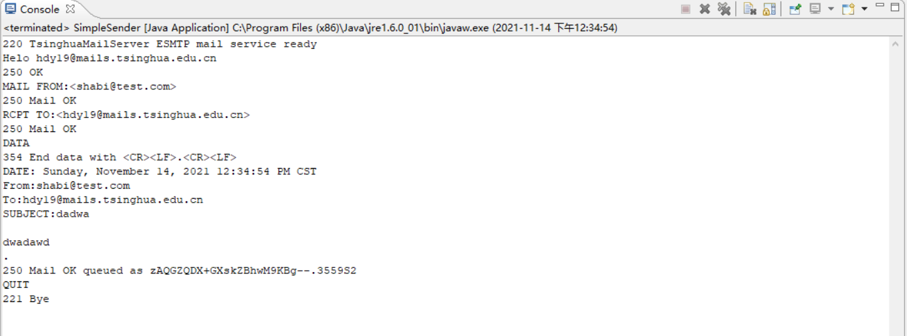
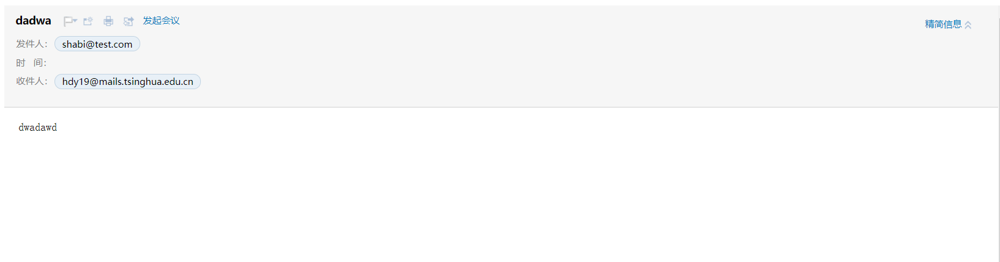
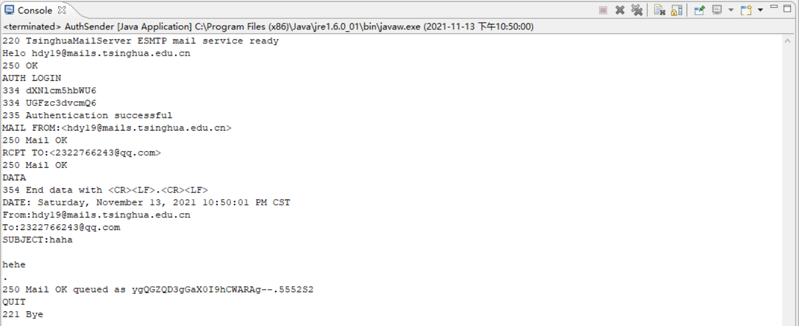
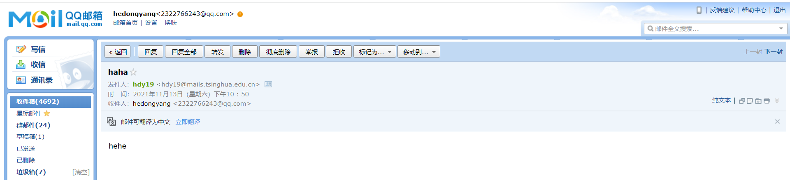

# 实验三 Socket编程实现网络通信

何东阳 自96 2019011462

## 实验目的

掌握Socket编程思想，并实现简单的Socket应用的连接通信过程。

## 实验内容

### Simple SMTP

#### 实验截图

控制台截图

邮箱截图

### Auth SMTP

#### 实验截图

控制台截图

邮箱截图

### socket 收发信息的客户端和服务器端程序

#### 实验截图

socket 收发信息程序

### 实验思考题

1. **Simple SMTP和常用的E-mail客户端在功能结构上的比较。**

   功能方面，Simple SMTP只能传输文本，并且只能进行没有身份认证的信息传输，也无法查看邮件。E-mail的功能更加全面，不仅支持文本的发送，还支持富文本文件的发送，同时也可以进行身份验证，查看别人发来的邮件。结构方面，校园网等邮箱接收邮件使用POP3、IMAP协议较多，而通常发送邮件使用的较多的是SMTP。

2. **使用TCP和UDP各自的优缺点比较。**

   速度：TCP慢，UDP快；稳定性：TCP稳定，UDP不稳定；安全性：UDP比TCP更安全；连接：TCP只能点对点的建立连接，而UDP是无连接的，可以支持多对多的交互通信；TCP首部字节数比UDP更多。

3. **针对程序中出现的问题及解决方法，写出实验体会。**

   **问题一**：Simple SMTP实验中，邮件的发送发不能使用清华邮箱或者QQ邮箱，不然会显示IP错误，可能是因为清华邮箱能够识别出邮件来源IP和期望IP不符合，所以必须使用一个清华邮箱无法检测到的邮箱地址，例如虚构的邮箱地址。

   **问题二**：在socket python编程实验中，如果不改动助教代码直接运行，客户端每次只能发送一次消息，发送后连接就关闭了。为了能够循环发送消息，必须在循环里建立连接，这样客户端就能持续发送消息了。