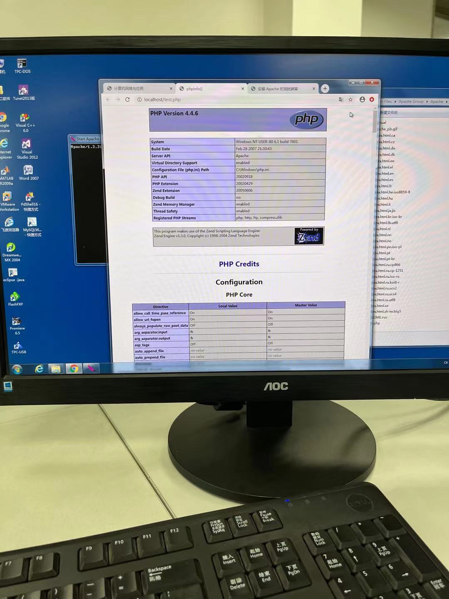

# 实验二 常用网络服务配置

## 1 实验目的

通过实验熟悉常用网络服务的基本原理和基于客户机/服务器的服务模式, 掌握各项服务的服务原理, 练习常用网络服务的配置方法。

## 2 实验内容

1. 在 windows 环境练习下配置 DNS 服务, 理解域名服务的解析原理和层次关系及相关概 念。
2. 在 windows 环境中用 Apache HTTP Server 开设 WWW 服务, 安装配置 PHP 动态网页编 辑环境。
3. 利用 SERV-U 实现 ftp 服务，并针对不同用户、地址或端口进行授权访问;
4. 掌握 DHCP 服务器的安装与设置, 了解 DHCP 的含义及工作原理,了解 DHCP 客户机的设 置;

## 3 具体实验

### 3.1 DNS服务器的配置

#### 3.1.1 实验步骤

1. 安装 DNS 服务器
2. 配置新的 DNS 服务器
3. 添加资源记录
4. 设置 DNS 的属性
5. 设置 DNS 客户机与测试

#### 3.1.2 实验图片

### 3.2  用 Apache HTTP Server 开设 WWW 服务

#### 3.2.1 实验步骤

1. Apache 服务器安装与配置, 了解配置 web 服务
2. PHP 安装与配置
3. 使用 PHP 完成网页计数器和动态显示图片功能

#### 3.2.2 实验图片

### 3.3 架设 ftp 服务器

#### 3.3.1 实验步骤

1. Serv-U 的下载和安装。
2. Serv-U 的配置。
3. FTP 的访问。

#### 3.3.2 实验图片

### 3.4 DHCP 服务器的配置

#### 3.3.1 实验步骤

1. 安装DHCP服务
2. 配置DHCP服务器
3. 管理DHCP服务器
4. 管理DHCP客户机

#### 3.3.2 实验图片

## 4 思考

### 4.1 DNS服务器的配置

### 4.2 用 Apache HTTP Server 开设 WWW 服务

### 4.3 架设 ftp 服务器

### 4.4 DHCP 服务器的配置