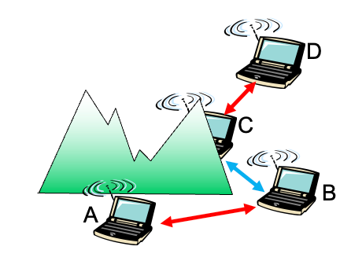
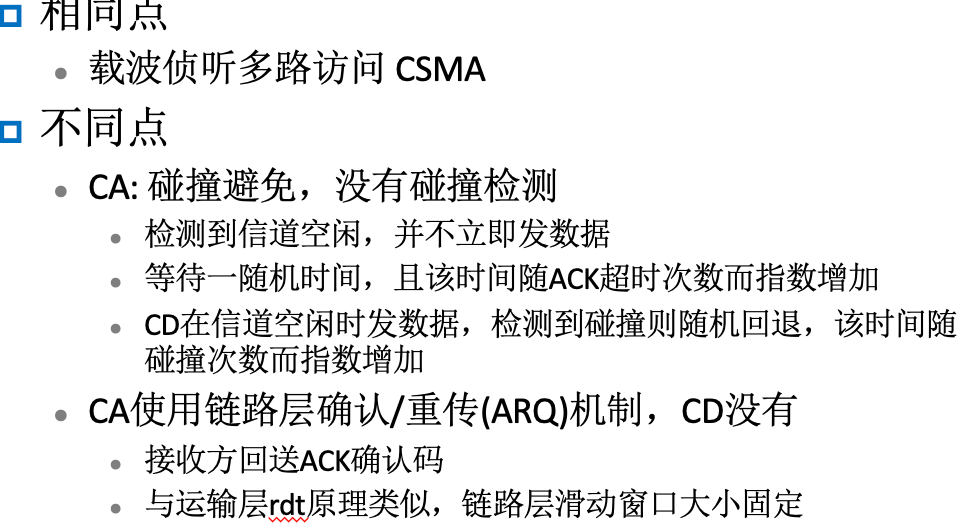
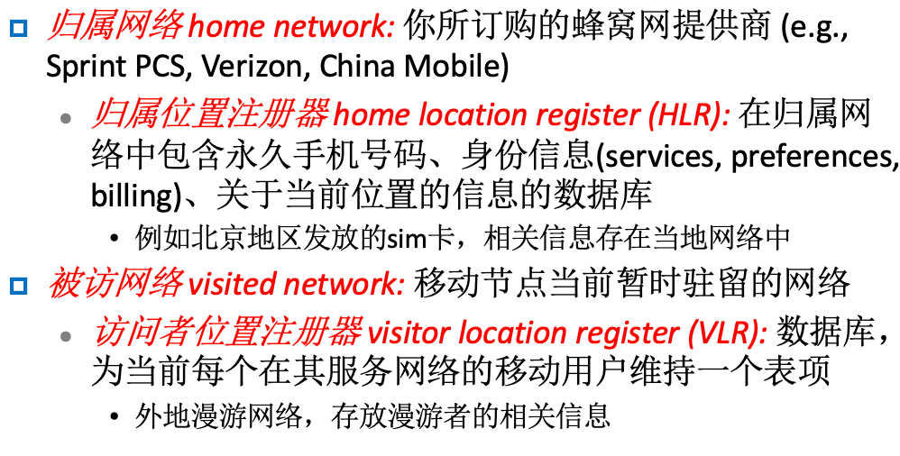

## 第七章

两大特点: 无线/移动，两大模式: 基础设施/自组织

### 无线链路特性

- 递减的信号强度、来自其他干扰源的干扰、多路径传播

- SNR：signal-to-noise ratio 信噪比，SNR越大 – 越容易从噪声中提取信号，BER: bit-error-rate 误码率

​		

- 隐藏终端问题：多个无线发送方和接受方造成了另外的问题；暴露终端问题

  

- 码分多路访问（CDMA）：给每个用户分配一个唯一的 “编码” ；所有用户共享相同的频率, 但每个用户有自己的码片序列

  

  

### 802.11协议

- 都使用 CSMA/CA 作为多路访问协议

- 无线主机与基站通信

- 2.4GHz-2.485GHz 频率范围被划分成11个不同频率的信道

- 802.11在发送之前侦听载波侦听，不与其他节点正在进行的发送碰撞；没有碰撞检测 (no CD)，特殊情况下不能感知到碰撞: 隐藏终端问题

- CSMA/CA (碰撞避免)：使用了指数回退算法

- CA和CD联系

  

- 处理隐藏终端问题：RTS/CTS机制：允许发送方 “预约” 信道而不是让数据帧随机访问: 避免了长数据帧的碰撞

  

- 802.11帧格式

  

- 802.11帧有三个MAC地址

  

- 速率自适应

   

- 电源管理

- 802.15：蓝牙技术，个人局域网

### 蜂窝英特网接入

- 2G 系统: 语音信道

- 2.5 G 系统: 语音和数据信道

- 3G 系统: 语音/数据

- 4G和3G的区别

  

### 移动管理原理：寻址与选路

- 名词解释

  

- 移动性的实现方法

  

- 移动性：注册

  

- 间接选路：在网络之间移动

  

- 直接选路

  

### 移动性案例

- 移动IP注册的例子

  

- 处理互联网的移动性：在不同MSC之间切换

