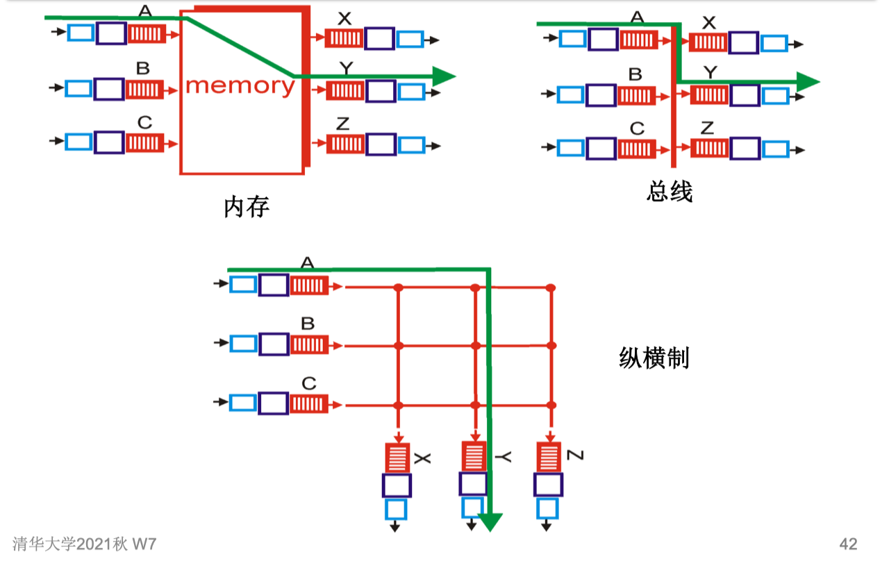
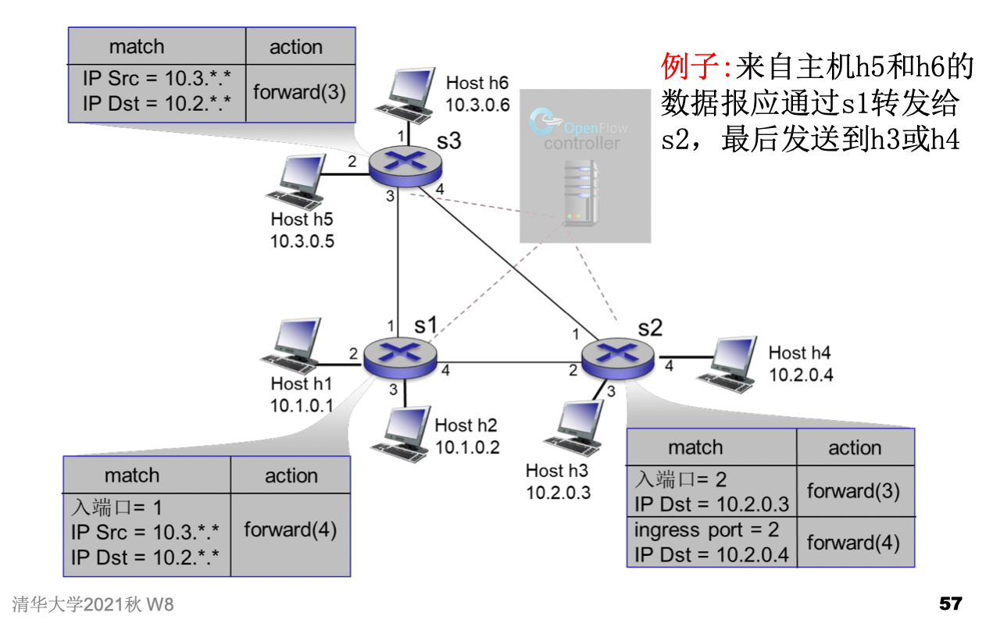

## 第四章 传输层

### 路由器工作原理

- 路由器主要两个功能
  - 运行选路算法/协议 (RIP, OSPF, BGP) 
  - 把数据报从输入链路转发到输出链路

- 转发表结构

  

- 最大前缀匹配

  

- 基本物理结构

  

  - 经内存交换

    

  - 经总线交换

    

  - 经网络交换

    

- 排队和调度
  - 先进先出
  - 优先权排队
  - 加权公平排队

### IP协议

- 网络层的三大组件：IP协议，选路协议，ICMP协议

- 数据报格式

  

- 分片与重组：网络链路层有最大传输单元MTU限制 (max. transm. unit) – 最大可能的链路层帧能承载的 数据量

  

- ipv4编址：32bit，接口 interface：主机、路由器和物理链路之间的连接

  

  - 网络部分
  - 主机部分
  - 编址方式
    - 传统方式：效率低，低利用率
    - 无类别域间选路: CIDR：
      - IP 地址的网络部分可以任意长
      - 地址格式: a.b.c.d/x, 其中 x 是 IP 地址网络部分的位数

- 子网

  

- 获得ip的方式之一：DHCP，动态地获得地 址, 指定IP地址、子网掩码、网关、DNS、 IP租期等

  

  层次化编址

- 有特殊意义的ip地址址

- NAT (Network Address Translation) 网络地址翻译

  所有离开本地网络的数据报 都有相同的NAT IP地址 138.76.29.7, 但有不同的源端口号

  不需要从ISP获得IP地址范围：所有本地计算机 对外只用一个IP地址

  

- ipv4的问题：地址空间不足（2^32 = 4G）；路由表膨胀；服务质量 无法保证

  

- Ipv6：128bit

  变化

  

  

- ipv4到ipv6的过渡技术

  隧道：IPv4路由器中IPv6数据包作为IPv4数据包的负载；双栈

- 通用转发和SDN

  每个“分组交换机”包含一个由远程控制器计算和分发的流表

- openflow

  流表：匹配加动作转发表在OpenFlow中称为流表

  

​										

​	流表例子：

​	

openflow抽象	

openflow例子

