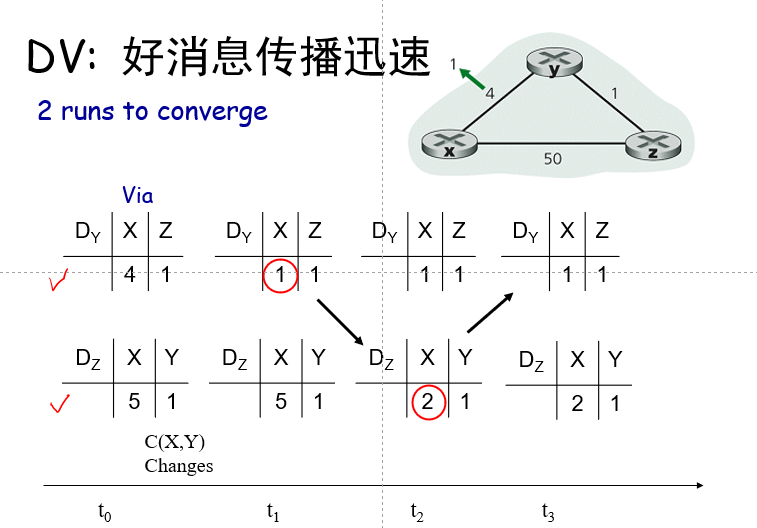

## 第五章 网络层

### 概述

网络层的两个功能：

- 转发:将数据包从路由器的输入移动到适当的路由器输出——数据平面

- 路由:确定数据包从源到目标的路由——控制平面

构建网络控制平面的两种方法:
- 每个路由器独自控制 (传统)
- 逻辑集中控制 (软件定义的网络)

两种转发方法对比：

- 传统方法模型：

- SDN方法模型：远程控制器计算和分发转发表以供每台路由器使用，路由选择设备仅执行转发

  

### 路由选择算法

目的：寻找**理想选路算法**

讨论：

- 全局算法还是分布式算法？
  - 全局：所有路由器拥有全部的拓朴结构、链路费用信息，例：**“链路状态”LS  算法**
  - 分布式：路由器仅知道与其物理上相连的链路及其费用信息，迭代的计算过程，与相邻主机交换信息，例：**“距离向量”DV 算法**

- 静态算法还是动态算法？
  - 静态：路由随时间变化缓慢
  - 动态：路由变化更快：周期性更新，对链路费用改变作出响应

#### 链路状态选路算法

- 所有节点通过链路状态广播(LS broadcast) 得到关于网络拓扑结构和链路费用等相同的信息（链路状态信息）

- Dijkstra 算法是链路状态选路算法的基本理论，例如OSPF（开放最短路优先）

- 思考：试图寻找一个节点（源点）到所有其他节点的最短路径，不容易让网络中的每个节点在同一时间知道确切的链路状态 

- Dijkstra算法：

  

  例子：

  

  

  

  

- 每个节点记录的信息：

  

- LS选路算法的问题：震荡现象

  

  解决方案：所有的路径**不同时（异步）运行**LS算法，Floyd发现存在自同步现象，因此允许引入随机时延 

#### 距离向量选路算法

- 所有节点和与它之间相连的节点交换距离向量信息(**DV**)，更新自己的距离向量，然后再把更新后的距离向量反馈给相邻节点

- 特点：分布式，迭代的，异步的，自终止的

- **Bellman-Ford方程**：定义$d_{x}(y):=$ 从节点 $x$ 到 $y$ 的最短路径的费用

  
  $$
  d_{x}(y)=\min _{v}\left\{c(x, v)+d_{x}(y)\right\}
  $$
  例子：

  

  **取最小值的那个节点就是最短路径上的下一跳 ➜ 转发表**

- $D_{x}(y):$ 从 $x$ 至 $y$ 的最低费用的估计
  - $x$ 维护自己的距离向量: $D_{x}=\left[D_{x}(y): y \in N\right]$ 

  - 节点 $x$ :

    - 知道到其邻节点v的费用: $c(x, v)$

    - 存储其所有邻节点的距离向量. 针对每个邻节点 $v, x$ 存储其距离向量 $D_{v}=\left[D_{v}(y): y \in N\right]$

- 核心思想：每个节点不时向其邻居发送自己的距离向量，当节点$x$收到一个其邻居的新的距离向量时，使用B-F方程**更新**自己的距离向量，在适当条件下, 距离向量$D_x(y)$ 最终将收敛至真实的最短路径费用$d_x(y)$

- 例子：

  

- DV好消息迅速传输：链路花销变少

  

  DV坏消息缓慢传播：链路花销变多

  

- DV链路费用改变：增加毒性逆转(毒性返路) Poisoned reverse：

  以上面的回路为例，如果Z通过Y选路到达目的地X，Z 告诉Y 其(Z) 到X的距离为无穷大 (这样Y将不会再通过Z选路到X，从而避免选路环路)。但不能完全解决无穷计数问题，涉及到三个以上节点形成的循环路由将无法用毒性逆转技术探测到。

#### 比较：DV vs LS

- 在 DV 算法中, 每个节点仅和它直接相连的邻居 节点通话, 但告诉它们它所学习到的任何信息 (到所有节点的距离)

- 在 LS 算法中, 每个节点与所有其它节点通话, 广播整个网络的拓扑结构和链路费用 (各节点的相 邻节点及链路费用）

- 收敛速度：

  LS: $O\left(\mathrm{n}^{2}\right)$ 算法需要 $O(\mathrm{n}|\mathrm{E}|)$ 报文
  - 每个源节点需 $n$ 次迭代 ( $n$ 为网络中除源节点外的节点数量)
  - 当链路状态发生变化时, 可能会振荡

  DV: 收敛时间变化

  - 可能会导致循坏路由 routing loops
  - 无穷计数问题 count-to-infinity problem

- 鲁棒性

  LS:
  - 节点会通告 advertise 不正确的链路费用
  - 每个节点自行计算它自己的路由表, 相互之间分离, **更鲁棒**

   DV:

  - DV 节点会通告不正确的路径费用并可能引导错误的选路信息

  - 每个节点的路由表会被其他节点所用——错误会在网络中**传播扩散**

### 因特网中自治系统内部的路由

规模：实践中节点互联网节点规模非常庞大，路由表不可能存储所有节点。

管理自治：每个网络管理员希望控制在自己网络内的选路，特定的控制策略

- 层次选路：把路由器聚合成多个区域，“autonomous systems” (AS)自治系统

  在同一AS中的路由器运行同样的选路协议：“intra-AS” routing protocol自治系统内部选路协议

  在不同AS中的路由器可运行不同的 intra-AS 选路协议

  不同AS之间运行自治系统间选路协议 ，这时需要**网关路由器**[^ 1]

- 网关路由器的转发表由intra- 和 inter-AS 选路算法来配置

- Inter-AS选路任务：

  1. 学习哪些目的地址经由AS2可达，哪些经由AS3可达
  2. 将该可达信息传递给AS1域内的所有路由器

  

- Intra-AS选路任务：
  - Intra-AS Routing protocol又叫做内部网关协议 Interior Gateway Protocols (IGP)

- OSPF开放最短路优先

  使用链路状态路由选择算法

  - 链路状态包转发

  - 整个自治系统的完整拓扑图

  - 基于Dijkstra算法的路径计算

  OSPF通告包含在OSPF报文中，该OSPF报文直接由IP承载（而不是TCP或UDP）

- Hierarchical OSPF

  

  - 两层体系结构: local area, backbone.
    - 仅在当地区域中通告链路状态
    - 每个节点有详细的当地区域的拓扑结构信息; 但仅知道去在其他区域中的网络的大致方向 (shortest path)
  - 区域边界路由器 Area border routers: "汇总"到 自己区域内各网络的距离, 通告到其他Area Border routers.
  - 主干路由器 Backbone routers: 仅在主干网上运 行 OSPF 选路
  - 边界路由器 Boundary routers: 连接到其他 AS

### ISP之间的路由选择: BGP

- BGP(边界网关协议):自治系统间路由选择协议，BGP为每个AS提供了一种方法

  - eBGP: 从相邻ASes获取子网可达性信息

  - iBGP: 给As内部的所有路由器传播可达信息

  - 基于可达性信息和策略确定到其他网络的“好”路由

  - 模型

    

- BGP会话：两个BGP路由器（“对等方”）通过半永久性TCP连接交换BGP报文
  - 通告到达不同特定CIDR前缀子网或子网集合的路径，BGP是一种“路径向量”协议

- BGP实例：当AS3的网关路由器3a通告路径 ”AS3,X” 给AS2的网关路由器2c，AS3向AS2承诺它将把数据报转发给X

  

- 路径属性和BGP路由

  - 通告前缀中包括一些BGP属性：前缀+属性=“路由”。

  - 两个重要的属性：AS-PATH：包含了通告前缀时已经通过的AS的列表，NEXT-HOP：AS-PATH起始的路由器接口的IP地址。

  - 当网关路由器接收到路由通告时，使用*import policy* 来决定接收/拒绝该通告，AS策略还决定是否向其他相邻的AS们通告路由。

  - 模型例子：

    

    

- BGP报文：使用**TCP**交换报文（半永久TCP连接）

- BGP，OSPF，转发表条目：

  

- BGP路由选择

  路由器可能学习到到达目的AS的多个路由，路由选择基于：

  - 本地偏好属性: 值是一种策略决定 

  - 最短AS-PATH

  - 最近NEXT-HOP路由器: 热土豆路由选择 [^2]

  - 附加标识符

- BGP路由选择策略

  |  |  |
  | ------------------------------------------------------------ | ------------------------------------------------------------ |

- Intra-AS 和 Inter-AS 的对比

  策略、规模、性能

### SDN控制平面

### ICMP: 因特网控制报文协议

### 网络管理和SNMP

### 补充

[^ 1]: AS 中的特殊路由器，与AS中所有其他路由器之间运行 intra-AS 选路协议，与其他的网关路由器之间运行 inter-AS
[^2 ]: