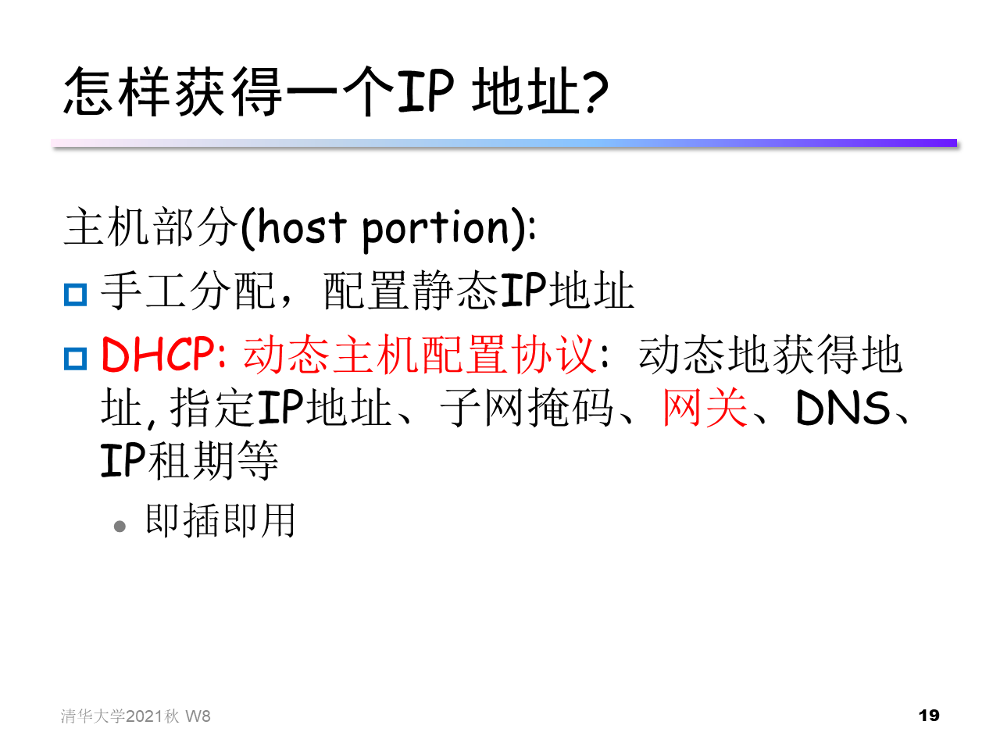

### 网际协议--ipv4寻址，寻址，ipv6，其他

- IP协议很重要

- 网络链路层有**最大传输单元MTU限制 (max. transm. unit)** - 最大可能的链路层帧能承载的 数据量。终点时把这些数据片组装成完整的数据。

- 

- 

- IP地址: 主机、路由器 接口 interface 的32bit识别号

- 接口**interface**: 主机、 路由器和物理链路之间的连接
  - 路由器通常有多个接口

  - 主机一般有1-2个接口(有线网口、无线网口)

- IP地址与接口相关, 而 不是主机或路由器

- 

- 子网掩码不能单独存在，它必须结合IP地址一起使用。子网掩码只有一个作用, 就是将某个IP地址划分成网络地址和主机地址两部分。子网掩码是一个32位地址，用于屏蔽IP地址的一部分以区别网络标识和主机标识,

- 

- 最长前缀匹配

### 通用转发和SDN

- 每个“分组交换机”包含一个由远程控制器计算和分发的流表

- **流表**：匹配加动作转发表在OpenFlow中称为流表

- openflow数据平面抽象：

  - Pattern: 匹配数据包首部字段中的值

  - Actions: 当分组匹配流表项时, 丢弃、转发、修改或将匹配的数
    据包发送给控制器

  - Priority: 消除重匹配的歧义

  - Counters (计数器) : 已经与该表项匹配的分组数量, 该表项上次
    更新以来的时间

  - 例子：
    $$
    \begin{aligned}
    &1. \operatorname{src}=1.2 . * *, dest =3.4 .5 . * \rightarrow drop\\
    &2. \operatorname{src}=* * * *, dest =3.4 . * * \rightarrow forward (2)\\
    &3. \operatorname{src}=10.1 .2 .3, dest =* . * . * * \rightarrow send\ to\ controller\\
    \end{aligned}
    $$

- openflow流表表项

  

- 例子：

  

 
