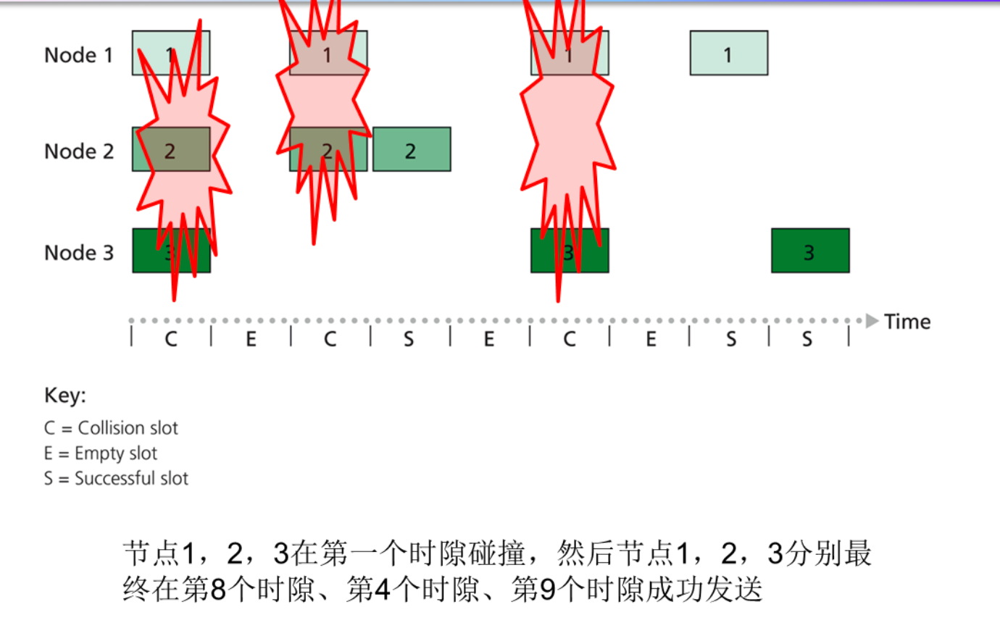
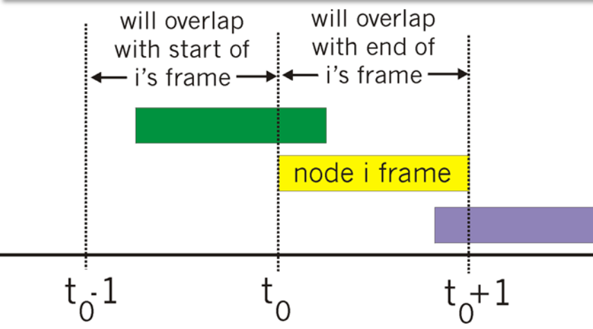
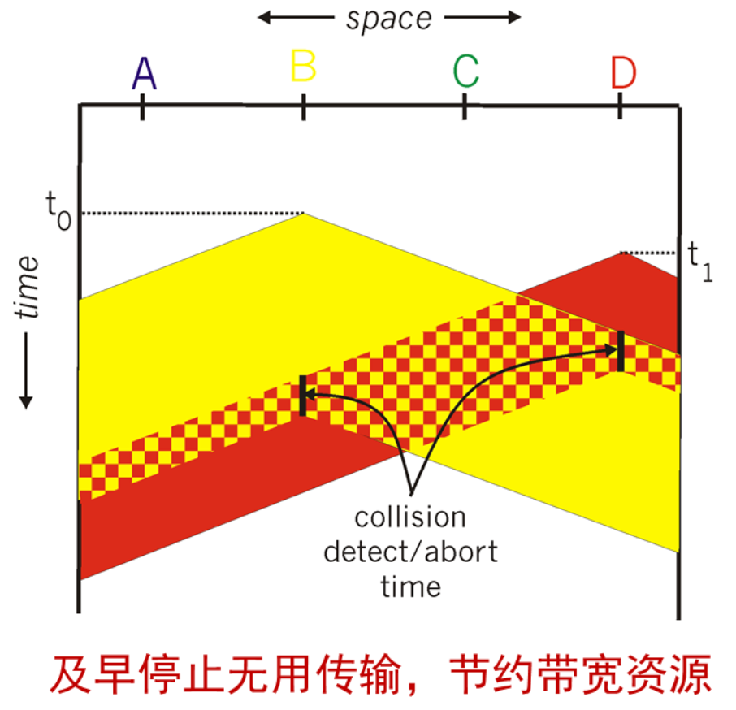
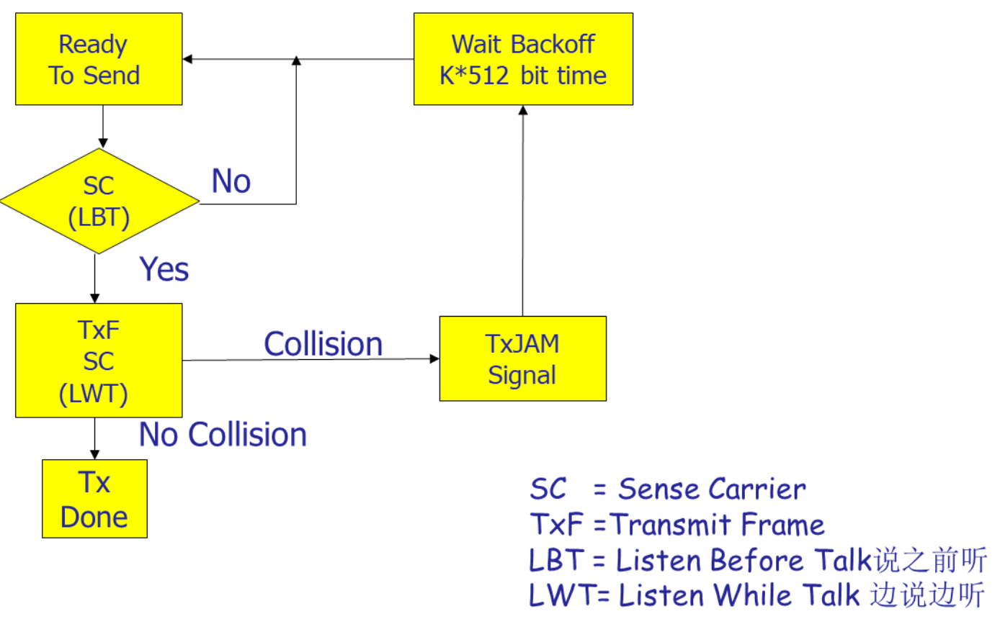
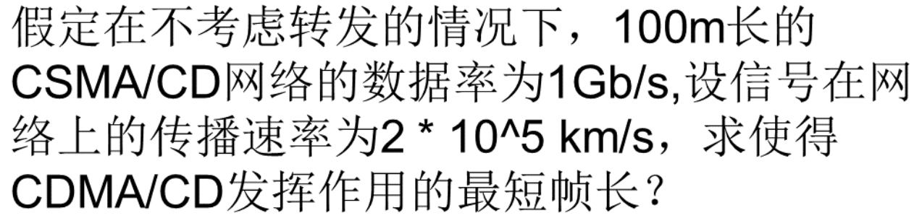
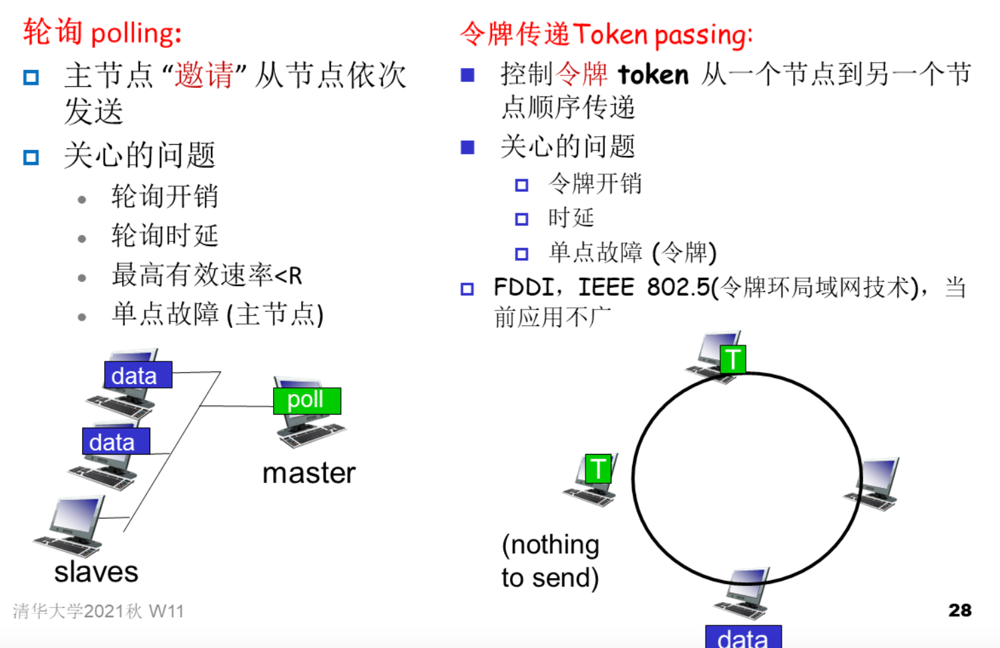
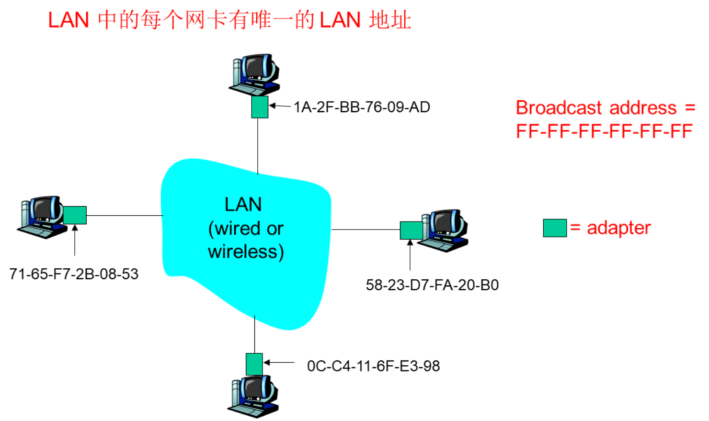
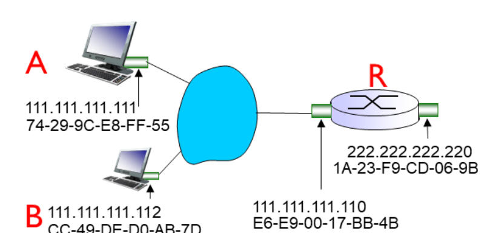
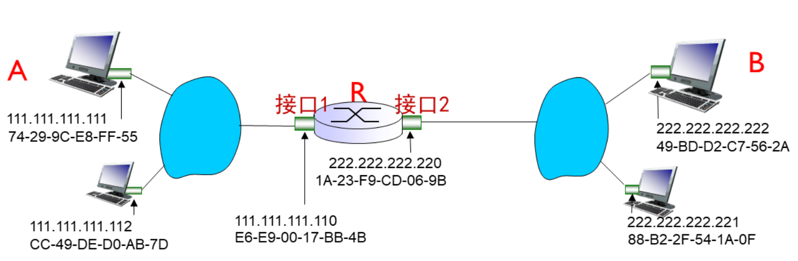

### 多路访问链路和协议

#### 随机访问协议

当节点有分组要发送时
- 以信道的全部数据率 $R$ 发送

- 事先不和其他节点协调

- 两个或两个以上的节点同时发送 $\rightarrow$ “碰撞”

- 随机访问 MAC 协议规定

  - 如何检测碰撞

  - 如何从碰撞中恢复 (e.g., 等待一段时间后重传)

- **随机访问 MAC 协议的例子**

  - 时隙 ALOHA

  - ALOHA

  - CSMA, CSMA/CD(总线式以太网), CSMA/CA(WiFi)

#### 时隙Aloha

**假设**

- 每个帧都一样长
- 把时间分成相等大小的时隙 (等于发送一帧的时间)
- 节点仅在时隙的开始时刻发送帧
- 各节点是同步的, 每个节点知道时隙何时开始

- 如果在某个时刻发生两个或多个帧的碰撞, 所有节点在本时隙结束之前都能检测到碰撞

**操作**

- 当节点从发送缓存中得到新的一帧, 则在下个时隙发送
- 如果没有碰撞发生, 则节点成功发送该帧
- 如果有碰撞, 则节点以概率 $\mathrm{p}$ 在随后的每一个时隙内重发该帧 直到发送成功

**优点**

- 允许单个活动的节点以信道的全部带宽 $R \mathrm{bps}$ 发送帧
- 分布式、简单

**缺点**

- 活动节点多了以后, 碰撞的机会增加, 效率损失
- 有时隙闲置, 带宽资源浪费
- 节点能在比发送帧更短的时间内检测到碰撞, 资源 浪费
- 需要时钟同步

**效率**

- 效率是从长期来看, 在有大量节点、每个节点都有许多帧要发送的情况下，成功发送的时隙所占的比例
- 假设每个节点在每个时隙都以概率 $p$ 发送一帧效率
  - 节点 1 在一个时隙发送成功的概率 $p(1-p)^{N-1}$
  - 在一个时隙内任意节点发送成功的概率 $N p(1-p)^{N-1}$
  - 寻找一个 $p^{*}$, 使 $N p(1-p)^{N-1}$ 最大
  - 当 $p^{*}=1 / N$， $p^*$是最优概率，得到时隙 $\mathrm{ALOHA}$ 的最大效率: $1 / e$ 最优概率 $\quad \lim _{N \rightarrow \infty}(1-1 / N)^{N}=1 / e=0.37$

#### 纯ALOHA

- 不分时隙, 不需同步。当帧一到达就立刻发送。发生冲突后, 以概率 $p$ 重传，大量用户时的最佳效率: $1 /(2 e)$

**效率**
在 $t_{0}$ 时刻发送的帧会和在 $\left[t_{0}-1, t_{0}+1\right]$时间段内发送的其他帧碰撞

假设：在任何一个帧传输时段内, 每个节点均以概率p尝试传输帧; 传完一个帧后能检测是否发生碰撞;

$P($ 某节点发送成功 $)=P($ 节点发送 $) \cdot P\left(\right.$ 无其他节点在 $\left[t_{0}-1, t_{0}\right]$ 发送)$\cdot P$ (无其他节点在 $\left[t_{0}, t_{0}+1\right]$ 发送)
$=p \cdot(1-p)^{N-1} \cdot(1-p)^{N-1}=p \cdot(1-p)^{2(N-1)} \quad$ 
系统效率为 $N \cdot p \cdot(1-p)^{2(N-1)}$, 选择最优的 $p=1 /(2 N-1)$, 令 $n\rightarrow\infty$，最佳效率 $=1 /(2 \mathrm{e})=0.18$

- **碰撞机会增加**
- 更低效，但是完全分布式实现

#### 载波侦听多路访问 CSMA

**CSMA**: 在发送前先侦听信道(检测电平) 

- 如果信道空闲, 则发送整个帧 

- 如果检测到信道忙, 推迟发送

- 类比人类社会: 不要打断别人的谈话

**碰撞**

- 碰撞产生原因：传播时延(propagation delay)使 得两个节点不能听到对方的发送

  碰撞导致整个分组传送时间浪费了（发送出的数据因碰撞无效)

#### CSMA/CD（碰撞检测）

CSMA/CD: 载波侦听和推迟机制和 CSMA一样, 额外增加了碰撞检测（collision detection）
- 在短时间内检测到碰撞(不必等传完整个帧)
- 取消发生碰撞的帧发送, 以减少信道的浪费

碰撞检测

- 在有线局域网中容易实现: 测量电平强度, 比较发送信号和接收信号

- 在无线局域网中难以实现: 信号随距离衰减

  - 节点自身发送信号强度远强于监听到的其他节点信号强度, 信号淹没

  - 即使本地有信号重叠, 也不一定会影响其他节点处接收信号

类比人类社会: 礼貌的谈话者

- 如果在说话过程中, 听到他人同时也在说话, 则停止说话

**碰撞检测基本原理**

- 不分时隙 slots

- 如果网卡(adapter)侦听 到某个网卡正在传送, 则不发送——载波侦听 carrier sense

- 正在传送数据的网卡如 果检测到其他网卡也在传送, 则放弃当前传送 —— 碰撞检测 collision detection

- 在尝试重传之前，网卡等待一个随机的时间——随机访问 random access

**具体协议**

1. 网卡(adapter)从网络层接收 数据报, 封装成帧
2. 如果网卡侦听到信道空闲 (96bit time内无传送), 则开 始传送帧; 如果侦听到信道 忙, 则等待直到信道空闲(至 少96bit time), 然后传送
3. 如果网卡传送出整个帧而且 在传送过程中没有检测到其 他传送, 则网卡成功完成一 次帧的发送！

4. 如果在传送过程中网卡检测 有到其他传送存在, 则放弃, 并发送出一个48bit的阻塞信 号 jam signal
5. 放弃传送后, 网卡进入指数 后退 exponential backoff 阶 段: 即在第 $n$ 次碰撞后, 网卡 从 $\left\{0,1,2, \ldots, 2^{\mathrm{m}}-1\right\}$ (其中 $m=m i n(n, 10))$ 中随机选择一 个 $\mathrm{K}$；等待 $\mathrm{K} \cdot 512 \mathrm{bit}$ 的时间; 返回第 2 步

**Jam Signal**：48 位, 确保其他发送者都意识到碰撞 

**Bit time**: 对于10 Mbps 以太网为 $0.1$ 微秒; 例如 $K=1023$, 等待时间大约为 50 毫秒

**以太网CSMA/CD**状态图

**CSMA/CD协议的效率**

**效率定义**: 当网络中有大量活跃节点, 且每个节点有大量的 帧要发送时, 帧在信道中无碰撞传输的时间占比

- $T_{\text {prop }}=$ 局域网中任意两个节点间的最大传输延迟

- $\mathrm{t}_{\text {trans }}=$ 传输最大长度的以太网帧所需的时间
  近似公式: $\quad$ efficiency $=\frac{1}{1+5 t_{\text {prop }} / t_{\text {trans }}}$

- 若希望效率逼近 $100 \%$ :

  - 需要 $t_{\text {prop }}$ 趋向于 0 (一碰撞就立刻终止, 不会浪费时间)

  - 或者 $t_{\text {trans }}$ 趋向无穷大 (一旦节点占据信道, 就一直在传输)

- 比ALOHA性能更好; 同时简单、低成本、去中心化

**例子**

#### 轮流“taking turns”协议

- **了解即可**

#### MAC协议小结

如何控制对共享介质的访问?
- 信道划分 Channel Partitioning, 根据时间、频率或编码
  - Time Division, Frequency Division, Code Division
- 随机访问 (动态的),
  - 时隙ALOHA, ALOHA, CSMA, CSMA/CD
  - 载波侦听: 某些技术中易实现 (wire), 某些技术中难实现 (wireless)
  - $C S M A / C D$ 在以太网中使用
- Taking Turns
  - 从中心主节点轮询; 令牌传递
  - FDDI, IEEE 802.5(令牌环, 已过时)

### 交换局域网

32 位的IP 地址
- 接口的网络层地址
- 用来把数据报传递到目的 $\mathrm{P}$ 主机(跨多个网络) 

48位的MAC 地址 (LAN 地址/物理地址)

- 用来把帧从一个网络接口传递到另一个物理上相连的网络接口 (同一个网络内-即网络地址相同)

- 48 位 MAC 地址
  - 烧刻在网卡的 ROM 里, 全球唯一, 但也可改写
  
  - e.g.: 1A-2F-BB-76-09-AD (16进制表示, 全1为广播地址: FF-FF-FF-FF-FF-FF)
  
- 若帧里MAC地址匹配, 则网卡将帧拆封给上层协议
  - 特殊的混杂模式, 网卡侦听所有帧并提交给上层协议 Sniffer

- MAC 地址的分配由 **IEEE** 管理

- 制造商购买不同的 MAC 地址空间段 (以确保唯一性) 

- 类比
  (a) MAC 地址: 好比身份证号码
  (b) IP 地址: 好比邮政通信地址
- “平的” MAC地址 $\rightarrow$ 便携性
  - 可以把网卡从一个LAN 移到另一个 LAN, 而MAC地址保持不变

- IP 层次化的地址不便于移动, 随网络环境而改变

  - 依据节点所处的IP子网而设定

  - 方便全球选路
  **MAC地址和IP地址不可互相取代，有其存在必要性! **

#### 链路层寻址与ARP[^2 ]

- LAN 中的每个IP 节点 (主机、路由器) 都有一张 ARP 表

- ARP 表: 同一LAN(子网)内 芇点的 IP与MAC 地址之间 的映射
  <IP address; MAC address; TTL>

- TTL (存活时间 Time To Live): 这个时间以后地址映射将被忘掉 (通常 $20 \mathrm{~min}$ )

**ARP工作原理1：目的节点在同一LAN（子网）**

- A想发送数据报到B，根据A和B的IP地址及子网掩码可 知道 $\mathrm{B}$ 与 $\mathrm{A}$ 在同一子网内

- A向其ARP表查询B的MAC地 址, 假设发现B 的MAC地址 不在 A的ARP表中

- A 广播 ARP 查询分组，其中包含B的IP地址
  - Dest MAC address = FF-FF-FF FF-FF-FF
  - LAN上所有节点收到 ARP 查 询, 并拆包递交给ARP模块

- B 收到 ARP 分组, 发送ARP
  响应分组把它的MAC 地址
  回应给 A
  - 把帧发送到 A 的 MAC 地址 (单播)

- A 在它的ARP表中缓存 (记 下) B主机的IP-to-MAC 地址对, 直到信息过期 (超时)
  - 软状态 soft state: 除非得到 刷新, 信息将过期 (goes away)

- ARP is "plug-and-play":
  - 节点无需网络管理员的介入即可构建它们自己的 ARP 表

**ARP工作原理2: 目的节点在不同LAN(子网)**[^ 1]

A途经 R 向 B 发送数据报 假设 A 已知 B 的 IP 地址 (经由DNS解析)

- 路由器 $\mathrm{R}$ 有两张 $\mathrm{ARP}$ 表，每个 $\mathrm{IP}$ 网络 (LAN) 一张
- 在源主机的网络层配置中(DHCP), 查到其网关路由器 $111.111 .111 .110$
- 在源主机的 ARP 表中, 查到路由器 MAC 地址 E6-E9-00-17-BB-4B

#### 以太网

#### 链路层交换机

#### 虚拟局域网VLAN

### 链路虚拟化: 网络作为链路层

### 数据中心网络

### 回顾: Web页面请求的历程

### 补充

[^1 ]: 详情见第十二周ppt开头处

[^2 ]:  区分ARP、转发表https://cloud.tencent.com/developer/article/1173761