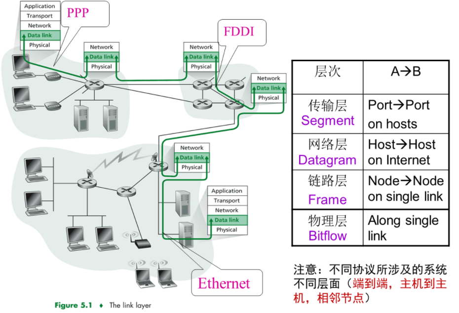
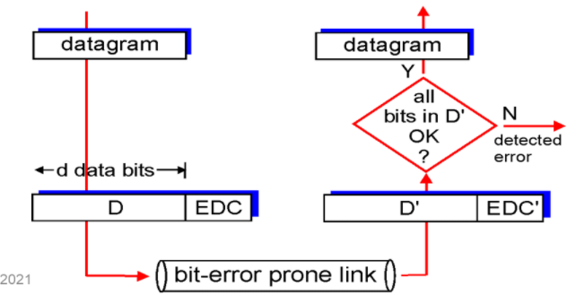

## 第六章 链路层和局域网

### 链路层概述

- 主机和路由器都称为**节点nodes**

- 通信链路上与节点毗邻的通信信道称为**链路links**

- 链路层的数据分组称为帧frame, 它把**数据报datagram**封装起来

- **数据链路层负责把数据报从一个节点经过一条链路传递到相邻的另一个节点**

- 数据报会经过不同的链路, 由不同的链路协议来传送，各链路协议提供不同类型的服务

- 链路层服务内容：

  - 成帧：数据包封装成帧，并加上头尾
  - 链路访问：帧的报头使用MAC地址识别原地址和目标地址
  - 相邻节点间使用**可靠数据传输**
  - 流量控制
  - 差错检测

- 适配器（网卡）通信

  

包含链路层的模型

### 差错检测和纠正技术

- 功能：比特层次的差错检测

- 发送方：给 $D$ (sending Data) 添加$ EDC$ (Error Detection Code)

- 接收方：接收 $E D C^{\prime}$ 和 $D^{\prime}$, 可能与 $E D C$ 和 D 不同

- 差错检测：

  

差错检测模型

### 多路访问链路和协议

### 交换局域网

### 链路虚拟化: 网络作为链路层

### 数据中心网络

### 回顾: Web页面请求的历程