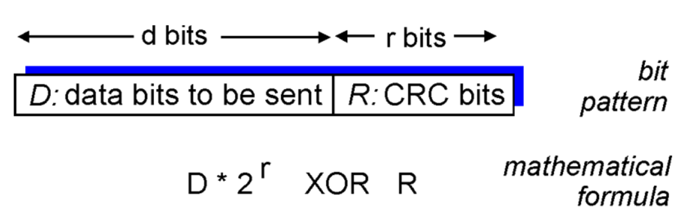

## 第六章 链路层和局域网

### 链路层概述

- 主机和路由器都称为**节点nodes**

- 通信链路上与节点毗邻的通信信道称为**链路links**

- 链路层的数据分组称为帧frame, 它把**数据报datagram**封装起来

- **数据链路层负责把数据报从一个节点经过一条链路传递到相邻的另一个节点**

- 数据报会经过不同的链路, 由不同的链路协议来传送，各链路协议提供不同类型的服务

- 链路层服务内容：

  - 成帧：数据包封装成帧，并加上头尾
  - 链路访问：帧的报头使用MAC地址识别原地址和目标地址
  - 相邻节点间使用**可靠数据传输**
  - 流量控制
  - 差错检测

- 适配器（网卡）通信

  

包含链路层的模型

### 差错检测和纠正技术

- 功能：比特层次的差错检测

- 发送方：给 $D$ (sending Data) 添加$ EDC$ (Error Detection Code)

- 接收方：接收 $E D C^{\prime}$ 和 $D^{\prime}$, 可能与 $E D C$ 和 D 不同

- 差错检测：

  

差错检测模型

- 差错检测方法：

  奇偶校验 Parity Check
  检验和 Checksum
  循环冗余检测 CRC (Cyclic Redundancy Check)

#### 奇偶校验

- 例子

  

#### 互联网检验和

- 不只用在传输层

- 发送方：报文内容相加按位取反得到checksum

  接收方：报文内容和checksum内容相加看是否为1

#### 循环冗余检测CRC

- 把要发送的数据比特, D, 看作一个二进制数

- 双方协商一个 $r+1$ 位的模式 (生成多项式 generator), $G$

- 目的: 选择 $r$ 位的CRC, $R$, 使得

  - <D,R> 恰好被 G 整除 (模2算术)

  - 接收方也知道 G, 用 G 去除 $\langle D, R>$; 若余数不为零: 检测到差错!
  - 能检查到所有小于 $\mathrm{r}+1$ 位的突发误差

- 在实践中广泛使用 (以太网, 802.11 WiFi, ATM)

- 例子

  

- 差错检测, 不能纠错
- 能检测小于 $r+1$ 比特的错误
  - 长度大于 $\mathrm{r}+1$ 比特的错误以概率 $1-0.5^r$被检测到